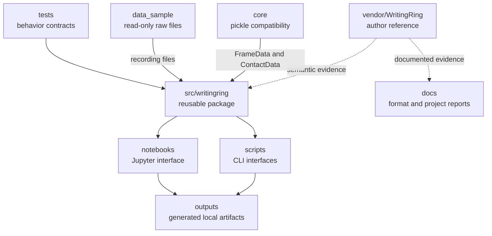
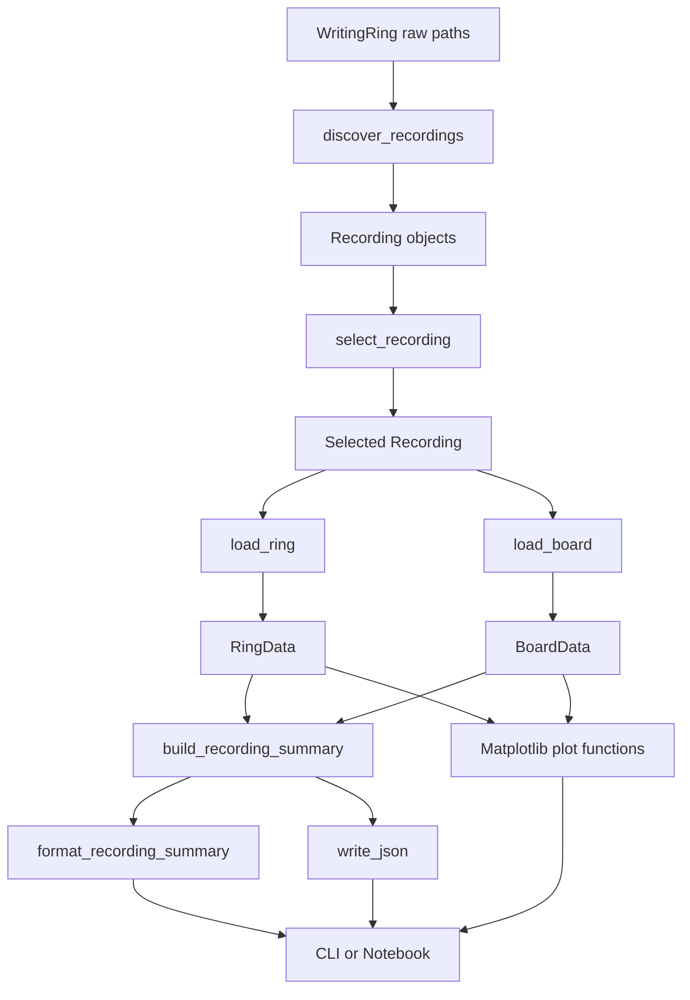
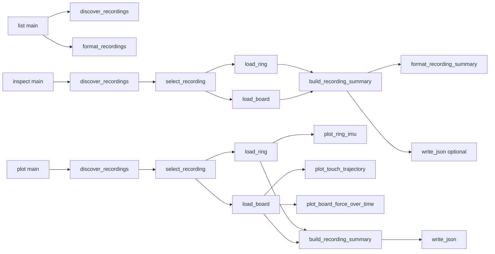

# WritingRing local inspection and visualization: final technical report

## 1. Executive summary

The WritingRing dataset combines a seven-value Ring inertial stream, text
timestamp markers, and chunked Sensel Board recordings. The dataset author's
code contains focused plotting and acquisition utilities, but it is organized
as research scripts rather than as a reusable inspection package. In
particular, the author scripts do not provide unified recording discovery,
typed validation reports, a shared summary model, tested command-line
workflows, or an explicit policy for preserving anomalous chunks.

This project turns the verified upstream data semantics into a local Python
3.11 workflow. It discovers files by user, action, and numeric dataset ID;
selects one exact recording; loads and validates the primary Ring stream and
all matching Board chunks; exposes Pandas tables and structured reports;
creates Matplotlib figures; and presents the same implementation through a
Python API, command-line tools, and a Jupyter notebook.

The compact pipeline is:

```text
WritingRing raw files
→ recording discovery
→ exact recording selection
→ Ring loading and validation
→ Board loading and validation
→ structured summaries and DataFrames
→ Matplotlib plots
→ CLI or Notebook interface
```

On the supplied sample, the completed workflow discovers four recordings,
loads only `ring_0` payloads, retains all 39 Board chunks in numeric filename
order, and reports Dataset 0's backward `6->7` timestamp boundary without
repairing or hiding it. The durable low-level evidence is documented in
[DATA_FORMAT.md](DATA_FORMAT.md).

## 2. Original upstream implementation

### Ring code

The author's `vendor/WritingRing/ring_plot.py` defines
`plot_ring_data(file_path, if_save)`. It reads a Ring file with:

```python
data_ring0 = np.fromfile(file_path, dtype=np.float64)
data_ring0 = data_ring0.reshape(-1, 7)
```

The file is therefore interpreted as a native-endian NumPy `float64` vector
whose value count must form seven-value rows. The plotted columns are, in
order, acceleration x/y/z and gyroscope x/y/z; the seventh value is used as
the timestamp. The same semantic order is represented by
`IMUData` in `vendor/WritingRing/core/imu_data.py`, whose constructor fields
are `acc_x`, `acc_y`, `acc_z`, `gyr_x`, `gyr_y`, `gyr_z`, and `timestamp`.

`ring_plot.py` derives the matching marker path by replacing
`ring_0.bin` with `timestamp.txt`. It parses the first token of each marker
line, finds the Ring row whose final column is nearest to that marker, and
draws a vertical line at the resulting row index. Its six signal lines use
sample position as the x-axis; the script does not convert the raw timestamp
to seconds.

`IMUData` is a supporting data representation rather than a class used
directly by `ring_plot.py`. It provides norms, NumPy conversion, direction
classification, and `scale()`. The latter divides acceleration fields by
`9.8`, converts gyroscope values using `value / pi * 180`, and flips selected
signs. Those operations suggest conventional transformations, but neither
`ring_plot.py` nor `IMUData` states the Ring's raw physical units. The current
project therefore does not assign them.

`vendor/WritingRing/core/window.py` supplies a generic bounded `Window` with
push, slice, mapping, aggregation, NumPy conversion, and feature helpers. It
is part of the upstream supporting code, but neither upstream plotting script
calls it, and the current inspection project does not use it.

The upstream Ring plot is intentionally compact. It assumes the file exists,
is nonempty, has a valid seven-column shape, and has a matching marker file.
It does not return a typed result or structured validation metadata.

### Board code

The author's `vendor/WritingRing/board_plot.py` defines `load_data(filename)`
as a direct call to:

```python
compress_pickle.load(filename)
```

The corresponding writer in
`vendor/WritingRing/core/sensel_lib/board.py` serializes lists with
`compress_pickle.dump`. It uses an incrementing integer `segment` in filenames
and normally flushes at 1,000 frames.

Deserialization depends on the classes in
`vendor/WritingRing/core/sensel_lib/frame_data.py`:

- `FrameData` contains `force_array`, `timestamp`, and a `contacts` list.
- `ContactData` contains identifier, state, x/y, area, force, major/minor
  axes, coordinate/force/area deltas, label, and frame ID fields.

The Board writer creates timestamps with `int(time.time() * 1e6)`. It stores a
force array multiplied by `0.2`, divides Sensel x and y positions by
`Board.MAX_X` (`230.0`) and `Board.MAX_Y` (`130.0`), and copies
`total_force` into `ContactData.force`. The constants and physical units are
not documented.

`visualize_touch_data` globs every `*.gz` file in an action directory. For
each successfully loaded list, it retains frames whose raw timestamp lies
inside an inclusive marker interval. It then extracts:

```python
x_coords = [contact.x for contact in point.contacts]
y_coords = [1 - contact.y for contact in point.contacts]
force = [contact.force for contact in point.contacts]
```

The plotted vertical coordinate is therefore a display transformation,
`1 - stored_y`; it is not a change to the stored contact object. Force is used
as the scatter color. `plot_board_data` chooses a timestamp file and adjacent
marker interval randomly, then calls `visualize_touch_data`.

The upstream Board script does not filter gzip files by the selected dataset
ID and does not explicitly sort them. It catches per-file exceptions, prints
an error, and continues. These choices are reasonable for a concise research
visualization script, but they are not sufficient to establish complete,
deterministic recording membership or to preserve a failed chunk in a
structured report.

### Upstream limitations for this project

The author code is treated as the semantic reference, not as defective code.
Its purpose is focused acquisition and visualization. The new project's
engineering requirements are broader:

- deterministic discovery across the user/action hierarchy;
- dataset-ID membership isolation;
- numeric Board chunk ordering;
- explicit primary `ring_0` selection;
- typed, reusable loader results;
- structured validation and warnings;
- preservation of empty and temporally anomalous chunks;
- common text and strict-JSON summaries;
- reusable Matplotlib functions;
- CLI and notebook interfaces backed by the same library; and
- synthetic regression tests plus real-sample acceptance checks.

No single upstream API provides that combined behavior, so the project
preserves verified transformations while introducing a separate modular
architecture.

## 3. Confirmed dataset organization

The observed and parsed hierarchy is:

```text
data/
└── user_{id}/
    └── action_id/
        ├── {dataset_id}_ring_0.bin
        ├── {dataset_id}_ring_1.bin
        ├── {dataset_id}_timestamp.txt
        └── {dataset_id}_board_{chunk_index}.gz
```

- The first directory below the data root is the user identity.
- The next directory is the action identity.
- The integer filename prefix is the dataset ID within that user/action
  directory.
- The Ring suffix contains a Ring index (`0` or `1`).
- The final integer in a Board filename is its chunk index.

`discovery.py` uses `ring_0` as the anchor for a nominal recording because the
upstream Ring plotting path targets `ring_0` and the project requirements
select it as primary. `ring_1` is retained in `Recording.ring_1_path` for
inspection metadata only. Its payload is not used as the primary Ring input,
and its purpose remains unknown.

Board files belong to a recording only when their parsed dataset ID matches
the Ring anchor's dataset ID. Their chunk indices are parsed as integers and
sorted numerically. This is necessary because lexical order would place
`board_10` between `board_1` and `board_2`. Numeric order follows the author's
integer segment counter, although numeric adjacency does not itself prove
timestamp continuity.

See [DATA_FORMAT.md](DATA_FORMAT.md) for byte-level findings, confirmed fields,
sample observations, timestamp evidence, and the distinction between upstream
facts and project policy.

## 4. Project goals and design principles

The implementation follows these principles:

1. **Upstream code is the semantic reference.** Loading and display
   transformations are grounded in `vendor/WritingRing`, not guessed.
2. **Actual sample data verifies assumptions.** File shapes, object types,
   timestamp behavior, empty chunks, and Dataset 0's anomaly were checked
   against `data_sample`.
3. **Raw values remain available.** Ring timestamps and Board `y_raw` are
   preserved. Derived values have explicit names.
4. **Anomalies are reported, not silently corrected.** The system does not
   timestamp-sort, repair, split, or discard Board chunks.
5. **Undocumented units are not invented.** Signal, coordinate, force, area,
   axis, and delta values remain raw/stored or undocumented.
6. **Inference is visibly labeled.** Ring relative seconds use an observed
   microsecond interpretation that is not a confirmed upstream contract.
7. **The streams are independent.** Similar timestamp magnitudes do not
   establish a Ring–Board synchronization guarantee.
8. **Interfaces are thin.** Library modules own discovery, loading,
   validation, summaries, and plotting; scripts and the notebook call them.
9. **Reference and sample trees are read-only.** Work products live outside
   `vendor/WritingRing` and `data_sample`.
10. **Tests protect semantics.** Tests explicitly cover primary-Ring
    selection, numeric order, non-repair, non-dropping, warnings, and CLI
    behavior.

## 5. Final project architecture

```text
writingring-viz/
├── core/
├── vendor/WritingRing/
├── data_sample/
├── src/writingring/
├── scripts/
├── tests/
├── notebooks/
├── docs/
├── outputs/
├── pyproject.toml
└── README.md
```



### `vendor/WritingRing`

This is the read-only dataset-author reference. Its plotting, data classes,
and Board writer establish the strongest available source evidence for
loading and display semantics.

### Root `core`

Existing pickles reference the module path `core.sensel_lib.frame_data`.
Python must be able to import that exact namespace before deserialization.
The root `core` source matches `vendor/WritingRing/core`; the only difference
reported by `diff -qr` is a root `__pycache__` directory.

### `src/writingring`

This is the new modular implementation: discovery, selection, Ring and Board
loading, validation, summaries, JSON conversion, and plotting.

### `scripts`

The five scripts are command-line adapters. They parse arguments, call the
reusable modules, present errors concisely, and return nonzero status on
expected failures.

### `notebooks`

`notebooks/explore_recording.ipynb` is an interactive walkthrough built on
the installed package. It does not contain its own Ring parser, Board
deserializer, summary builder, or plotting implementation.

### `tests`

The fourteen test files use temporary synthetic inputs to encode behavioral
contracts for discovery, selection, loaders, gravity and spectral analysis,
plots, and CLIs. Real-sample and notebook acceptance checks complement,
rather than replace, these unit tests.

## 6. Module-by-module explanation

### `discovery.py`

**Purpose.** Parse recognized filenames and group filesystem paths into
recordings without opening payloads.

**Public API.**

- `FileKind` identifies `RING_0`, `RING_1`, `TIMESTAMP`, and `BOARD_CHUNK`.
- `ParsedFilename` stores `dataset_id`, kind, and optional chunk index.
- `Recording` stores user/action identity, dataset ID, primary and optional
  paths, ordered Board paths, missing indices, and warnings. Its properties
  expose Board indices and the first/last index range.
- `parse_recording_filename(filename)` performs pure filename parsing and
  returns `None` for unrelated or malformed names.
- `discover_recordings(data_root)` traverses `data_root/user/action` and
  returns recordings sorted by directory and dataset identity.
- `DiscoveryError` reports an unusable root or conflicting primary files.

**Dependencies and callers.** It uses only standard-library dataclasses,
enums, regex, and `pathlib`. Selection, both loaders, both CLIs, the listing
script, and the notebook consume `Recording` or its parser.

**Invariants.** `ring_0` anchors a result; `ring_1` does not create one.
Board membership is restricted by dataset ID and sorted by integer chunk
index. Missing timestamps, absent chunks, missing indices, duplicate indices,
and ambiguous optional paths become warnings. No Ring binary, Board pickle,
or marker content is opened.

### `selection.py`

**Purpose.** Resolve exactly one `Recording` by user, action, and numeric
dataset ID.

**Public API.** `select_recording(recordings, *, user, action, dataset_id)`
validates nonempty string selectors and a nonnegative integer dataset ID
(excluding booleans), filters exact matches, and returns the sole result.
`InvalidRecordingSelectorError`, `RecordingNotFoundError`, and
`MultipleRecordingsMatchedError` inherit from `RecordingSelectionError`.

**Dependencies and callers.** It depends only on `Recording`. The inspection
CLI, plotting CLI, notebook, and direct API workflow call it after discovery.

**Invariants.** Selection never guesses or defaults an identity. Zero and
multiple matches are explicit errors.

### `ring_loader.py`

**Purpose.** Safely decode one primary Ring stream and attach structured
validation and timestamp-interpretation metadata.

**Public API and types.**

- `load_ring(source)` accepts a `Recording`, string path, or `Path`.
- `RingData` contains the source path, DataFrame, `RingValidationReport`,
  `TimestampInterpretation`, and warnings.
- `ChannelStatistics` stores finite/non-finite counts and finite-only
  minimum, maximum, mean, and population standard deviation.
- `RingLoadError` is the base for `RingPathError`,
  `EmptyRingFileError`, and `MalformedRingFileError`.

**Loading and output.** A `Recording` always resolves to `ring_0_path`.
An explicit path must parse as `*_ring_0.bin`; a `ring_1` path is rejected
before `np.fromfile` runs. The loader validates existence, regular-file
status, nonzero size, divisibility by eight bytes, and a float count divisible
by seven. It then performs the upstream operations:

```python
raw = np.fromfile(path, dtype=np.float64)
values = raw.reshape(-1, 7)
```

The DataFrame has the seven confirmed columns and a named `sample_index`
index. The raw timestamp column is never overwritten.

**Validation and inference.** `RingValidationReport` records size/count
consistency, raw timestamp endpoints and duration, finite status,
nondecreasing/strict status, duplicate and backward steps, bounded backward
positions, per-column non-finite counts, finite-channel statistics, inferred
duration/rate, and warnings. The duration-based sampling-rate estimate is
created only for at least two samples with finite, nondecreasing timestamps
and positive duration.

When all timestamps are finite, the loader may add
`relative_time_inferred_s = (timestamp - timestamp[0]) * 1e-6`.
`TimestampInterpretation` records that the raw unit is unconfirmed, that no
synthetic axis was used, and that no nominal rate was assumed. A relative
column may still expose a backward step if the raw timestamps contain one;
the loader does not repair it. The inferred duration/rate remain unavailable
when monotonicity or duration requirements fail.

**Dependencies and callers.** It depends on discovery filename semantics,
NumPy, and Pandas. The inspection CLI, plotting CLI, notebook, summary
builder, and Ring plot consume its result.

### `board_loader.py`

**Purpose.** Decode Board chunks in the exact supplied order, transform
author objects into analysis tables, and report chunk and recording
validation without hiding anomalies.

**Public API and types.**

- `load_board(source)` accepts a `Recording`, one string/`Path`, or a sequence
  of paths.
- `BoardData` contains the optional source recording, exact chunk paths,
  `BoardChunkReport` objects, frame/contact DataFrames,
  `BoardValidationReport`, and warnings.
- `ChunkBoundaryReport` represents the relationship between adjacent supplied
  chunks.
- `FiniteRange` records finite extrema and finite/non-finite counts.
- `BoardLoadError` is the root of typed path, import, deserialization,
  container, object, attribute, and empty-file errors.

**Loading and order.** A `Recording` contributes
`recording.board_chunk_paths` unchanged. Explicit path sequences are also
consumed unchanged; decreasing numeric indices are rejected rather than
sorted. Dataset IDs must agree. Duplicate numeric indices may remain in a
nondecreasing sequence and are reported. Before any pickle load,
`_load_official_types` imports `FrameData` and `ContactData` from
`core.sensel_lib.frame_data`. Each chunk is then decoded with
`compress_pickle.load(path)`.

**Chunk handling.** A zero-byte file is an error, while a successfully
deserialized empty list is a valid empty chunk. Every top-level object must be
a list; frames and contacts must be official types with expected attributes.
Frame timestamps and contact x, y, and force must be numeric. A failure raises
a typed exception carrying a failed `BoardChunkReport`; it is never silently
skipped.

**Frame table.** One row is created for every frame, including frames with no
contacts. Columns are dataset ID, chunk index, frame index within chunk,
global frame index, raw frame timestamp, contact count, and force-array
shape/dtype metadata. The current `BoardData` does **not** retain the dense
`force_array` values themselves.

**Contact table.** One row is created per contact. It includes frame identity,
raw timestamp, contact index/ID, state, x, raw y, display y, force, area,
major/minor, deltas, label, and contact frame ID. `y_raw` preserves the
stored value; `y_display = 1.0 - y_raw` is the upstream plotting
transformation.

**Validation.** Per-chunk reports contain size, decode status, counts,
timestamp endpoints and monotonicity, bounded backward positions, warnings,
and errors. The aggregate report records missing/duplicate/empty/leading-empty
indices, frame/contact/contact-free counts, first/last timestamp in numeric
file order, within-chunk backward locations, every adjacent boundary,
backward boundaries, and finite ranges. It never sorts by timestamps.

**Dependencies and callers.** The module depends on discovery parsing,
`compress_pickle`, NumPy, Pandas, and the root `core` namespace. The
inspection and plotting CLIs, notebook, summary builder, and Board plots use
`BoardData`.

### `gravity.py`

**Purpose.** Estimate and subtract the stationary acceleration contribution
in explicitly configured Ring sensor/body axes without mutating raw data.

`GravityRemovalConfig` defaults to a nominal 200 Hz rate, m/s² acceleration,
rad/s gyroscope data, identity axes, Madgwick gravity removal, and automatic
calibration when manual bounds are absent. It also records the Madgwick beta
gain, the alternative second-order Butterworth low-pass cutoff, scale
overrides, a right-handed axis transform, confidence gates,
calibration thresholds, strict/provisional policy, unit label, and profile
name. `GravityCalibration` records robust stationary statistics, gravity
magnitude/direction, gyro bias, anchor sample, provenance, pass/fail state,
stationary-search metadata, and warnings.

### `stationary.py`

**Purpose.** Select an evidence-based stationary calibration candidate from a
finite `(N, 6)` NumPy array containing m/s² acceleration and rad/s gyroscope
samples. `StationarySearchConfig` defaults to a 200 Hz, 1.0-second window with
a 0.05-second stride and expected gravity of `9.80665 m/s^2`.

`find_stationary_interval` measures median gravity magnitude/error, robust
MAD-based acceleration variation, per-axis acceleration variation, and median,
95th-percentile, and robust gyroscope activity. It returns the lowest-score
passing window or, if none pass, the lowest-score failed candidate with its
failed checks. `process_ring_gravity` honors manual bounds first; otherwise it
uses this candidate. Strict automatic failure raises a typed calibration error;
provisional mode retains the candidate with visible warnings. Automatic search
does not prove physical stationarity and may be fooled by sustained constant
linear acceleration.

`calibrate_gravity_removal` validates a finite `(N, 3)` acceleration/gyro
pair and the explicit calibration interval. `remove_gravity_in_body_frame`
either runs confidence-gated IMU-only Madgwick fusion from the calibration
anchor in both directions, or applies a causal second-order Butterworth IIR
SOS/biquad independently to the three acceleration axes. The Madgwick result
is deliberately noncausal. `process_ring_gravity` is the thin `RingData`
adapter.

`GravityRemovalResult` exposes read-only configured acceleration,
bias-corrected angular velocity, estimated gravity contribution, linear
acceleration, correction mask/confidence, and aggregate diagnostics. Its
DataFrame conversion uses explicit derived column names and preserves the
source Ring DataFrame. The opt-in `upstream_suggested` profile records, but
does not certify, the unit/axis hints from upstream `IMUData.scale()`.

### `plotting.py`

**Purpose.** Produce reusable Matplotlib figures from already validated
`RingData` and `BoardData`.

**Public functions.**

- `plot_ring_imu` creates two shared-x axes: accelerometer channels above and
  gyroscope channels below.
- `plot_ring_gravity_removal` compares configured acceleration, estimated
  gravity contribution, linear acceleration, and correction confidence in
  four shared-x panels.
- `plot_touch_trajectory` scatters x against `y_display`, colors by force,
  uses equal aspect, and adds a color bar when contacts exist.
- `plot_board_force_over_time` scatters contact force against a frame index or
  raw Board timestamp.
- `concise_warning_text` normalizes, deduplicates, and bounds warning text.

Ring modes are `sample_index` and `inferred_time`; the latter requires the
existing `relative_time_inferred_s` column. Board modes are `frame_index` and
`raw_timestamp`. Plot functions do not create a synthetic Ring axis, sort
contacts, repair timestamps, or synchronize streams.

Empty contact tables produce valid figures with explanatory text. Warning
footers summarize duplicate Ring timestamps, inferred-time status, empty
Board chunks, contact-free frames, and backward chunk boundaries. Output
parents are created when necessary; figures are saved when `output_path` is
given and shown only when `show=True`. Returned figures stay open, so
noninteractive callers such as `plot_recording.py` close them.

Representative plotting errors are `UnsupportedTimeAxisError`,
`MissingPlotColumnError`, `InferredTimeUnavailableError`,
`PlotOutputError`, and `MalformedPlotDataError`, all under `PlottingError`.

### `inspection.py`

**Purpose.** Provide one summary model for human-readable and JSON
inspection.

`build_recording_summary(recording, ring_data, board_data)` returns a nested
dictionary with `recording`, `ring`, `board`, and `notes` sections. It includes
identity and paths, selected validation fields, ranges and warnings, and
explicit unit/timestamp/synchronization caveats.

`format_recording_summary(summary)` converts that dictionary to readable
terminal text. `to_jsonable(value)` recursively converts paths, dataclasses,
enums, mappings, sequences, NumPy arrays/scalars, and ordinary values. It
represents non-finite Python floats with the strings `"NaN"`, `"Infinity"`,
or `"-Infinity"` so that output can remain strict JSON.
`write_json(path, value)` creates parent directories and calls `json.dumps`
with `allow_nan=False`.

The inspection CLI prints `format_recording_summary` and optionally calls
`write_json`. The plotting CLI builds the same summary, appends a `plotting`
section, and calls `write_json`. This common source prevents the two tools
from independently redefining validation summaries.

### `__init__.py`

`src/writingring/__init__.py` imports and lists the supported package surface
in `__all__`. The verified current surface contains 50 names: primary
dataclasses, report types, exception families, discovery/selection/load
functions, summary/JSON functions, and plot functions.

Application code should import from `writingring` when practical because that
surface is the package's intended stable entry point. Internal constants such
as CLI time-axis choices remain in their defining module and are used
directly by `plot_recording.py`.

## 7. Important data structures

| Type | Created by | Contains | Consumed by |
| --- | --- | --- | --- |
| `ParsedFilename` | `parse_recording_filename` | Dataset ID, `FileKind`, optional chunk index | Discovery and path validation |
| `Recording` | `discover_recordings` | User/action/dataset identity, primary and metadata paths, numeric Board paths, discovery warnings | Selection, loaders, summaries, CLIs, notebook |
| `RingData` | `load_ring` | Source path, Ring DataFrame, validation, timestamp interpretation, warnings | Summary builder and Ring plot |
| `RingValidationReport` | Ring validation helper | Counts, timestamps, monotonicity, non-finite counts, channel statistics, inferred duration/rate | `RingData`, summaries, notebook |
| `TimestampInterpretation` | `load_ring` | Confirmed-versus-inferred timestamp metadata and synthetic-axis policy | Notebook and callers inspecting semantics |
| `ChannelStatistics` | Ring validation helper | Finite count, NaN/infinity counts, finite extrema/moments | `RingValidationReport` |
| `BoardChunkReport` | Board chunk loader | Path, decode status, counts, timestamp checks, warnings/errors | Aggregate Board validation and notebook |
| `ChunkBoundaryReport` | Board boundary helper | Adjacent indices, timestamps, delta, backward state, warning | `BoardValidationReport`, summaries, plots |
| `BoardValidationReport` | Board aggregate helper | Recording-level counts, chunk anomalies, boundaries, ranges, warnings | `BoardData`, summaries, plots |
| `BoardData` | `load_board` | Exact paths, chunk reports, frame/contact tables, aggregate validation | Summary builder and Board plots |
| Summary dictionary | `build_recording_summary` | Recording, Ring, Board, and limitation notes | Text formatter, JSON writer, CLIs, notebook |

The Ring DataFrame preserves seven raw columns:

```text
acc_x, acc_y, acc_z, gyr_x, gyr_y, gyr_z, timestamp
```

Its `sample_index` is a named DataFrame index. The optional
`relative_time_inferred_s` column is derived and explicitly inferred.

The Board frame DataFrame contains:

```text
dataset_id, chunk_index, frame_index_in_chunk, global_frame_index,
frame_timestamp_raw, contact_count, force_array_shape, force_array_dtype
```

The contact DataFrame contains:

```text
dataset_id, chunk_index, frame_index_in_chunk, global_frame_index,
frame_timestamp_raw, contact_index, contact_id, state, x, y_raw, y_display,
force, area, major, minor, delta_x, delta_y, delta_force, delta_area, label,
contact_frame_id
```

Raw stored data is identifiable by names such as `timestamp`,
`frame_timestamp_raw`, and `y_raw`. Derived presentation values are
`sample_index`, `relative_time_inferred_s`, `global_frame_index`, and
`y_display`. Validation reports describe the data without replacing it;
summary dictionaries select and serialize user-facing validation facts.

## 8. Function call and dependency flow

The end-to-end data flow is:



The major executable call relationships are:



The diagrams deliberately show only calls present in current source.
`build_recording_summary` does not call plotting functions, and the loaders do
not call one another. The CLI and notebook orchestrate independent Ring and
Board loading.

## 9. End-to-end workflows

### Workflow A: list recordings

`scripts/list_recordings.py`:

1. parses required `--data-root`;
2. calls `discover_recordings`;
3. formats each `Recording` with `format_recordings`;
4. prints identity, primary Ring name, marker status, Board count/range,
   missing indices, and warnings; and
5. returns status `2` for a `DiscoveryError`.

It does not select or open a payload.

### Workflow B: inspect one recording

`scripts/inspect_recording.py`:

1. parses data root, user, action, dataset ID, and optional JSON path;
2. discovers recordings and calls `select_recording`;
3. calls `load_ring(recording)` and `load_board(recording)`;
4. calls `build_recording_summary`;
5. prints `format_recording_summary(summary)`; and
6. optionally calls `write_json`.

Expected discovery, selection, Ring, Board, filesystem, type, and value
errors become concise `error: ...` messages with status `2`.

### Workflow C: generate plots

`scripts/plot_recording.py` first detects `--no-show` and selects Matplotlib's
Agg backend before importing pyplot-dependent modules. It then:

1. discovers and selects a recording;
2. loads Ring and Board data;
3. calls `plot_ring_imu`, `plot_touch_trajectory`, and
   `plot_board_force_over_time`;
4. builds the common summary;
5. adds selected plotting modes, output paths, and overwrite policy;
6. writes strict JSON; and
7. closes returned figures in noninteractive mode.

The output directory contains:

```text
ring_imu.png
touch_trajectory.png
board_force_time.png
summary.json
```

Ring axis choices are `sample_index` and `inferred_time`; Board choices are
`frame_index` and `raw_timestamp`. The CLI imports those choices from
`writingring.plotting`, so its parser follows the plotting implementation.

### Workflow D: use the Notebook

`notebooks/explore_recording.ipynb` imports public names from `writingring`,
resolves the project data and output directories, discovers all recordings,
and displays a concise discovery DataFrame. Its documented example selects
`user_0`, action `0`, Dataset 0; loads Ring and Board results; builds the
common summary; and displays `.head()` previews plus structured validation.

It calls the reusable plots for Ring inferred time and sample index, touch
trajectory, and Board force against frame index and raw timestamp. Saved
figures are explicitly closed. Separate examples filter Board contacts by
numeric chunk index and slice the Ring table by its sample index. Markdown
explicitly states that those independent filters do not synchronize the
streams.

The verified executed notebook artifact contains 16 executed code cells and
zero error outputs.

### Workflow E: direct Python API

```python
from pathlib import Path

from writingring import (
    build_recording_summary,
    discover_recordings,
    load_board,
    load_ring,
    plot_ring_imu,
    plot_touch_trajectory,
    select_recording,
)

recordings = discover_recordings(Path("data_sample/data"))
recording = select_recording(
    recordings,
    user="user_0",
    action="0",
    dataset_id=0,
)

ring = load_ring(recording)
board = load_board(recording)
summary = build_recording_summary(recording, ring, board)

ring_figure = plot_ring_imu(ring, show=False)
touch_figure = plot_touch_trajectory(board, show=False)
```

The caller owns returned figures and should close them when finished.

## 10. Data transformations

### Ring path

```text
ring_0.bin
→ native-endian float64 vector
→ reshape to N × 7
→ seven-raw-column DataFrame
→ named sample_index
→ validation statistics
→ optional relative_time_inferred_s
→ summaries and Ring plots
```

The six signal columns and `timestamp` are decoded raw values.
`sample_index` is a positional DataFrame index. The relative-time column,
inferred duration, and inferred sampling rate are interpretations based on
`1e-6` seconds per raw timestamp unit; their names and metadata disclose that
the interpretation is unconfirmed.

### Board path

```text
discovered Board paths
→ numeric chunk-index order
→ official class import
→ gzip/pickle deserialization
→ FrameData and ContactData objects
→ frame and contact rows
→ chunk and boundary validation
→ aggregate Board validation
→ summaries and Board plots
```

The frame table preserves one row per frame, including contact-free frames.
The contact table preserves the stored coordinate as `y_raw` and derives:

```python
y_display = 1.0 - y_raw
```

That derived column reproduces the upstream display transformation. It does
not modify the pickled object or replace `y_raw`. Chunk order, frame order,
contact order, and raw timestamps are retained.

## 11. Validation and error-handling strategy

### Discovery validation

Regex parsing defines supported filenames. Discovery checks the root,
anchors on exactly one primary `ring_0`, isolates dataset membership, and
reports optional/missing/duplicate components. Unrecognized filenames are
ignored as unrelated.

### Ring validation

Path and size checks precede decoding. The loader validates complete
`float64` and seven-value rows, then reports raw shape, non-finite values,
timestamp finiteness and monotonicity, duplicate and backward steps, bounded
locations, per-channel statistics, and inference eligibility. Malformed
payloads raise `RingLoadError` subclasses; usable duplicates become warnings.

### Board validation

Path resolution rejects missing files, mixed dataset IDs, malformed names,
and decreasing chunk order. Deserialization validates official types,
containers, attributes, and numeric fields. Empty serialized lists and
contact-free frames remain valid and visible. Chunk reports and aggregate
validation record counts, missing/duplicate/empty indices, within-chunk
timestamp behavior, every cross-chunk boundary, and coordinate/force finite
ranges. Failed chunks raise `BoardChunkError` subclasses carrying reports.

### Plotting validation

Plot functions require the correct loaded result type and DataFrame columns,
validate the requested axis mode and output path, and distinguish unavailable
inferred time from other malformed input. Empty contacts produce explanatory
figures rather than unrelated Matplotlib errors.

### CLI error handling

The inspection and plotting scripts catch expected project exceptions plus
filesystem/type/value errors, print a concise message to standard error, and
return status `2`. Argparse handles malformed arguments. Tests confirm that
expected failures omit tracebacks and that noninteractive plots close even
after a later plotting failure.

## 12. Dataset 0 case study

Dataset 0 demonstrates why filename order and timestamp validation must be
separate policies.

Discovery produces the exact numeric sequence:

```text
0, 1, 2, 3, 4, 5, 6, 7, 8, 9, 10, 11, 12, 13, 14, 15
```

The loader retains all 16 reports and all usable frame/contact rows. Chunk 0
successfully deserializes to an empty list. Chunks 1 through 6 are
chronologically continuous, but the boundary report between chunks 6 and 7
records:

```text
previous last timestamp: 1720476305908521
next first timestamp:    1720475918032031
delta:                  -387876490
```

Chunks 7 through 15 remain in numeric filename order even though they form an
older timestamp region. No timestamp sort, repair, automatic split, or chunk
deletion occurs. The aggregate Board warnings include:

```text
backward timestamp boundary 6->7: delta=-387876490.0
```

The common summary includes the structured boundary, while touch and force
figures display a concise footer stating that the backward `6->7` boundary
was retained. This behavior belongs at the loader/plotting policy boundary:
the loader must preserve and describe the source sequence, and plots must
disclose what they show. Choosing to discard or segment the old tail would be
a separate, evidence-dependent product policy. The cause of the anomaly is
not known.

## 13. Testing strategy

The current suite is organized by responsibility:

- `test_discovery.py` protects filename parsing, `ring_0` anchoring,
  metadata-only `ring_1`, dataset isolation, numeric ordering, missing
  components, and malformed unrelated names.
- `test_selection.py` protects exact selection and invalid, zero-match, and
  multiple-match behavior.
- `test_ring_loader.py` protects shape/column semantics, raw timestamp
  preservation, explicit inference, malformed files, non-finite statistics,
  monotonicity states, invalid-duration behavior, and prevention of
  `ring_1` reads.
- `test_board_loader.py` protects official-object decoding, empty and
  contact-free preservation, y transformation, missing/duplicate indices,
  typed failures, dataset isolation, numeric order, timestamp anomalies, and
  non-finite ranges.
- `test_plotting.py` protects axes and line content, existing-time-column
  use, no DataFrame mutation, touch coordinates/color bar/equal aspect,
  empty-data messages, raw timestamp order, warning visibility, saving, and
  plotting exceptions.
- `test_cli.py` protects inspection text/JSON, concise failures, output
  creation, time-axis forwarding, Agg mode, figure closure, primary Ring-only
  reads, and complete Board order.
- `test_gravity.py` protects frame/sign conventions, stationary and rotating
  synthetic cases, dynamic correction rejection, gyro-bias calibration,
  bidirectional anchoring, strict/provisional calibration, transforms,
  immutability, the Ring adapter, and the assumed upstream profile.
- `test_gravity_plotting.py` protects the four-panel comparison, existing
  time axes, provisional warnings, row-count validation, saving, and source
  DataFrame preservation.
- `test_gravity_cli.py` protects explicit gyro scaling, primary `ring_0`
  selection, automatic/manual calibration summaries, overwrite policy, Agg
  mode, figure closure, and the opt-in upstream profile.
- `test_stationary.py` protects valid beginning/middle/end windows, tilted
  stationary orientation, rotation rejection, failed candidates, malformed
  input, and manual-overrides-automatic integration.

Most unit tests use temporary synthetic files, making individual edge cases
small and deterministic. Real-sample verification separately loads the four
sample recordings, tracks actual payload calls, checks 39 Board chunks and
Dataset 0, and generates figures/JSON. Source-tree hash checks confirm that
`data_sample` and `vendor/WritingRing` remain unchanged. End-to-end acceptance
also executes the notebook.

The current full-suite result is recorded after the final verification run:

```text
174 passed
```

## 14. Packaging and environment

The project targets Python 3.11 and uses the `writingring-viz` Conda
environment:

```bash
conda activate writingring-viz
python -m pip install -e .
```

`pyproject.toml` declares runtime dependencies on `compress-pickle`,
Matplotlib, NumPy, and Pandas; a `test` extra for pytest; and a `notebook`
extra for ipykernel, JupyterLab, nbconvert, and nbformat.

Setuptools maps the `src` layout package `writingring` from
`src/writingring`. It also installs root `core` and `core.sensel_lib` so
pickles can resolve the official class module path. An editable import checked
from outside the repository resolves both:

```text
.../writingring-viz/src/writingring/__init__.py
.../writingring-viz/core/sensel_lib/frame_data.py
```

Consumers therefore do not need to set `PYTHONPATH=src`. Pytest's own
configuration still lists `src` as a test import path, but production CLI and
notebook workflows use the editable package installation.

## 15. Current implementation effect

The project can now:

- discover recordings under arbitrary user/action directories;
- isolate and select an exact numeric dataset ID;
- retain `ring_1` as metadata while loading only primary `ring_0`;
- validate Ring file shape, values, timestamps, and channel statistics;
- load Board pickles through their official class namespace;
- preserve every successfully decoded chunk, empty frame, and contact-free
  frame;
- report missing, duplicate, empty, and temporally anomalous chunks;
- expose Ring, frame, and contact data through structured Pandas tables;
- create local Ring IMU, touch trajectory, and Board force figures;
- derive and plot explicitly configured, offline body-frame gravity and
  linear-acceleration estimates with calibration diagnostics;
- produce human-readable and strict-JSON summaries;
- operate through direct Python, four CLI tools, and Jupyter; and
- retain the author's verified raw and display semantics without claiming
  unsupported physical or synchronization meaning.

It is an inspection and visualization system, not a data-cleaning,
navigation, or general sensor-fusion system.

## 16. Known limitations and non-goals

### Known limitations and unverified facts

The following statements could not be verified as positive facts from the
available upstream source and sample:

- the independently documented Ring byte order beyond NumPy's native-endian
  read behavior;
- the Ring writer's clock source and a guaranteed timestamp unit;
- a nominal Ring sampling frequency;
- physical units for Ring acceleration and gyroscope values;
- physical units for Board coordinates before normalization, contact force,
  force-array values, area, axes, and deltas;
- the semantic purpose of `ring_1` or why the author plot targets `ring_0`;
- action-ID meanings;
- a shared Ring–Board clock, offset, or synchronization guarantee;
- why every sample recording begins with an empty Board chunk;
- why Dataset 0 contains an older tail or a backward `6->7` boundary;
- why the `FrameData` docstring mentions `time.perf_counter` while the writer
  uses `time.time`; and
- why `Board.FPS` is 50 while observed sample timing differs.

Gravity-removal results additionally depend on an explicit nominal rate,
gyroscope scale, acceleration scale/label, sensor-to-body axis transform, and
stationary calibration interval. These are processing configuration, not
newly confirmed file-format facts.

The report does not turn those unknowns into assumptions.

### Current non-goals

The current project does not implement:

- Ring–Board synchronization or sensor fusion;
- timestamp correction, Board reordering, automatic anomaly splitting, or
  chunk deletion;
- marker-driven filtering or segmentation in the reusable loaders;
- dense Board force-array analysis or visualization;
- trajectory reconstruction beyond plotting stored contacts;
- downsampling or aggregation of dense plots;
- feature extraction beyond the documented gravity-removal and spectral
  inspection workflows, machine-learning preprocessing, training, or
  inference;
  or
- reproduction of a WritingRing velocity-prediction model.

Dense plots may overdraw points because the current policy preserves every
contact row.

## 17. Future extension points

Reasonable future research directions, none of which is a current feature,
include:

- define an explicit, user-approved policy for Dataset 0's older tail;
- add optional visualization-only downsampling while preserving full data;
- investigate the Ring writer, timestamp source, and units;
- attempt Ring–Board synchronization only after clock evidence is available;
- document action identities and marker semantics;
- add explicit segment extraction above the immutable loaders;
- expose or process dense Board force arrays in a separately designed API;
- build ML-ready preprocessing with provenance and split policies; and
- investigate whether upstream velocity-prediction research can be reproduced
  from sufficiently documented data and code.

Each extension should keep raw values and anomaly metadata traceable.

## 18. Usage quick reference

Install:

```bash
conda activate writingring-viz
python -m pip install -e .
```

List:

```bash
python scripts/list_recordings.py --data-root data_sample/data
```

Inspect:

```bash
python scripts/inspect_recording.py \
    --data-root data_sample/data \
    --user user_0 \
    --action 0 \
    --dataset-id 0 \
    --json-output outputs/dataset_0_inspection.json
```

Plot:

```bash
python scripts/plot_recording.py \
    --data-root data_sample/data \
    --user user_0 \
    --action 0 \
    --dataset-id 0 \
    --output-dir outputs/dataset_0 \
    --no-show
```

Notebook:

```text
notebooks/explore_recording.ipynb
```

Tests:

```bash
python -m pytest -q
```

Main plotting outputs:

```text
ring_imu.png
touch_trajectory.png
board_force_time.png
summary.json
```

The format evidence remains in [DATA_FORMAT.md](DATA_FORMAT.md), while
[README.md](../../README.md) provides the concise operator-facing setup and
usage guide.
