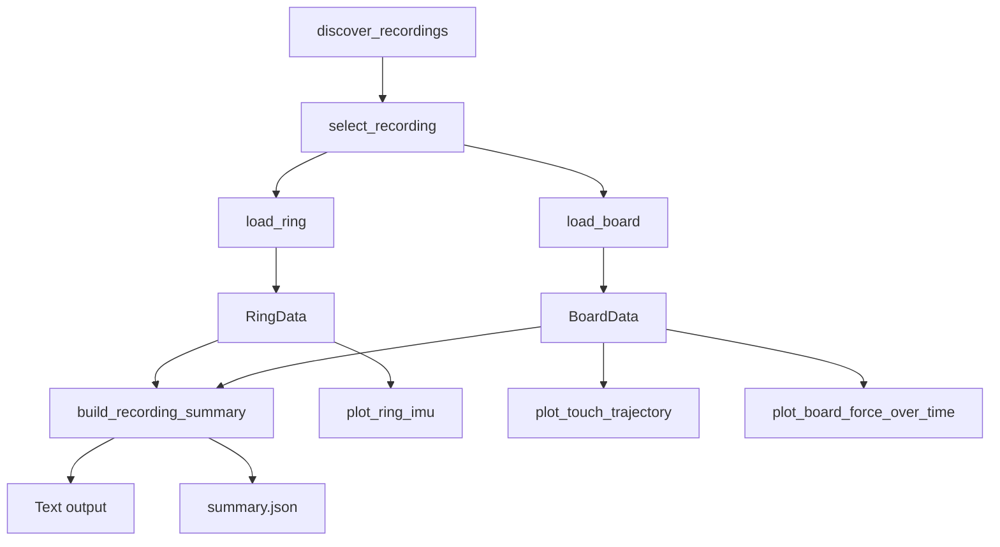

# WritingRing Project Report Task

## Objective

Create a comprehensive technical report for the complete WritingRing local data inspection and visualization project.

Write the final report to:

```text
docs/notes/PROJECT_REPORT.md
```

The report must explain the project from beginning to end:

1. what the dataset author's original code does;
2. what data-format conclusions were extracted from it;
3. why the new project was created;
4. what every current module, script, and notebook is responsible for;
5. how the public functions call one another;
6. how raw files become validation reports, DataFrames, summaries, JSON files, and plots;
7. what the project currently achieves;
8. what remains unknown or intentionally unsupported.

This is a documentation-only phase.

Do not change implementation behavior unless a documentation-blocking contradiction is discovered.

---

# Required sources

Read the following before writing the report.

## Project instructions and existing documentation

* `AGENTS.md`
* `TASK.md`
* `PROGRESS.md`
* `README.md`, if it exists
* `docs/notes/DATA_FORMAT.md`

## Dataset-author reference code

Read the relevant code under:

```text
vendor/WritingRing/
```

At minimum:

* `vendor/WritingRing/ring_plot.py`
* `vendor/WritingRing/board_plot.py`
* `vendor/WritingRing/core/imu_data.py`
* `vendor/WritingRing/core/window.py`
* `vendor/WritingRing/core/sensel_lib/frame_data.py`
* `vendor/WritingRing/core/sensel_lib/board.py`

Read additional upstream files only when necessary to explain a referenced type, field, or behavior.

Treat `vendor/WritingRing` as read-only.

## Current implementation

Read all source modules under:

```text
src/writingring/
```

At minimum, explain:

* `discovery.py`
* `selection.py`
* `ring_loader.py`
* `board_loader.py`
* `plotting.py`
* `inspection.py`
* `__init__.py`

## Command-line tools

Read and explain:

* `scripts/list_recordings.py`
* `scripts/inspect_recording.py`
* `scripts/plot_recording.py`

## Notebook

Read:

* `notebooks/explore_recording.ipynb`

Explain its role and how it reuses the installed package.

## Tests and packaging

Inspect:

* `pyproject.toml`
* all files under `tests/`

Use tests to confirm intended behavior and important invariants.

Do not derive the report only from `PROGRESS.md`. Verify important claims directly from the current source code.

---

# Required report structure

## 1. Executive summary

Explain concisely:

* the original problem;
* the dataset organization;
* why the author scripts were insufficient as a reusable local analysis project;
* what the new project provides;
* the current end-to-end result.

Include a compact pipeline such as:

```text
WritingRing raw files
→ recording discovery
→ recording selection
→ Ring loading and validation
→ Board loading and validation
→ structured summaries
→ Matplotlib plots
→ CLI or Notebook interface
```

---

## 2. Original upstream implementation

Explain what the dataset author's code provides.

Cover separately:

### Ring code

Explain:

* how `ring_plot.py` reads binary files;
* dtype;
* reshape width;
* confirmed column order;
* timestamp handling;
* the role of `IMUData`;
* assumptions or limitations in the upstream script.

### Board code

Explain:

* how `board_plot.py` loads board files;
* the use of `compress_pickle`;
* the role of `FrameData` and `ContactData`;
* how board chunks are handled;
* how contact coordinates and force are extracted;
* the `y` display transformation;
* timestamp filtering or plotting behavior.

### Upstream limitations for this project

Explain why the upstream scripts were treated as reference implementations instead of being used directly as the final architecture.

Examples may include:

* script-oriented rather than reusable APIs;
* limited validation;
* no unified recording discovery;
* no structured validation reports;
* no common CLI summary;
* no tested modular package;
* no explicit preservation and reporting of known anomalies.

Do not criticize the author unnecessarily. Distinguish between a research visualization script and a reusable engineering tool.

---

## 3. Confirmed dataset organization

Explain the hierarchy:

```text
data/
└── user_{id}/
    └── action_id/
        ├── dataset_ring_0.bin
        ├── dataset_ring_1.bin
        ├── dataset_timestamp.txt
        └── dataset_board_{chunk_index}.gz
```

Explain clearly:

* user ID;
* action ID;
* dataset ID;
* ring index;
* board chunk index;
* membership of files in one recording;
* why `ring_0` is primary;
* how `ring_1` is retained as metadata;
* why board chunks must be sorted numerically.

Link to `docs/notes/DATA_FORMAT.md` instead of duplicating every low-level format detail.

---

## 4. Project goals and design principles

Explain the main engineering principles:

* upstream source as the semantic reference;
* actual sample data used for verification;
* raw data preserved;
* anomalies reported instead of silently repaired;
* physical units not invented;
* inferred timestamp interpretation clearly labeled;
* Ring and Board not assumed synchronized;
* reusable library code separated from CLI and Notebook interfaces;
* sample and vendor directories treated as read-only;
* tests used to protect data semantics.

---

## 5. Final project architecture

Include the relevant directory tree and explain each layer.

Example:

```text
writingring-viz/
├── core/
├── vendor/WritingRing/
├── data_sample/
├── src/writingring/
├── scripts/
├── tests/
├── notebooks/
├── docs/
├── outputs/
├── pyproject.toml
└── README.md
```

Explain the important distinction among:

### `vendor/WritingRing`

Read-only dataset-author reference implementation.

### Root `core`

Compatibility namespace required when deserializing the author's pickled Board objects.

### `src/writingring`

The new modular and tested implementation.

### `scripts`

Thin command-line interfaces built on the reusable package.

### `notebooks`

Interactive exploration built on the same public package APIs.

### `tests`

Behavioral contracts and regression protection.

---

## 6. Module-by-module explanation

For every module under `src/writingring`, document:

* its purpose;
* its important public classes and functions;
* its inputs;
* its outputs;
* its errors;
* the modules it depends on;
* which higher-level components call it;
* important invariants it preserves.

Use subsections.

### `discovery.py`

Explain at least:

* filename parsing;
* filesystem traversal;
* `Recording`;
* dataset membership;
* numerical Board ordering;
* warnings for missing or duplicate components;
* why it does not open payload files.

### `selection.py`

Explain:

* exact user/action/dataset selection;
* zero-match behavior;
* multiple-match behavior;
* selector validation.

### `ring_loader.py`

Explain:

* accepted input types;
* protection against loading `ring_1`;
* NumPy loading and reshape;
* DataFrame construction;
* validation report;
* timestamp duplicate and backward-step detection;
* inferred relative-time handling;
* typed exceptions.

### `board_loader.py`

Explain:

* accepted input types;
* official pickle-class import;
* exact Board chunk order;
* `compress_pickle.load`;
* chunk-level reports;
* frame-level DataFrame;
* contact-level DataFrame;
* empty frame preservation;
* `y_raw` and `y_display`;
* within-chunk and cross-chunk timestamp validation;
* Dataset 0 anomaly preservation;
* typed exceptions.

### `plotting.py`

Explain:

* Ring IMU plotting;
* touch trajectory plotting;
* Board force plotting;
* supported time-axis modes;
* warning footer behavior;
* empty-data handling;
* output saving;
* why synchronization and timestamp repair are not performed.

### `inspection.py`

Explain:

* common recording summary;
* readable text formatting;
* strict JSON conversion;
* handling of Paths, dataclasses, enums, NumPy values, and non-finite floats;
* why both CLIs use one summary source.

### `__init__.py`

Explain how the public package API is defined and why consumers should import from `writingring` rather than internal modules when practical.

---

## 7. Important data structures

Document the major types and their relationships.

At minimum include:

* `Recording`;
* parsed filename representation;
* `RingData`;
* Ring validation report;
* timestamp interpretation;
* `BoardData`;
* Board chunk report;
* Board validation report;
* frame-level DataFrame;
* contact-level DataFrame;
* summary dictionary.

Include a table with columns such as:

| Type | Created by | Contains | Consumed by |
| ---- | ---------- | -------- | ----------- |

Clearly distinguish:

* raw stored data;
* derived columns;
* validation metadata;
* inferred interpretations;
* user-facing summaries.

---

## 8. Function call and dependency flow

Provide a clear explanation of how the major functions connect.

Include a Mermaid flowchart similar to:



Verify the names against the current implementation.

Also include a module dependency diagram if useful.

Do not invent function calls that do not exist.

---

## 9. End-to-end workflows

Explain each major user workflow step by step.

### Workflow A: list recordings

Trace:

```text
list_recordings.py
→ argument parsing
→ discover_recordings
→ recording metadata formatting
→ terminal output
```

### Workflow B: inspect one recording

Trace:

```text
inspect_recording.py
→ discover_recordings
→ select_recording
→ load_ring
→ load_board
→ build_recording_summary
→ readable text
→ optional strict JSON
```

### Workflow C: generate plots

Trace:

```text
plot_recording.py
→ discover and select
→ load Ring and Board
→ plot three figures
→ write summary.json
→ close figures in noninteractive mode
```

Explain the generated files:

* `ring_imu.png`;
* `touch_trajectory.png`;
* `board_force_time.png`;
* `summary.json`.

### Workflow D: use the Notebook

Explain:

* package import;
* discovery table;
* selection;
* loading;
* summaries;
* DataFrame previews;
* plotting;
* independent Ring and Board filtering;
* why the filters do not imply synchronization.

### Workflow E: direct Python API

Include a concise complete example that uses only the public API.

---

## 10. Data transformations

Trace important transformations explicitly.

### Ring path

```text
ring_0.bin
→ float64 vector
→ reshape N × 7
→ raw-column DataFrame
→ validation statistics
→ optional inferred relative-time column
→ plots and summaries
```

Explain which values are raw and which are inferred.

### Board path

```text
board chunk paths
→ numeric order
→ gzip/pickle deserialization
→ FrameData objects
→ frame table
→ contact table
→ y display transformation
→ validation reports
→ plots and summaries
```

Explain that:

```python
y_display = 1.0 - y_raw
```

is a display transformation, not a modification of stored data.

---

## 11. Validation and error-handling strategy

Summarize the validation layers:

### Discovery validation

Filename and recording membership.

### Ring validation

Binary shape, finite values, timestamp properties, channel statistics.

### Board validation

Path order, object types, missing fields, empty chunks, empty-contact frames, coordinate/force values, timestamp boundaries.

### Plotting validation

Required columns, supported axes, output paths, malformed inputs.

### CLI error handling

Concise messages and nonzero status without unnecessary tracebacks.

Include representative typed exceptions, but do not produce an exhaustive source-code dump.

---

## 12. Dataset 0 case study

Use Dataset 0 as an example of why the project preserves and reports anomalies.

Explain:

* chunks `0..15` are retained;
* chunk 0 is empty;
* the boundary from chunk 6 to 7 moves backward;
* the exact recorded delta;
* no timestamp sorting;
* no repair;
* no automatic split;
* no chunk deletion;
* how the warning appears in summaries and figures.

Explain why this behavior belongs in the loader and plotting policy.

Do not claim the cause of the anomaly is known.

---

## 13. Testing strategy

Explain the test organization and what each group protects.

Cover:

* discovery tests;
* Ring loader tests;
* Board loader tests;
* plotting tests;
* selection tests;
* CLI tests;
* Notebook execution verification.

Explain the difference between:

* synthetic unit tests;
* real-sample verification;
* read-only source-tree hash checks;
* end-to-end acceptance runs.

Record the final test count only after running the current full test suite.

---

## 14. Packaging and environment

Explain:

* Python version;
* Conda environment;
* editable installation;
* `src` layout;
* why root `core` must also be importable;
* how `pyproject.toml` exposes both the new package and pickle compatibility namespace;
* why `PYTHONPATH=src` is no longer required.

Include:

```bash
conda activate writingring-viz
python -m pip install -e .
```

---

## 15. Current implementation effect

Describe concretely what the project can now do.

For example:

* discover recordings across users/actions;
* select an exact dataset ID;
* validate Ring data;
* validate and preserve all Board chunks;
* identify empty and anomalous chunks;
* provide structured DataFrames;
* generate local Matplotlib figures;
* produce human-readable and strict JSON summaries;
* operate through Python, CLI, and Jupyter;
* preserve the author's raw data semantics.

Avoid overstating unsupported capabilities.

---

## 16. Known limitations and non-goals

Document clearly:

* undocumented physical units;
* inferred Ring timestamp interpretation;
* no confirmed Ring–Board synchronization;
* unresolved meaning of `ring_1`;
* unresolved reason for empty initial Board chunks;
* unresolved Dataset 0 old tail;
* possible plot overdraw for dense recordings;
* no filtering, segmentation, ML model, trajectory reconstruction, or synchronization in the current project.

Separate current limitations from possible future extensions.

---

## 17. Future extension points

Describe reasonable future work without implementing it.

Possible areas:

* explicit anomaly policy for Dataset 0;
* optional downsampling for visualization;
* timestamp-source investigation;
* Ring–Board synchronization only after evidence is available;
* action-label documentation;
* segment extraction;
* ML preprocessing;
* WritingRing velocity-prediction reproduction.

Clearly state that these are future possibilities, not current features.

---

## 18. Usage quick reference

End the report with a compact reference containing:

* installation;
* list command;
* inspect command;
* plot command;
* Notebook path;
* test command;
* main generated outputs.

---

# Evidence and accuracy requirements

For important claims:

* refer to the relevant source path;
* mention the class or function name where practical;
* distinguish source-code evidence from sample-data observations;
* distinguish confirmed behavior from inferred interpretation;
* distinguish current implementation from proposed future work.

Do not rely only on comments or `PROGRESS.md` when executable code provides stronger evidence.

Do not claim physical units, synchronization, or anomaly causes that remain unknown.

---

# Diagram requirements

Include at least:

1. one project architecture diagram;
2. one end-to-end data-flow diagram;
3. one major function-call diagram.

Use Mermaid diagrams inside Markdown.

Make sure Mermaid node labels are concise and compatible with standard Markdown renderers.

---

# Writing requirements

* Write the report in clear English.
* Use technical but readable language.
* Use headings and tables where useful.
* Prefer explanation over large source-code dumps.
* Include short code excerpts only when they clarify a data format or API.
* Ensure the report is useful to a new developer joining the project.
* Ensure the report can also serve as a technical appendix for future research work.
* Avoid repeating the same facts in every section.
* Link related sections when appropriate.

---

# Verification before finishing

Before finalizing the report:

1. Run the full test suite.
2. Verify the current public APIs.
3. Verify the current CLI `--help` output.
4. Verify the current project tree.
5. Confirm the Notebook exists and previously executed successfully, or execute it again if required by the current acceptance instructions.
6. Check that all named source files and functions in the report actually exist.
7. Check that Mermaid diagrams match the real call flow.
8. Confirm that no implementation, sample data, or upstream source was modified.

Update `PROGRESS.md` with:

* report path;
* sections completed;
* commands run;
* exact test result;
* documentation-only file changes;
* remaining limitations.

Do not add new implementation features during this task.
