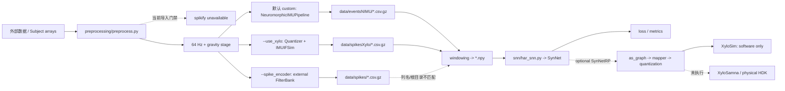
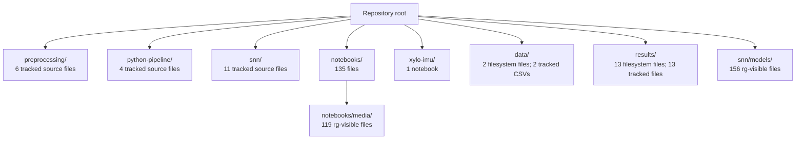
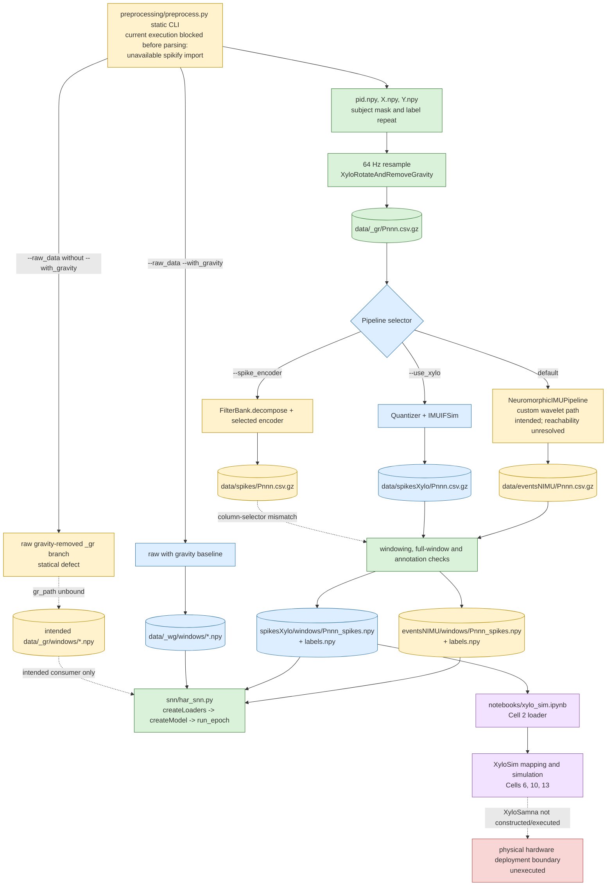

# Neuromorphic-Gravity Project Summary

## 1. 执行摘要、仓库状态与项目架构

本仓库研究 IMU 信号的重力处理、时频/滤波编码、脉冲神经网络分类、NeuroBench 评估，以及 Rockpool/Xylo 的软件与硬件边界。最完整的静态意图是：`preprocessing/preprocess.py` 产生 64 Hz、15 通道窗口，`snn/har_snn.py` 将其送入默认 `SynNet`。但这不是当前可复现的端到端生产路径：`preprocess.py` 在解析 CLI 之前无条件导入 `spikify`，而该依赖不可用；默认 custom 分支随后还追加一个无仓库相对回退的绝对 `python-pipeline` 路径。故“默认 custom 路径是被强烈推断的生产意图；当前可执行可达性为 Unresolved”。`preprocessing/preprocess.py:L13-L27`, `preprocessing/preprocess.py:L223-L268`, `preprocessing/spike_encoders.py:L40-L58`。

Phase 1 的基线是 `main...origin/main [ahead 1]`；`environment.yml` 的改动和 `environment.original.yml` 的未跟踪状态均早于本调查，且被保留。当前声明的环境和导出的旧环境并不完全一致，因此“哪个环境是权威可复现环境”仍为 **Unresolved**；所有 `environment.yml` 版本比较只是配置声明，并非已安装运行时版本。完整三方比较见 Appendix A。

本报告使用三种置信度：**Confirmed** 表示由仓库调用/源码或受控观测直接支持；**Strongly inferred** 表示生产者—消费者意图明确但可达性或外部条件未证实；**Unresolved** 表示缺依赖、缺运行证据、缺元数据或硬件边界。对 Rockpool/NeuroBench/Samna 的说法另标注 E1（仓库）、E2（确切已安装源码）或 E3（最小运行时观测）。



图中的实线描述 E1 静态调用/持久化意图；`spikify` 门禁意味着这些预处理实线目前不能从 CLI 实际走通。`XyloSim` 是软件模拟，`XyloSamna`/HDK 是未执行的硬件专用边界。`preprocessing/preprocess.py:L13-L27`, `preprocessing/preprocess.py:L301-L351`, `snn/har_snn.py:L30-L145`, `notebooks/xylo_sim.ipynb`, cells 0–16。

## 2. 活跃端到端数据流

`preprocess.py` 的静态流程读取 `pid.npy`、`X.npy`、`Y.npy`，按 subject 选择并重采样到 64 Hz，再通过 `XyloRotateAndRemoveGravity()` 写入 `data/<dataset>_gr/Pnnn.csv.gz`。随后选择 default custom、`--use_xylo`，或 `--spike_encoder` 分支；窗口逻辑仅保存完整的 `int(64 * window_size)` 段，默认 `--window_size=10.0` 对应 640 样本。`har_snn.py` 再按 raw/`--use_xylo` 标志选择窗口根目录并创建 loader/model。上述调用与持久化边界均为 **Confirmed E1**，但从预处理 CLI 入口的实际可达性仍被门禁阻断。`preprocessing/preprocess.py:L45-L55`, `preprocessing/preprocess.py:L94-L99`, `preprocessing/preprocess.py:L112-L196`, `preprocessing/preprocess.py:L301-L351`; `snn/har_snn.py:L30-L93`。

路径分类如下：

| 路径 | 分类与当前状态 |
|---|---|
| 默认 custom → `eventsNIMU/windows` → default SNN | **Strongly inferred intended active production; current executable reachability Unresolved**。目录意图和消费端匹配，但有 `spikify` 与绝对导入两层门禁。 |
| `--use_xylo` → `spikesXylo/windows` → `har_snn.py --use_xylo` | **Active optional intent; current reachability blocked**。flag 和消费者匹配。 |
| raw with gravity | **Active optional intent; current reachability blocked**。`_wg/windows` 与 SNN selector 匹配。 |
| raw gravity-removed `_gr` | **Unresolved / statically defective**：`gr_path` 仅在 `not args.raw_data` 下赋值，却在 `args.raw_data` 下被引用。 |
| standalone `FilterBank` | **Unresolved / likely defective; current reachability blocked**：依赖缺失、`spikes_*`/`spikenc` 不匹配、无 SNN root。 |
| `prepareWindows()` | **Dead or unexecuted**：未发现 caller，且返回未定义的 `windowsPath`。 |
| `xylo_sim.ipynb` | **Experimental software simulation**。 |
| 物理 Xylo | **Unexecuted hardware-only boundary**。 |

`preprocessing/preprocess.py:L112-L163`, `preprocessing/preprocess.py:L198-L221`, `preprocessing/preprocess.py:L273-L294`, `preprocessing/prepare_data.py:L7-L29`, `snn/har_snn.py:L30-L38`, `notebooks/xylo_sim.ipynb`, cells 0–17。Phase 2 范围内没有建立任何 legacy 路径；后续发现的 `snn/snn.py` 与 `mnist_snn.py` 见第 12 节。

## 3. Custom Wavelet 数学

令 `n=0,...,M-1`，`c=(M-1)/2`，`x_n=(n-c)/s`，并令严格支持掩码为 `χ(x_n)=1{-1/2 < x_n < 1/2}`。仓库精确实现为：

\[
\psi_{power}=\sqrt{1/s}\,χ(x)\,{40\over3}x(4x^2-1)^3,
\quad
\psi_{acceleration}=\sqrt{1/s}\,χ(x)\,{29\over4}x(4x^2-1),
\]
\[
\psi_{velocity}=\sqrt{1/s}\,χ(x)\,{11\over7}(4x^2-1)^2.
\]

`powerWavelet()` 和 `accelerationWavelet()` 关于中心为奇对称，`velocityWavelet()` 为偶对称；端点因严格不等式被排除。`sqrt(1/s)` 是实现的尺度归一化，但代码没有离散能量再归一化或采样间隔因子，因此物理单位、离散 unit-energy、以及 `frequencies` 的物理中心频率解释均为 **Unresolved**。`python-pipeline/wavelets.py:L4-L36`。

默认 caller 固定 `sampleFreq=64`、`frequencies=[0.5,1,2,4,8]`，所以 `s=int(64/f)` 为 `[128,64,32,16,8]`。`WaveletFIRFilterModule` 的概念是采样核的因果 tapped-delay 卷积；它不在选定 pipeline 中。选定的 `WaveletIIRFilterModule` 则对每个 `waveletFunc(s,s)` 做 `prony(h,2,2)`，实现二阶 AR/MA 递推：

\[
y_{d,k}[t]=b_{0,k}x_d[t]+b_{1,k}x_d[t-1]+b_{2,k}x_d[t-2]
-a_{1,k}y_{d,k}[t-1]-a_{2,k}y_{d,k}[t-2].
\]

输入/输出历史从零开始。源代码没有稳定性极点检查或精确相位/群延迟计算，故每个 Prony IIR 的稳定性和精确延迟为 **Unresolved**。这不是 production true CWT；notebook 中的 `scipy.signal.cwt()` 是实验性路径。`python-pipeline/modules.py:L215-L255`, `python-pipeline/modules.py:L258-L306`, `python-pipeline/utils.py:L4-L86`, `notebooks/wavelet_experiments.ipynb`, cells 7–15。

## 4. Custom Wavelet 实现与参数来源

默认分支每个 subject 只构造一次 `NeuromorphicIMUPipeline`，随后对每一行的 `[x,y,z]` 调用同一实例：

```text
torch.Tensor([x,y,z])
  -> Identity                    # globalFrame=True
  -> Identity                    # usePower=False
  -> WaveletIIRFilterModule
  -> MaxFilterModule(usePower=False)
  -> (3,5) signed amplitudes
```

caller 显式覆盖 `usePower=False`、`singleDim=False`、`frequencies=[0.5,1,2,4,8]`、`waveletFunc=accelerationWavelet`；`globalFrame=True` 与构造器默认相同。构造器的 `maxFiltWin=(0.3,0.5)` 在该配置下给出 frequency window 1、time window 19，状态为 `(3,5,18)`；`beta=1`、`threshold=1` 虽用于构造本地 `snn.Leaky`，但该对象没有加入 `self.model`，所以不影响执行输出。`quantized=False` 也未被读取。`AbsModule`、`QuantizerModule`、FIR、local-frame 和 power 模块均未在此默认链执行。`python-pipeline/modules.py:L19-L98`, `python-pipeline/modules.py:L101-L255`, `python-pipeline/modules.py:L331-L371`; `preprocessing/preprocess.py:L223-L257`。

对 `usePower=False`，`MaxFilterModule` 的输出不是 binary spike：

\[
e[t]=c[t]1\{c[t]=\max(W_t)\}+c[t]1\{c[t]=\min(W_t)\}.
\]

两个判定独立求值；常数非零窗口使二者同时成立，输出为 `2c[t]`。因此结果是 **unbounded signed amplitude**，不保证稀疏，也不是单次中心响应。`python-pipeline/modules.py:L345-L366`。

新实例的 IIR `(3,2)`/`(3,5,2)` 与 extrema `(3,5,18)` buffer 均为零；该实例跨行复用且无 reset，所以同一 run 内后面的输出依赖前面样本。Phase 11 的唯一 CPU 检查以 caller-derived 64 Hz 配置和 20 行包含数据运行 direct module，得到 `torch.float32`、`(20,3,5)`、8 个非零输出，且两类 state 均非零。这是 **Confirmed E3** 的 direct-module 结论，不解除 CLI 门禁，也不确定 CSV/`.npy` dtype。`python-pipeline/modules.py:L281-L306`, `python-pipeline/modules.py:L341-L364`, `preprocessing/preprocess.py:L238-L253`; Appendix G, Phase 11。

## 5. Rockpool NIMU / `IMUIFSim`

`--use_xylo` 是静态可选分支。E1 中，前置重力阶段先对三轴数据做 `XyloRotateAndRemoveGravity()`；分支再将 `input_data/2` clip 到 `(-1,1)`，以 `Quantizer(shape=3,num_bits=16)` 量化，并调用 `IMUIFSim(bypass_jsvd=True,sampling_freq=64,select_iaf_output=True)`。随后把全 subject 输出重整为 15 列 `spikes_*`，写 CSV，之后才切成 10 秒窗口。`preprocessing/preprocess.py:L112-L196`, `preprocessing/preprocess.py:L259-L351`。

Rockpool 2.9.1 的 E2 源码表明：未传 `filter_list` 时使用 15 条 `DEFAULT_FILTER_BANDS`；`select_iaf_output=True` 选择默认阈值 1024 的 `IAFSpikeEncoder`。仓库计算的频率值只用于 label/实验，并没有传给 `IMUIFSim`，因此 label 与固定滤波器系数在 64 Hz 下的物理对应关系为 **Unresolved**。输出经 rectification/integration/count-difference 后被 clip 为每时间/通道 `0` 或 `1` 的非负 Boolean event。`/home/ted/miniconda3/envs/xyloIMU/lib/python3.10/site-packages/rockpool/devices/xylo/syns63300/imuif_sim.py:L49-L140`, `/home/ted/miniconda3/envs/xyloIMU/lib/python3.10/site-packages/rockpool/devices/xylo/syns63300/imuif/spike_encoder.py:L91-L160`, `/home/ted/miniconda3/envs/xyloIMU/lib/python3.10/site-packages/rockpool/devices/xylo/syns63300/imuif/params.py:L31-L48` (E2)。

一次 `IMUIFSim.evolve()` 接收完整 `(T_subject,3)`，自动 batch 为 `(1,T_subject,3)`，产生 `(1,T_subject,15)`，然后才持久化/窗口化为 `(640,15)`。其 FilterBank 使用整个 subject 的 reversed prefix 减少起始边界影响，故 subject 开头不是严格因果；FilterBank 与 IAF state 在每次 subject-level `evolve()` 开始，而不是每个保存窗口开始时重置。`preprocessing/preprocess.py:L176-L196`, `preprocessing/preprocess.py:L301-L351`, `/home/ted/miniconda3/envs/xyloIMU/lib/python3.10/site-packages/rockpool/devices/xylo/syns63300/imuif/filterbank.py:L85-L171` (E1/E2)。

## 6. Active standalone `FilterBank` Encoding

standalone 分支经 `preprocessing/spike_encoders.py` 从 `spikify.filtering.FilterBank` 导入。若门禁被修复，其 caller 会请求 `FilterBank(fs=64,channels=5,f_min=0.32,f_max=10.24,order=1)`，在完整 `(T_subject,3)` 重力去除输入上执行 `decompose().reshape(-1,15)`，再交给 CLI 选择的 encoder。此处 15 通道与 `x` 五 band、`y` 五 band、`z` 五 band 的标签顺序只是 **Strongly inferred**；`spikify` 缺失使中心频率、滤波数学、实际 shape/memory order、dtype、range、causality 和 state 均为 **Unresolved**。`preprocessing/preprocess.py:L198-L221`, `preprocessing/spike_encoders.py:L40-L58`。

即使依赖可用，producer 写 `spikes_*`，但窗口代码筛选 `spikenc`，静态结果是零列；`har_snn.py` 也没有 `spikes<encoder>/windows` root。因此它不是已建立的 SNN producer contract；metrics utility 只是同样受导入门禁阻断的静态 CSV consumer。`preprocessing/preprocess.py:L219-L221`, `preprocessing/preprocess.py:L314-L325`, `snn/har_snn.py:L30-L38`, `preprocessing/spike_encoder_neurobench_utils.py:L31-L44`。

## 7. 三个编码器家族比较

| 维度 | Custom wavelet | NIMU / `IMUIFSim` | standalone `FilterBank` |
|---|---|---|---|
| 滤波构造 | 仓库多项式 `accelerationWavelet` 的五个二阶 Prony IIR。 | Rockpool 2.9.1 的每轴五 default band。 | 外部 `spikify`，内部数学 Unresolved。 |
| 输入量化/阈值 | 选定链没有 output threshold 或 quantization。 | repository 16-bit Quantizer；默认 IAF threshold 1024。 | Unresolved。 |
| state 与因果性 | IIR/extrema history 跨行保留；精确相位/稳定性 Unresolved。 | full-subject reversed prefix；state 每个 `evolve()` 重置，非每 window。 | Unresolved。 |
| 输出语义 | unbounded signed amplitude，常数窗口可能双倍。 | non-negative binary 0/1 event。 | filter response 后接未知 external encoder。 |
| 目标顺序 | `(x five,y five,z five)`，15。 | 同一 axis-major/band-minor，15（E2）。 | 同一标签意图；实际 layout Unresolved。 |
| SNN 关系 | 默认 `eventsNIMU` root 的意图匹配。 | `spikesXylo` root 的意图匹配。 | 无有效 window/SNN contract。 |
| Xylo 关联 | 未建立 direct export。 | 直接 IMU-interface relevance；物理部署未执行。 | 未建立。 |

比较只陈述当前仓库 wiring 与 E2 Rockpool 行为；不把缺失 `spikify` 的属性推断为 wavelet 或普通 band-pass。相关 shape/参数证据见 Appendix B、C、H。

## 8. Encoder Shape Ledgers 与 SNN Input Contracts

| 家族 | subject-level producer | 默认持久化窗口 | 默认 SNN contract | 关键限制 |
|---|---|---|---|---|
| Custom | `(T_subject,3)` → `(T_subject,3,5)` → `(T_subject,15)` signed amplitudes。 | 预期 `(N,640,15)`，`events_*`。CSV/`.npy` dtype Unresolved。 | `(B,T,15)`，默认 `SynNet inputSize=15`。 | 当前 producer blocked；polarity 为 `(T,30)`，但与 rectification 同开有 30-vs-15 静态错配。 |
| NIMU | `(T_subject,3)` → `(1,T_subject,15)` → `(T_subject,15)` Boolean events。 | 预期 `(N,640,15)`，`spikes_*`。reload dtype Unresolved。 | `(B,T,15)`，默认 `inputSize=15`。 | 若 Boolean `0/1` 重新读入成功，polarity 的负半部恒为零。 |
| standalone | 意图 `(T_subject,3)` → `(T_subject,15)`。 | 当前 selector 静态为 `(N,640,0)`。 | 无 root/有效 consumer。 | 依赖及 `decompose()` contract Unresolved。 |

`har_snn.py` 把 `inputSize` 硬编码/flag 派生为 15 或 30，而不是从 loaded data 推导。默认 sequence model 不改变 `(B,T,15)`；`SNNMLP` 的默认 flatten 算术恰好是 `640×15=9600`，但 polarity、time compression、padding、非 10 秒 window 时需重新核算。`ANNMLP`、`LSTMNetANN`、`CNNNetANN` 对普通 15-channel window 不兼容。`snn/har_snn.py:L42-L93`, `snn/utils_datasets.py:L31-L59`, `snn/utils_datasets.py:L344-L385`, `snn/utils_architectures.py:L155-L208`, `snn/utils_architectures.py:L280-L331`, `snn/utils_architectures.py:L403-L471`。

## 9. Primary SNN 架构与神经元动力学

默认 parser 选择 local snnTorch `SynNet`，而不是 `SynNetRP`：Capture24/Willetts 的默认尺寸为 `15→24→24→24→6`。`SynNet.forward()` 按 `x[:,step]` 处理 batch-major `(B,T,C)`，并堆叠 `(B,T,C_out)` 的最终 output spikes；分类使用时间求和并归一化的 spike score，不是 membrane state。`snn/utils_parser.py:L9-L36`, `snn/har_snn.py:L42-L93`, `snn/utils_architectures.py:L40-L110`, `snn/utils_run.py:L26-L54`。

```mermaid
flowchart LR
  I[(B,T,15)] --> F1[fc1 15→24]
  F1 --> L1[Synaptic 24]
  L1 --> F2[fc2 24→24]
  F2 --> L2[Synaptic 24]
  L2 --> F3[fc3 24→24]
  F3 --> L3[Synaptic 24]
  L3 --> F4[fc4 24→6]
  F4 --> L4[Synaptic 6]
  L4 --> O[(B,T,6) spikes]
```

默认 `shiftSyn=2`、`shiftMem=1` 使 hidden decay 由 `α=1-2^{-shiftSyn}`（按 layer group）和 `β=1-2^{-shiftMem}=0.5` 决定；本地名义 `tauSyn`/`tauMem` 计算值没有被存储或传给 neuron。E2 的 installed `snntorch 0.9.4` 对 `Synaptic` 使用 synaptic/membrane state、delayed subtractive reset、trainable threshold（初值 1），以及 `atan(alpha=2)` surrogate 的 backward path。概念递推为 synaptic accumulation 后的 leaky membrane update，并在 spike 时应用延迟 reset；精确实现以 installed `Synaptic` 为准。`snn/utils_architectures.py:L45-L110`, `/home/ted/miniconda3/envs/xyloIMU/lib/python3.10/site-packages/snntorch/_neurons/synaptic.py:L200-L279` (E1/E2)。

每次 local `SynNet.forward()` 都 reset 四层 state，所以 state 只在单个 item 的 `T` 轴内保留，不跨 DataLoader batch 泄漏；没有 learned recurrent matrix。`SynNetRP` 是 **Active optional / deployment-relevant**，有 `as_graph()` 与 bitshift-derived time constants；repository-local `rockpool_nn_modules_torch_lif_torch.py` 未被选定路径导入。`snn/snn.py` 是 **Legacy path — statically defective standalone candidate entrypoint**，因 `from architectures import SynNet` 与实际的 `utils_architectures.py` 不符；`mnist_snn.py` 是无关 tutorial。`snn/utils_architectures.py:L70-L110`, `snn/rockpool_nn_networks_synnet.py:L25-L320`, `snn/snn.py:L1-L66`, `snn/mnist_snn.py:L1-L79`。

## 10. 训练与评估

`createLoaders()` 用标准化 subject split `[20,5,5]`，对 train/validation 做 class balancing；默认 batch size 为 256。`har_snn.py` 用 Adam、`lr=5e-4`、20 epochs；默认 objective 是 `CrossEntropySpkReg(alpha=0)`。`CrossEntropySpkReg`/`TimeFirstWin` 是 loss，而 snnTorch `atan(alpha=2)` 是通过 `loss.backward()` 到达的 spike-function surrogate，不是 loss。`snn/utils_datasets.py:L61-L197`, `snn/har_snn.py:L127-L146`, `snn/utils_losses.py:L1-L158`, `snn/utils_run.py:L10-L54`。

评估累积 `y_true`/`y_pred` 并计算 accuracy、balanced accuracy、AUROC、F1、kappa、MCC 等。`sklearn.metrics.confusion_matrix` 的 class order 来自 `dataloader.dataset.targ_dict.keys()`，行/列名来自 `.values()`；结果无条件包装为 `wandb.Table`，即使 `--use_wandb` 为 false，只有 `wandb.init()`/`wandb.log()` 受 flag 保护。因此在未使用 W&B 时，table construction 仍是依赖边界。没有训练、checkpoint load、W&B 会话或网络访问被执行。`snn/utils_run.py:L55-L93`, `snn/har_snn.py:L108-L146`。

checkpoint load 若启用，只合并名字不含 `'4'` 的匹配 key，随后为 `fc1/lif1`、`fc2/lif2`、`fc3/lif3`、`fc4/lif4` 设置递增的分层 learning rate；此代码假定 local `SynNet` attribute layout，对 `SynNetRP` 的兼容性为 **Unresolved / likely defective**。`snn/har_snn.py:L108-L125`。

## 11. NeuroBench、Rockpool、量化、XyloSim 与硬件边界

`notebooks/neurobench.ipynb` 是实验性 `CNNNetSNN`/`TorchModel` workload，报告 Footprint、ConnectionSparsity、ActivationSparsity、SynapticOperations；它与 repository encoder reconstruction metrics 和 primary `SynNet` CLI 评估不同。notebook wiring 是 E1，NeuroBench 2.1.0 internals 是 E2，版本元数据是 E3。`notebooks/neurobench.ipynb`, cells 0–5；Appendix G, Phase 9。

optional `SynNetRP` 的 notebook chain 是 `as_graph()` → `mapper()` → `global_quantize(fuzzy_scaling=False)` → `config_from_specification()` → `XyloSim.from_config()`。`channel_quantize()` 仅是 commented/static alternative。E2 factory 实际调用 Samna validation 并返回 `(config,is_valid,msg)`，但 `xylo_sim.ipynb`, cell 6 只捕获结果、不检查便创建 `XyloSim`；因此“该 repository model 会产生有效 config”为 **Unresolved**。`notebooks/xylo_sim.ipynb`, cell 6；`notebooks/rockpool_transform_quantize_methods.py:L26-L405`; `/home/ted/miniconda3/envs/xyloIMU/lib/python3.10/site-packages/rockpool/devices/xylo/syns63300/xylo_samna.py:L35-L80` (E1/E2)。

global/per-channel helpers 的 source 值为 8-bit signed weight limit 127、16-bit threshold limit 32767；factory/mapper 限制是 dependency-source 约束，不是实测硬件性能。`XyloSim` 为软件模拟；`find_xylo_hdks`、`XyloSamna`、`IMUIFSamna` 与 power cells 仅在 tutorial 中，未被执行。没有 Samna object、硬件 discovery、部署、功耗或 timing measurement。`notebooks/rockpool_transform_quantize_methods.py:L26-L405`, `xylo-imu/xylo-imu-intro.ipynb`, cells 10, 15–22, 39–41, 60–72。

## 12. 支持脚本、重要 notebook、数据与结果

`preprocess.py`、custom `python-pipeline/*` 与 `snn/har_snn.py` 是理解主路径的核心脚本；`run_metrics.sh` 是 site-specific static metrics entrypoint，亦被 shared `spikify` import 阻断；`notebooks/compatibility.sh` 会备份/改写 installed `neurobench`，是未调用且不安全的 legacy utility。完整 script inventory 在 Appendix D。`preprocessing/run_metrics.sh:L1-L69`, `notebooks/compatibility.sh:L1-L103`。

重要 supporting notebook 均为 experimental 或 tutorial，不能把其 cell 值升级为 production default。优先读 `cwt_fir_iir.ipynb`、`module_test.ipynb`、`reconstruction_error.ipynb`（custom/NIMU 对比），再读 `har_snn.ipynb`、`xylo_sim.ipynb`、`neurobench.ipynb`（SNN/部署）；硬件 tutorial `xylo-imu-intro.ipynb` 的 HDK cells 仅作边界说明。notebook cell execution order/output freshness 均为 **Unresolved**。完整 inventory 与优先级见 Appendix E。

包含样本 `Subject001_left_global_acc.csv` 与 right 版本各有 `# time,acc_x,acc_y,acc_z,gyr_x,gyr_y,gyr_z`。left/right 数据行数分别为 532,820/532,838，观测间隔 `0.001953125 s`（512 Hz），时长约 1040.7 s。文件名支持 Subject001 与 left/right 身份；units、sensor make/model、以及 `global` 是否为已证明的坐标变换均为 **Unresolved**。`notebooks/test_MCU.ipynb`, cell 2；`xylo-imu/xylo-imu-intro.ipynb`, cell 30。

`results/fir_filter.pdf`、`iir_filter.pdf` 与 `nimu-reconstructed.pdf`、`xylo-reconstructed.pdf` 分别有 matching notebook `savefig` source；这只证明生成意图，不能证明当前 artifact 的实际执行来源。其余 spike PDF、W&B aggregate CSV/媒体与 AUROC 只有部分或 commented/static provenance。`snn/models/` 仅作为 checkpoint collection（156 `.pth`、约 26 MB）记录，未加载或枚举。Appendix F 给出 artifact map。

## 13. 学习路径与最小已验证复现工作流

| 阶段 | 目标与阅读顺序 | 已验证动作 / 预期 | 常见误解与完成条件 |
|---|---|---|---|
| 1 | 先读 `preprocess.py`、Appendix F/H，理解 import gate 与目录。 | 阅读静态 call graph；不运行 CLI。 | `--use_xylo` 是可选意图，不等于当前可执行。能指出 `spikify` 门禁即完成。 |
| 2 | 读 `wavelets.py`、`utils.py`、`modules.py`、`cwt_fir_iir.ipynb`。 | Appendix G Phase 11 的 direct custom module command 已验证 `(20,3,5)`。 | 不要把 IIR approximation 或 notebook CWT 当作 true production CWT。能写出三条 wavelet 方程即完成。 |
| 3 | 读 Appendix C 与 `utils_datasets.py`、`utils_architectures.py`。 | 静态确认 default `(B,640,15)` → `SynNet inputSize=15`。 | `inputSize` 是 hard-coded/flag-derived，不是 data-derived。能说明 15/30 变换条件即完成。 |
| 4 | 读 `utils_losses.py`、`utils_run.py`、`har_snn.py`。 | 静态追踪 loss、score、metrics、W&B boundary。 | surrogate gradient 不是 loss；`wandb.Table` 并非 flag-guarded。 |
| 5 | 读 `rockpool_nn_networks_synnet.py`、quantizer helper、`xylo_sim.ipynb` 和 tutorial。 | 仅阅读 E1/E2 chain；不创建 hardware object。 | `XyloSim` 不是 physical deployment；cell 6 忽略 validation result。 |

下表只列出实际执行过且记录在 Appendix G 的可复现命令；没有把未执行的训练、primary-SNN forward、metrics CLI 或 XyloSim 伪装成已验证步骤。

| 需要 | 已验证命令/状态 |
|---|---|
| 环境版本 | 已验证：`/home/ted/miniconda3/envs/xyloIMU/bin/python -c 'import importlib.metadata as m; print("rockpool",m.version("rockpool")); print("neurobench",m.version("neurobench"))'` → Rockpool 2.9.1、NeuroBench 2.1.0。没有验证 `conda activate` 命令，因此不建议把它当作已验证复现命令。 |
| minimal detailed encoder | 已验证：Appendix G Phase 11 的 exact `python -c ... NeuromorphicIMUPipeline(...)` command；direct-module scope、CPU-only。 |
| sample data | 已以只读 schema/interval inspection 验证；具体结果见第 12 节与 Appendix F。 |
| primary SNN forward / evaluation / metrics / XyloSim | **Not verified**：前者不需要额外 check；preprocess/metrics 被 `spikify` 阻断；XyloSim/config validity 和 checkpoint compatibility 未建立。 |
| hardware | **Not executed**，并且应与 software workflow 分离。 |

## 14. 开放问题、歧义与技术风险

- `spikify` 不可用，故 standalone `FilterBank` 的 version、math、state、dtype/order 及 external encoder output 都是 **Unresolved**；不应以标签名猜测实现。
- 默认 custom 与 NIMU 的 CLI producer 均受同一 pre-parser import gate 阻断；custom 还依赖不可移植的 absolute import path。
- custom CSV/reload/window `.npy` 的真实 dtype、NIMU Boolean persistence dtype、外部 data/model root 的存在性均未验证。
- custom physical units、wavelet frequency-scale calibration、Prony IIR 稳定性/精确相位；NIMU label-to-filter physical correspondence、gravity/frame scientific correctness仍为 **Unresolved**。
- `--rectify_spikes` 与 `--polarity_bichannel` 同开、standalone `spikes_*`/`spikenc`、non-10-second padding、以及多个 special model dimension 形成明确的静态 contract 风险。`snn/utils_datasets.py:L42-L59`, `preprocessing/preprocess.py:L314-L325`, `snn/har_snn.py:L64-L69`。
- notebook execution order、historical result/W&B provenance、actual checkpoint compatibility、mapped/quantized accuracy、Samna transport/timing/power 与 physical hardware behavior 均未建立；这些不能由当前静态或 CPU-only evidence 替代。

## 15. 关键结论

1. 仓库最清晰的设计目标是 64 Hz、三轴×五 band 的 15-channel IMU 编码后接 `SynNet`；这不是当前可运行的端到端 pipeline。
2. custom 默认路径输出的是 stateful、signed、unbounded extrema amplitudes，而非 binary spikes；NIMU 输出的是 15-channel Boolean IAF events。
3. custom 与 NIMU 的默认 `(640,15)` 意图均与 local `SynNet inputSize=15` 对齐；standalone `FilterBank` 没有有效 SNN handoff。
4. `SynNet` 是 primary local model；`SynNetRP`、mapper、quantization 与 `XyloSim` 是 optional/experimental deployment chain，physical Xylo 仍是未执行边界。
5. 最重要的复现前修复点是依赖/相对导入、standalone column/root contract、dtype persistence 与 configuration-validation handling；任何硬件或历史结果主张都应等待相应证据。

以下 Appendices A–H 保留 Phase 1–11 的详细参数来源、shape ledger、inventories、commands 与分类证据。

## Appendix A. Important Symbols and Variables

### Phase 1 — Repository and environment baseline

| Item | Observed value | Confidence | Evidence |
|---|---|---|---|
| Git branch / commit / upstream relation | `main` / `47c0289b10b390ae27527810df5dedaefa47006a` / `main...origin/main [ahead 1]` | Confirmed | Read-only `git status -sb` and Git revision inspection, 2026-07-28. |
| Pre-existing working-tree state at Phase 1 start | `environment.yml` was modified and mode-changed from `100644` to `100755`; `environment.original.yml` was untracked. | Confirmed | Phase-start read-only `git status`, diff, index-mode, and `stat` inspection. These changes were preserved. |
| Files created or modified during Phase 1 | `docs/PROJECT_SUMMARY_REPORT.md` was created as an untracked evidence file; the already-tracked `PROGRESS.md` was modified to record Phase 1. | Confirmed | Phase-1 before/after `git status --short`; only these permitted evidence/log files were written. |
| Declared environment name | `xyloIMU` | Confirmed | `environment.yml:L1`; `environment.original.yml:L1`. |
| Locally modified declaration | Python `3.10`; CPU PyTorch wheel index; `torch==2.6.0`, `torchvision==0.21.0`, and `torchaudio==2.6.0` | Confirmed | `environment.yml:L9-L10`, `environment.yml:L29-L38`. |
| Locally declared neuromorphic stack | `neurobench==2.1.0`, `rockpool==2.9.1`, `samna==0.43.0.0`, `xylosim==0.1.3`, plus `tonic`, `sinabs`, and `snntorch` | Confirmed | `environment.yml:L40-L50`. |
| Active interpreter availability check | Python `3.10.20`; module specs present for `torch`, `neurobench`, `rockpool`, `samna`, `xylosim`, `tonic`, `sinabs`, `snntorch`, `jax`, `pywt`, and `wandb` | Confirmed (availability only) | Phase-1 read-only `importlib.util.find_spec()` check. It does not establish installed package versions. |
| Exported-prefix evidence | The untracked file named `environment.original.yml` records `/home/igavier_umass_edu/.conda/envs/xyloIMU`; its authorship and relationship to the tracked specification are not established. | Confirmed fact; Unresolved provenance | `environment.original.yml:L241`. |

### Phase 1 — Three-way environment declaration comparison

All entries below are **configuration declarations only**, not installed-runtime versions. `HEAD:environment.yml` denotes the committed Git blob; the local `environment.yml` is modified; `environment.original.yml` is untracked. The backend column records declared PyTorch distribution/runtime packages, not observed hardware capability.

| Declaration | Committed `HEAD:environment.yml` | Locally modified `environment.yml` | Untracked `environment.original.yml` | Evidence |
|---|---|---|---|---|
| Python | `3.9.21=h9c0c6dc_1_cpython` | `3.10` | `3.10` | `HEAD:environment.yml:L37-L37`; `environment.yml:L9-L9`; `environment.original.yml:L37-L37` |
| NumPy | `2.0.2` | `1.26.4` | `1.26.4` | `HEAD:environment.yml:L132-L132`; `environment.yml:L16-L16`; `environment.original.yml:L132-L132` |
| PyTorch and backend packages | `torch==2.6.0`, `torchvision==0.21.0`, `torchaudio==2.8.0`, and explicitly pinned `nvidia-*` CUDA packages | `torch==2.6.0`, `torchvision==0.21.0`, `torchaudio==2.6.0`, CPU wheel index; no explicit `nvidia-*` entries | `torch==2.6.0`, `torchvision==0.21.0`, `torchaudio==2.8.0`, and explicitly pinned `nvidia-*` CUDA packages | `HEAD:environment.yml:L133-L146`, `HEAD:environment.yml:L219-L221`; `environment.yml:L29-L38`; `environment.original.yml:L133-L146`, `environment.original.yml:L219-L221` |
| Rockpool | `2.9.1` | `2.9.1` | `2.9.1` | `HEAD:environment.yml:L185-L185`; `environment.yml:L42-L42`; `environment.original.yml:L185-L185` |
| NeuroBench | `2.1.0` | `2.1.0` | `2.1.0` | `HEAD:environment.yml:L128-L128`; `environment.yml:L41-L41`; `environment.original.yml:L128-L128` |
| Samna | `0.43.0.0` | `0.43.0.0` | `0.43.0.0` | `HEAD:environment.yml:L187-L187`; `environment.yml:L43-L43`; `environment.original.yml:L187-L187` |
| Tonic | `1.6.0` | `1.6.0` | `1.6.0` | `HEAD:environment.yml:L218-L218`; `environment.yml:L45-L45`; `environment.original.yml:L218-L218` |
| Sinabs | `3.1.0` | `3.1.0` | `3.1.0` | `HEAD:environment.yml:L193-L193`; `environment.yml:L46-L46`; `environment.original.yml:L193-L193` |
| snnTorch | `0.9.4` | `0.9.4` | `0.9.4` | `HEAD:environment.yml:L197-L197`; `environment.yml:L47-L47`; `environment.original.yml:L197-L197` |
| XyloSim | `0.1.3` | `0.1.3` | `0.1.3` | `HEAD:environment.yml:L238-L238`; `environment.yml:L44-L44`; `environment.original.yml:L238-L238` |

### Phase 1 — External path variables

| Path / variable | Repository use observed | Confidence | Evidence |
|---|---|---|---|
| `DEFAULT_BASE_PATH` | `/work/pi_sunghoonlee_umass_edu/Ignacio` is the default dataset base for the preprocessing CLI. | Confirmed | `preprocessing/preprocess.py:L57-L71`. |
| NeuroBench utility `DEFAULT_BASE_PATH` | The same absolute `/work/pi_sunghoonlee_umass_edu/Ignacio` default occurs in the metrics utility. | Confirmed | `preprocessing/spike_encoder_neurobench_utils.py:L73-L76`. |
| `data_path` | The SNN script forms dataset/window paths below `/work/pi_sunghoonlee_umass_edu/Ignacio/`. | Confirmed | `snn/har_snn.py:L30-L38`. |
| `model_path` | SNN checkpoints are pointed at `/home/igavier_umass_edu/Documents/Neuromorphic-IMU/snn/models/`. | Confirmed | `snn/har_snn.py:L40-L42`. |
| SNN import root | `har_snn.py` appends an absolute repository `snn/` path before local imports. | Confirmed | `snn/har_snn.py:L1-L9`. |
| `python-pipeline` import root | Two preprocessing scripts append an absolute `/home/igavier_umass_edu/Documents/Neuromorphic-IMU/python-pipeline/` path. | Confirmed | `preprocessing/preprocess.py:L223-L227`; `preprocessing/spike_encoder_neurobench_utils_xylo_nimu.py:L1-L5`. |
| Metrics shell `BASE_PATH` | The SLURM shell script hard-codes `/work/pi_sunghoonlee_umass_edu/Ignacio`. | Confirmed | `preprocessing/run_metrics.sh:L12-L23`. |
| NIMU results directory | `results_dir` defaults to `<base_path>/metrics`. | Confirmed | `preprocessing/spike_encoder_neurobench_utils_xylo_nimu.py:L18-L32`. |

These user- and site-specific absolute paths are a **Confirmed portability risk**: outside the original filesystem layout, CLI overrides or code/environment changes are required; the Phase 1 evidence does not establish whether those roots are available elsewhere.

### Phase 1 — Environment uncertainty

The current `environment.yml` is a locally modified, shorter specification, whereas the committed Git blob declares Python 3.9.21, NumPy 2.0.2, `torchaudio==2.8.0`, and explicit CUDA packages. The untracked file resembles the older expanded declaration except that it declares Python 3.10 and NumPy 1.26.4. The intended reproducible environment is therefore **Unresolved** despite successful import availability in the current interpreter.

### Phase 3 — Custom wavelet mathematics

Let `n = 0, ..., M - 1`, `c = (M - 1) / 2`, and

\[
x_n = \frac{n-c}{s}, \qquad \chi(x_n)=\mathbf{1}\{-\tfrac12 < x_n < \tfrac12\}.
\]

`M` is the returned sample count and `s` is the width in samples according to the function docstrings. The exact implementations are:

\[
\psi_{\mathrm{power}}[n;s] = \sqrt{\frac1s}\,\chi(x_n)\,\frac{40}{3}x_n(4x_n^2-1)^3,
\]

\[
\psi_{\mathrm{acceleration}}[n;s] = \sqrt{\frac1s}\,\chi(x_n)\,\frac{29}{4}x_n(4x_n^2-1),
\]

\[
\psi_{\mathrm{velocity}}[n;s] = \sqrt{\frac1s}\,\chi(x_n)\,\frac{11}{7}(4x_n^2-1)^2.
\]

These equations directly transcribe the tensor expressions in `python-pipeline/wavelets.py:L4-L36`. The strict inequalities exclude samples exactly at the normalized support endpoints. `powerWavelet()` and `accelerationWavelet()` are odd around the sampled centre, while `velocityWavelet()` is even; the support mask is itself symmetric about that centre. The code uses the dilation-style `sqrt(1 / s)` factor, but does not multiply by a sampling interval or renormalize discrete energy, so unit-energy and physical-amplitude interpretations are **Unresolved**.

The terms “power”, “acceleration”, and “velocity” are documented names only. The code comment calls the former “power (`dE/dt`)”, but gives no physical units, calibration, or derivation that identifies `frequencies` as a wavelet centre frequency. Those interpretations remain **Unresolved**. `python-pipeline/wavelets.py:L3-L36`.

### Phase 8 — Primary SNN symbols

| Symbol / identifier | Meaning in the default `SynNet` path | Evidence and confidence |
|---|---|---|
| `x` | Batch-major SNN input `(B,T,C)`; the primary default has `C=inputSize=15`. The intended default custom/NIMU producer has `T=640` only for a 10-second, 64-Hz window. | Confirmed E1. `snn/utils_run.py:L26-L40`; `snn/har_snn.py:L42-L69`; Phase 7 ledger. |
| `shiftSyn`, `shiftMem` | CLI defaults `2` and `1`; they determine synaptic and membrane decay factors in local `SynNet`. | Confirmed E1. `snn/utils_parser.py:L29-L36`; `snn/utils_architectures.py:L45-L55`. |
| `alpha`, `beta` | Local `SynNet` assigns `alpha=1-2^{-s}` per hidden-neuron group and `beta=1-2^{-shiftMem}`. At defaults, `beta=0.5`; the output `Synaptic` also has `alpha=0.5`. | Confirmed E1. `snn/utils_architectures.py:L45-L65`. |
| `syn`, `mem`, `spk` | `snntorch.Synaptic`'s synaptic-current state, membrane state, and binary forward spike. All local `SynNet` layers zero `syn`/`mem` at the start of every `forward()`. | Confirmed E1/E2 (installed `snntorch 0.9.4`). `snn/utils_architectures.py:L76-L110`; `/home/ted/miniconda3/envs/xyloIMU/lib/python3.10/site-packages/snntorch/_neurons/synaptic.py:L200-L210`; `/home/ted/miniconda3/envs/xyloIMU/lib/python3.10/site-packages/snntorch/_neurons/synaptic.py:L216-L279`. |
| `tauSyn`, `tauMem`, `tausFactor` | Local formulas convert decay factors to nominal time constants using `1 / sampleFreq / tausFactor`, but the resulting local variables are neither stored nor passed to a neuron. They do not configure the executed local `SynNet` recurrence. | Confirmed E1. `snn/utils_architectures.py:L54-L65`; caller provenance at `snn/har_snn.py:L74-L93`. |
| `SynNetRP` | Optional Rockpool `SynNet` wrapper, not the parser default. It supplies an actual `dt=timeResolution`, bitshift-derived taus, Xylo-style spike caps, and a graph-export-capable model. | Confirmed E1; deployment execution Unresolved. `snn/utils_architectures.py:L113-L133`; `snn/rockpool_nn_networks_synnet.py:L38-L84`; `snn/rockpool_nn_networks_synnet.py:L285-L320`. |

## Appendix B. Complete Parameter Provenance

### Phase 3 — Wavelet, FIR, and IIR provenance

| Item | Repository rule | Intended custom-preprocessing value / effect | Confidence and evidence |
|---|---|---|---|
| `sampleFreq` | Width construction uses `widths = (sampleFreq / frequencies).to(torch.int)` | The intended custom branch supplies `sampleFreq = 64`, `frequencies = [0.5, 1, 2, 4, 8]`, and `accelerationWavelet`; the positive ratios therefore truncate to widths `[128, 64, 32, 16, 8]` samples. | Confirmed E1. `preprocessing/preprocess.py:L94-L105`, `preprocessing/preprocess.py:L229-L245`; `python-pipeline/modules.py:L233-L237`, `python-pipeline/modules.py:L277-L279`. |
| Frequency-to-width relationship | `s_k = int(sampleFreq / f_k)` | It is an inverse-width convention in samples, not a documented physical-frequency calibration. Output labels use `1 / frequencies`, but that does not establish a CWT centre-frequency mapping. | Confirmed computation; physical interpretation Unresolved. `preprocessing/preprocess.py:L233-L256`; `python-pipeline/modules.py:L233-L237`. |
| FIR sampled-kernel coefficients | `h_k[n] = waveletFunc(M_max, s_k)[n]`, `M_max = max_k s_k` | For the intended values, every FIR column has `M_max = 128` coefficients; smaller-width kernels are compactly zero outside their strict normalized support but remain stored in the common 128-tap bank. | Confirmed E1. `python-pipeline/modules.py:L233-L240`. |
| FIR filtering equation | The current input is concatenated before its history and matrix-multiplied by `filterBank` | \(y_{d,k}[t]=\sum_{n=0}^{M_{max}-1} x_d[t-n]h_k[n]\), with zero-initialized prehistory. This is a sampled-kernel convolution implemented as a streaming causal FIR, not a library CWT call. | Confirmed E1. `python-pipeline/modules.py:L242-L255`. |
| FIR delay / boundaries | The coefficient sequence is centred at `(M_max-1)/2` but applied to current-and-past samples | For symmetric/antisymmetric sampled kernels, the standard linear-phase group-delay inference is `(M_max - 1)/2` samples (63.5 samples for the intended 128-tap bank). Start-up samples are affected by zero-filled `signalPrev`. The exact delay of a later extrema detector is outside this phase. | Strongly inferred from the tap order and symmetry; boundary initialization Confirmed. `python-pipeline/modules.py:L236-L255`; `python-pipeline/wavelets.py:L10-L12`, `python-pipeline/wavelets.py:L22-L24`, `python-pipeline/wavelets.py:L34-L36`. |
| Prony target | For each band, IIR fits `h_k = waveletFunc(s_k, s_k)` | Unlike FIR, each target has length `M=s_k`; because `M=s`, the grid endpoints lie strictly inside the nominal normalized support. | Confirmed E1. `python-pipeline/modules.py:L277-L279`; `python-pipeline/wavelets.py:L10-L12`. |
| IIR orders and coefficients | `prony(h, 2, 2)` returns numerator `b=[b_0,b_1,b_2]` and denominator `a=[1,a_1,a_2]` | The module stacks `[b_0,b_1,b_2,1,a_1,a_2]` per band, retains `B=[b_0,b_1,b_2]`, and stores feedback coefficients `[-a_1,-a_2]`. The source comment says `(5, numfilt)`, but the executable concatenation and `[4,5]` indexing require six rows. | Confirmed E1; source-comment discrepancy Confirmed. `python-pipeline/utils.py:L34-L81`; `python-pipeline/modules.py:L277-L288`. |
| IIR filtering equation | Two input and two output history samples are kept per dimension/band | \(y_{d,k}[t]=b_{0,k}x_d[t]+b_{1,k}x_d[t-1]+b_{2,k}x_d[t-2]-a_{1,k}y_{d,k}[t-1]-a_{2,k}y_{d,k}[t-2]\). Initial histories are zero. | Confirmed E1. `python-pipeline/modules.py:L290-L306`. |
| IIR stability and delay | No pole test, coefficient-range check, or group-delay calculation is present in the production source | Stability and exact phase/group delay of each fitted IIR are **Unresolved**. Zero initialization establishes a start-up transient but not stability. | Confirmed absence in inspected code; final status Unresolved. `python-pipeline/utils.py:L52-L81`; `python-pipeline/modules.py:L277-L306`. |
| `convm(h,p)` | Pads `h` with `p-1` zeros on both sides and fills an `(len(h)+p-1) × p` Toeplitz-like matrix columnwise | Its own documentation treats `h` as causal and zero after length `N`; `prony()` calls it with `p+1` to solve the denominator least-squares system and numerator. | Confirmed E1. `python-pipeline/utils.py:L4-L32`, `python-pipeline/utils.py:L52-L81`. |
| `butter(N,Wn,**kwargs)` | Thin wrapper around `scipy.signal.butter`, returning Torch tensors | It is not used to construct the custom wavelet FIR/IIR bank. `LocalToGlobalModule` uses `butter(2, cutoffFreq * 2 / sampleFreq)` for a separate gravity filter, while the intended custom caller has `globalFrame=True`, selecting `nn.Identity()`. | Confirmed E1. `python-pipeline/utils.py:L83-L86`; `python-pipeline/modules.py:L49-L53`, `python-pipeline/modules.py:L130-L158`; `preprocessing/preprocess.py:L229-L245`. |

#### Transform taxonomy, support, and execution status

| Family | What the repository actually does | Classification / limitations |
|---|---|---|
| True CWT exploration | `signal.cwt()` is called on each acceleration axis and on total power with log-spaced widths in seconds, converted to samples. | Experimental notebook path: `notebooks/wavelet_experiments.ipynb`, cells 7–9; analogous experiment in `notebooks/module_test.ipynb`, cells 17–19. It is not the current CLI pipeline. Notebook execution order is uncertain. |
| Sampled custom kernel | Each `waveletFunc(M,s)` returns the compactly supported sampled polynomial above. | Shared source primitive, Confirmed. It is centred/noncausal as an indexed kernel before being placed in a streaming filter. `python-pipeline/wavelets.py:L4-L36`. |
| FIR approximation | `WaveletFIRFilterModule` stores sampled kernels in a finite tapped-delay bank. | Defined but not selected by `NeuromorphicIMUPipeline`, which constructs `WaveletIIRFilterModule`; its execution in the intended custom path is therefore not established. `python-pipeline/modules.py:L63-L68`, `python-pipeline/modules.py:L215-L255`. |
| IIR approximation | `WaveletIIRFilterModule` applies a per-band second-order Prony fit to each short sampled kernel. | Strongly inferred intended custom implementation: the pipeline constructor selects it, but Phase 2 established current entrypoint reachability as Unresolved because of the unavailable absolute import root. `python-pipeline/modules.py:L63-L68`, `python-pipeline/modules.py:L258-L306`; `preprocessing/preprocess.py:L223-L245`. |

#### Exploratory notebook values are not production defaults

- `notebooks/cwt_fir_iir.ipynb`, cells 2, 5, 8–10 uses `sampleFreq=64`, `[0.5,1,2,4,8]`, `accelerationWavelet`, and plots sampled FIR/IIR responses. Its FIR experiment sets `maxWidth = max(widths) - 1`, unlike source `WaveletFIRFilterModule`, and varies Prony orders with `min(...)`; these are experimental values.
- `notebooks/wavelet_experiments.ipynb`, cells 7–15 uses local NumPy copies of two wavelets, 101 log-spaced widths from 0.02 to 5 seconds, `signal.cwt`, and maxima thresholds/windows. It neither calls the production module nor defines `velocityWavelet()`.
- `notebooks/reconstruction_error.ipynb`, cells 6, 13, 17, 22, and 26 uses the intended five frequencies for one reconstruction experiment but introduces reconstruction factors (`/2.5`), impulse alignment, NIMU tests, and a `512`-sample-rate section. These values are experimental, not caller defaults.
- `notebooks/module_test.ipynb`, cells 9–13 manually builds IIR plus max filtering with `maxFiltWin=(0.3,0)`; cells 17–23 separately explore `signal.cwt`. `notebooks/test_MCU.ipynb`, cells 4, 8, and 10 is likewise experimental and explicitly warns that its reconstruction cell will fail because required event columns are absent.

No coefficient runtime check was needed: static source fixes the formulas, coefficient order, support inequality, tap ordering, and Prony orders. Detailed state propagation, extrema timing, and output semantics are deferred to Phase 4.

### Phase 8 — Primary SNN parameter provenance

| Parameter group | Default provenance | Executed meaning | Confidence / evidence |
|---|---|---|---|
| Architecture | Parser: `network_type='SynNet'`, `neurons_network=[24,24,24]`; `har_snn.py` hard-codes/flag-derives `inputSize=15` by default and dataset-specific `outputSize` (Capture24/Willetts: 6). | Local four-stage `15→24→24→24→6` snntorch SNN for that default configuration. | Confirmed E1. `snn/utils_parser.py:L9-L35`; `snn/har_snn.py:L42-L93`; `snn/utils_architectures.py:L15-L65`. |
| Decays and nominal taus | Parser supplies `shiftSyn=2`, `shiftMem=1`; `har_snn.py` supplies `sampleFreq=64` and default `tausFactor=1`; constructor derives alpha/beta and also local tau expressions. | Decays are executed; the derived tau locals and `tausFactor` are not retained/passed and do not configure local `SynNet`. | Confirmed E1. `snn/utils_parser.py:L29-L36`; `snn/har_snn.py:L74-L93`; `snn/utils_architectures.py:L45-L65`. |
| Threshold, reset, surrogate | Local constructor explicitly requests `learn_threshold=True`; remaining `Synaptic` values are dependency defaults at installed `snntorch 0.9.4`. | Trainable threshold initially 1, delayed subtractive reset, non-trainable alpha/beta, and `atan(alpha=2)` surrogate. | Confirmed E1/E2. `snn/utils_architectures.py:L57-L65`; `/home/ted/miniconda3/envs/xyloIMU/lib/python3.10/site-packages/snntorch/_neurons/synaptic.py:L156-L279`; `/home/ted/miniconda3/envs/xyloIMU/lib/python3.10/site-packages/snntorch/_neurons/neurons.py:L31-L108`. |
| Rockpool alternative | Selecting `--network_type SynNetRP` invokes the wrapper's hard-coded `time_constants_per_layer=[2,2,2]`, `quantize_time_constants=True`, `train_threshold=True`, spike caps 31/1, and `dt=timeResolution`. | Active optional/deployment-relevant path; mapping and Xylo execution are deferred. | Confirmed E1. `snn/utils_architectures.py:L113-L133`; `snn/rockpool_nn_networks_synnet.py:L38-L84`. |

### Phase 9 — Training, evaluation, and deployment parameter provenance

`snn/har_snn.py` is the primary static training candidate: parser defaults construct the local `SynNet`, while `--network_type SynNetRP` selects the optional graph-capable Rockpool alternative. End-to-end execution remains Unresolved because producer execution is blocked and data roots are absolute. **E1.** `snn/utils_parser.py:L9-L52`; `snn/har_snn.py:L20-L106`; `snn/utils_architectures.py:L15-L37`.

| Parameter / flow | Source and value | Executed effect / confidence |
|---|---|---|
| Subject split and balance | Parser default `subject_splits=[20,5,5]`, `random_seed=12345`; each dataset sorts subjects, permutes with a newly seeded generator, normalizes the three shares, rounds/minimizes each, and adjusts the training share. `har_snn.py` enables train/validation balancing unless its tags include `no_balancing` (not a default tag); test is not balanced. | The default is a normalized subject ratio, not literal subject counts. Train/validation shuffle and test does not. **Confirmed E1.** `snn/utils_parser.py:L6-L16`, `snn/har_snn.py:L20-L61`; `snn/utils_datasets.py:L61-L84`, `snn/utils_datasets.py:L110-L142`, `snn/utils_datasets.py:L200-L219`. |
| Loader / optimizer / epochs | Default batch `256`, Adam `lr=5e-4`, `num_epochs=20`; normal models use `model.parameters()`, `RP` uses `model.parameters().astorch()`. | Confirmed static training settings. **E1.** `snn/utils_parser.py:L40-L48`; `snn/har_snn.py:L104-L106`, `snn/har_snn.py:L127-L134`. |
| Dataset quantization | `--quantize_spikes` is false by default. If selected, `quantizeSpikes(scale=1,numBits=5,qtype='1/3')` applies the fractional-power transform, `ceil`, then clips to `[-16,15]`. | Confirmed selection/arithmetic; negative signed custom inputs remain **Unresolved** at the fractional-power operation. **E1.** `snn/utils_parser.py:L18-L27`; `snn/utils_datasets.py:L28-L59`, `snn/utils_datasets.py:L326-L342`. |
| Default objective | `CrossEntropySpkReg(alpha=0)`: repeat labels across time, flatten `(B,T,C)` to `(B*T,C)`, and apply cross entropy directly to output. `alpha_reg=2r/(B(\sum H)10\cdot64)` if spike regularization `r>0`. | Default has no spike penalty. `FirstWin` is an optional objective with `beta=1`, cutoff `320`, and the same optional penalty. **Confirmed E1.** `snn/har_snn.py:L95-L102`; `snn/utils_losses.py:L4-L22`, `snn/utils_losses.py:L60-L87`. |
| Objective versus surrogate | `CrossEntropySpkReg` and `TimeFirstWin` are the optimization objectives. `loss.backward()` reaches the local neuron's installed snnTorch `atan(alpha=2)` surrogate through the spike function's backward path. | The surrogate gradient is **not** a loss function. Objective wiring is **E1**; installed snnTorch behavior is **E2**, with prior version metadata **E3**. `snn/utils_run.py:L41-L45`; `snn/utils_losses.py:L4-L87`; `snn/utils_architectures.py:L57-L65`; `/home/ted/miniconda3/envs/xyloIMU/lib/python3.10/site-packages/snntorch/_neurons/neurons.py:L31-L108`. |
| Checkpoint and replacement optimizer | Only non-`'None'` `--model_checkpoint` loads a file. It merges matching state keys whose names do **not** contain `'4'`, then replaces Adam with groups `fc1/lif1: lr/8`, `fc2/lif2: lr/4`, `fc3/lif3: lr/2`, and `fc4/lif4: lr`. | The branch assumes the local `SynNet` attribute layout. It is likely statically defective for `SynNetRP`, which does not establish those `fc*`/`lif*` attributes. No checkpoint was loaded; compatibility remains **Unresolved**. **E1.** `snn/utils_parser.py:L36-L48`; `snn/har_snn.py:L108-L125`; `snn/utils_architectures.py:L113-L133`; `snn/rockpool_nn_networks_synnet.py:L145-L275`. |
| Save | `--save_model` saves only a new best validation macro-AUROC checkpoint and uses `run.start_time`/`run.id`. | Since `run` is assigned only with `--use_wandb`, save-without-W&B is a likely static defect. **E1.** `snn/har_snn.py:L23-L27`, `snn/har_snn.py:L136-L146`. |
| Evaluation score / metrics | ANN score is softmax of time-summed output; other models normalize time-summed output plus epsilon. The loop returns confusion matrix, loss/spikes, accuracy/balanced accuracy, AUROC, F1, MCC, and kappa. | Primary local-SNN classification is output-spike-count-derived, not membrane-state-derived. **E1.** `snn/utils_run.py:L46-L94`. |
| Confusion matrix / W&B dependency | `sklearn.metrics.confusion_matrix()` receives accumulated `y_true`/`y_pred` and `labels=list(dataloader.dataset.targ_dict.keys())`. Its `wandb.Table` wrapper uses `targ_dict.values()` for `Pred ...` columns and `True ...` rows. | `wandb.Table(...)` is constructed unconditionally, even when `--use_wandb` is false; only `wandb.init()` and `wandb.log()` are flag-guarded. No Phase-9 code ran, so no W&B API or network contact occurred. **Confirmed E1.** `snn/utils_run.py:L56-L94`; `snn/har_snn.py:L20-L27`, `snn/har_snn.py:L136-L146`. |
| NeuroBench | The notebook wires `CNNNetSNN` through `TorchModel`, a hard-coded `Realworld` loader, and four listed metrics. | Notebook wiring is **E1** and experimental. NeuroBench internals are **E2** at installed version `2.1.0` (**E3** metadata): static Footprint/ConnectionSparsity; workload ActivationSparsity/SynapticOperations. These are separate from repository encoder/reconstruction metrics. `notebooks/neurobench.ipynb`, cell 0; `notebooks/neurobench.ipynb`, cell 1; `notebooks/neurobench.ipynb`, cell 2; `notebooks/neurobench.ipynb`, cell 3; `/home/ted/miniconda3/envs/xyloIMU/lib/python3.10/site-packages/neurobench/benchmarks/benchmark.py:L33-L151`; `/home/ted/miniconda3/envs/xyloIMU/lib/python3.10/site-packages/neurobench/metrics/static/footprint.py:L4-L25`; `/home/ted/miniconda3/envs/xyloIMU/lib/python3.10/site-packages/neurobench/metrics/static/connection_sparsity.py:L7-L116`; `/home/ted/miniconda3/envs/xyloIMU/lib/python3.10/site-packages/neurobench/metrics/workload/activation_sparsity.py:L5-L55`; `/home/ted/miniconda3/envs/xyloIMU/lib/python3.10/site-packages/neurobench/metrics/workload/synaptic_operations.py:L5-L95`. |

## Appendix D. Supporting Script Inventory

### Phase 10 — Meaningful executable and support scripts

This inventory applies the approved “meaningful” test. Core producer, consumer, SNN, and custom-wavelet scripts were traced in Phases 2–9; this appendix records their supporting/reproduction role rather than re-deriving their internals. “Current reachability” is intentionally separate from static entrypoint status: `preprocess.py` and the metrics utility import unavailable `spikify` before CLI selection. `preprocessing/preprocess.py:L13-L27`; `preprocessing/spike_encoder_neurobench_utils.py:L31-L44`.

| Script / group | Compact role and artifact relationship | Classification / reproduction status |
|---|---|---|
| `preprocessing/preprocess.py` | Candidate CLI producer of gravity-processed CSVs, `eventsNIMU`/`spikesXylo` CSVs, and window `.npy` files. | Primary intended producer, but currently blocked before parser/branch selection by the unconditional `spikify` import; custom also has a later absolute import. `preprocessing/preprocess.py:L13-L27`, `preprocessing/preprocess.py:L248-L268`, `preprocessing/preprocess.py:L314-L351`. |
| `preprocessing/prepare_data.py` | Contains `prepareWindows()`-style window preparation, but no Phase-2 caller was established. | Dead or unexecuted within the inspected scope. `preprocessing/prepare_data.py:L1-L97`. |
| `preprocessing/spike_encoders.py` and `spike_encoder_neurobench_utils.py` | The former is the external `spikify` re-export boundary; the latter is a static `spikes*` CSV metrics consumer that writes per-subject/summary CSVs. | Supporting encoder/metrics path; current reachability blocked by the same import. `preprocessing/spike_encoders.py:L40-L58`; `preprocessing/spike_encoder_neurobench_utils.py:L31-L59`, `preprocessing/spike_encoder_neurobench_utils.py:L478-L526`. |
| `preprocessing/spike_encoder_neurobench_utils_xylo_nimu.py` | Standalone reconstruction/metric experiment for custom NIMU or Rockpool Xylo encoding; writes a metrics CSV beneath an external base path. | Experimental static entrypoint; absolute Python-pipeline path and external dataset root prevent repository-local reproducibility. `preprocessing/spike_encoder_neurobench_utils_xylo_nimu.py:L1-L35`, `preprocessing/spike_encoder_neurobench_utils_xylo_nimu.py:L78-L110`, `preprocessing/spike_encoder_neurobench_utils_xylo_nimu.py:L150-L186`. |
| `preprocessing/run_metrics.sh` | Slurm wrapper for the preceding general metrics CLI, with module/Conda activation and a hard-coded `/work/...` root. | Candidate metrics entrypoint only; static consumer but import-blocked and environment-specific. It was not executed or followed further in Phase 10. `preprocessing/run_metrics.sh:L1-L23`, `preprocessing/run_metrics.sh:L25-L69`. |
| `python-pipeline/wavelets.py`, `utils.py`, `modules.py` | Repository-defined custom wavelets, FIR/Prony utilities, and stateful `NeuromorphicIMUPipeline`. | Unique custom implementation; production intent is strong but current custom producer reachability remains unresolved. `python-pipeline/wavelets.py:L1-L74`; `python-pipeline/utils.py:L1-L107`; `python-pipeline/modules.py:L19-L98`, `python-pipeline/modules.py:L258-L366`. |
| `snn/har_snn.py`, `utils_parser.py`, `utils_datasets.py`, `utils_losses.py`, `utils_run.py`, `utils_architectures.py` | Main SNN CLI/configuration, artifact loader, loss/epoch loop, and local `SynNet` construction. | Primary intended training/evaluation path; its inputs require upstream artifacts that are not currently producible in this environment. `snn/har_snn.py:L20-L146`; `snn/utils_datasets.py:L17-L84`; `snn/utils_run.py:L10-L45`; `snn/utils_architectures.py:L40-L110`. |
| `snn/rockpool_nn_networks_synnet.py` and `notebooks/rockpool_transform_quantize_methods.py` | Optional graph-capable Rockpool `SynNet` and repository-local global/per-channel quantization helpers used by the simulation notebook. | Active optional/deployment-relevant static support; no mapping, simulator, or hardware operation occurred. `snn/rockpool_nn_networks_synnet.py:L25-L320`; `notebooks/rockpool_transform_quantize_methods.py:L26-L186`, `notebooks/rockpool_transform_quantize_methods.py:L189-L405`. |
| `snn/rockpool_nn_modules_torch_lif_torch.py` | Repository-local LIF implementation duplicate. | Dead or unexecuted in the selected path: the Rockpool network imports installed `LIFTorch`, not this copy. `snn/rockpool_nn_networks_synnet.py:L7-L12`. |
| `snn/snn.py` | Has a `__main__` that constructs and invokes `SNNIMU`. | **Legacy path — statically defective standalone candidate entrypoint**: obsolete `from architectures import SynNet` is unresolved and no active artifact consumer was found. `snn/snn.py:L1-L66`. |
| `snn/mnist_snn.py` | Self-contained MNIST download/train tutorial. | Legacy/tutorial, unrelated to IMU artifacts. `snn/mnist_snn.py:L1-L79`. |
| `notebooks/compatibility.sh` | Despite its suffix, this is a Python environment patch script that copies installed `neurobench`, deletes an existing backup, and rewrites installed `.py` files. | Legacy/unsafe compatibility utility; no repository caller. It is excluded from reproduction and was not run. `notebooks/compatibility.sh:L1-L103`. |
| Package `__init__.py` files | Empty/minimal package markers with no unique project logic. | Not meaningful under the approved definition. |

## Appendix E. Notebook Inventory and Reading Priority

### Phase 10 — Notebook roles, dependencies, and caveats

All notebook conclusions are E1 static notebook-source evidence. No notebook was executed, and execution order/output freshness is consequently **Unresolved** for every row. “External” means a hard-coded external path, installed package, W&B service, GPU, or HDK is required in addition to the repository.

| Notebook | Purpose, important cells, input/output or override | Dependencies / hardware / priority |
|---|---|---|
| `notebooks/cwt_fir_iir.ipynb` | Custom-wavelet FIR/IIR exploration: cells 2–6 set 64 Hz/five frequencies and plot/save `fir_filter.pdf`; cells 8–10 build/plot/save the Prony IIR result. | Repository custom pipeline + SciPy/plotting; no hardware. **Priority 2** supporting wavelet provenance. `notebooks/cwt_fir_iir.ipynb`, cells 2–10. |
| `notebooks/wavelet_experiments.ipynb` | Exploratory custom CWT-style kernels, scales, extrema, and plots; cells 2–4 read/trim an absolute-path sample and set 512 Hz. Axis plots label acceleration/velocity, but that is not source metadata proving dataset units. | External data root; no hardware. **Priority 2**; notebook-only parameters must not override production. `notebooks/wavelet_experiments.ipynb`, cells 2–4, 7–21. |
| `notebooks/module_test.ipynb` | Cross-checks Rockpool `IMUIFSim` versus manually assembled custom modules/reconstruction. Cells 4–8 use IMUIFSim; cells 9–24 exercise custom IIR/CWT experiments. | Rockpool, custom modules, external data; software only. **Priority 2** supporting comparative experiments. `notebooks/module_test.ipynb`, cells 4–24. |
| `notebooks/reconstruction_error.ipynb` | Reconstruction/error experiment: cells 0–21 custom path; cell 22 and later Rockpool IMU path; cells 15 and 18 save `nimu-reconstructed.pdf` and `xylo-reconstructed.pdf`; cells 28/34 write local notebook CSVs. | External and included sample-data variants; Rockpool; no physical device. **Priority 2** supporting the two result figures; parameter/provenance is experimental. `notebooks/reconstruction_error.ipynb`, cells 0–22, 28, 34. |
| `notebooks/test_MCU.ipynb` | Uses included left CSV, renames acceleration columns, resamples to 64 Hz, and explores MCU/custom-pipeline behavior. | Included data plus custom path; no confirmed physical deployment. **Priority 2**. `notebooks/test_MCU.ipynb`, cell 2 and subsequent construction/forward cells. |
| `notebooks/spike_encoder_neurobench.ipynb` | Reads pre-existing `spike_encoder_neurobench_realworld_*` CSV metrics and computes summaries/sparsity; it is a result reader, not a producer. | Hard-coded external metric files; no hardware. **Priority 2** for historical encoder-metric interpretation. `notebooks/spike_encoder_neurobench.ipynb`, cells 0–2. |
| `notebooks/har_snn.ipynb` | Experimental SNN construction/testing, hard-coded checkpoints/data roots, and export of test arrays. | PyTorch; CUDA-oriented cells; external artifacts/checkpoints. **Priority 2** supporting SNN context, not a reproducible primary entrypoint. `notebooks/har_snn.ipynb`, cells 0–7. |
| `notebooks/SynNet_rockpool.ipynb` | Installed-Rockpool `SynNet` tutorial/parameter exploration; cells 0–11 build toy and 64/16-Hz variants, with random/tiny training experiments. | Rockpool/PyTorch; no physical hardware. **Priority 2** for optional deployment model context. `notebooks/SynNet_rockpool.ipynb`, cells 0–11. |
| `notebooks/neurobench.ipynb` | Experimental NeuroBench workload setup/run around `CNNNetSNN`, a hard-coded Realworld root, and metrics. | NeuroBench, PyTorch, external windows; no hardware. **Priority 2**; separate from repository encoder metrics. `notebooks/neurobench.ipynb`, cells 0–5. |
| `notebooks/rockpool_transform_quantize_methods.py` | Notebook-adjacent Python source, not an `.ipynb`: global/per-channel quantization helpers consumed by `xylo_sim.ipynb`. | Rockpool graph/specification objects; no hardware. **Priority 2** supporting software-deployment provenance. `notebooks/rockpool_transform_quantize_methods.py:L26-L186`, `notebooks/rockpool_transform_quantize_methods.py:L189-L405`. |
| `notebooks/xylo_sim.ipynb` | Optional Rockpool deployment/simulation experiment: cell 0 imports Xylo APIs; cell 6 maps, globally quantizes, creates configuration, captures-but-does-not-check validation, then builds `XyloSim`; later cells compare data/model outputs. | Rockpool, W&B import, CUDA/external model/data; **software simulation only** in this notebook. **Priority 2** supporting the deployment chain. `notebooks/xylo_sim.ipynb`, cells 0–16. |
| `xylo-imu/xylo-imu-intro.ipynb` | Broad Xylo-IMU tutorial: cell 2 has an installation command; cells 15–19/41/60–72 discover/deploy/measure a physical HDK; cell 22 is software simulation; cell 30 reads included left CSV and builds Rockpool IMU processing. | Rockpool; several cells require a connected HDK/Samna. **Priority 2**; hardware cells are hardware-only and were not run. `xylo-imu/xylo-imu-intro.ipynb`, cells 2, 10, 15–22, 30, 39–41, 60–72. |
| `notebooks/data_explorer.ipynb` | External raw-data plotting and obsolete loader experiments; cells 5 and 13–16 use old bare imports and attempt array exports. | External data and obsolete import names; no hardware. **Priority 3**, experimental/statistically defective. `notebooks/data_explorer.ipynb`, cells 1–5, 13–16. |
| `notebooks/gravity_removal.ipynb` | Comparative gravity-removal/rotation exploration with hard-coded Shimmer/MoCap paths and filters. | External data; no hardware. **Priority 3**, experimental. `notebooks/gravity_removal.ipynb`, cells 1–16. |
| `notebooks/wandb_metrics.ipynb` | Queries W&B runs/artifacts, aggregates historical experiment frames, and plots figures; `to_csv`/`savefig` lines for `nature_experiments_2.csv`/`auroc_spikes.pdf` are commented. | W&B network/API and prior runs/artifacts; no hardware. **Priority 2** for historical-result interpretation, not reproducible offline. `notebooks/wandb_metrics.ipynb`, cells 0–7, 12–20. |

`notebooks/media/table/conf_mat/` contains 119 W&B table JSON artifacts. They are generated historical media, not executable notebooks; one sampled table has eight predicted-class columns and an 8×8 numeric matrix. Their originating run and reproduction recipe are **Unresolved** without contacting W&B, which was not done.

## Appendix F. File and Function Index

### Phase 1 — Top-level subsystem map



The source directories are **Confirmed** top-level implementation subsystems. Filesystem-aware `find -type f` and Git-aware `git ls-files` each count two files in `data/` (both CSV) and 13 files in `results/`. The earlier `rg --files` results of zero and 10 were incomplete because `rg --files` obeys ignore rules; it is therefore not valid evidence for complete filesystem or tracked-file counts. `results/`, `snn/models/`, and `notebooks/media/` remain **Strongly inferred** artifact collections from location and count; producer-consumer confirmation is deferred to later authorized phases.

### Phase 1 — Candidate entrypoints and preliminary classification

| Candidate | Evidence found | Preliminary classification | Confidence |
|---|---|---|---|
| `preprocessing/preprocess.py` | Module-scope `argparse` parser with dataset, Xylo, encoder, window, and base-path flags (`preprocessing/preprocess.py:L59-L70`) | Candidate CLI; downstream reachability deferred | Confirmed marker; Unresolved path classification |
| `preprocessing/spike_encoder_neurobench_utils.py` | `ArgumentParser` and `if __name__ == '__main__'` markers (`preprocessing/spike_encoder_neurobench_utils.py:L416-L463`) | Candidate CLI | Confirmed marker; Unresolved path classification |
| `preprocessing/spike_encoder_neurobench_utils_xylo_nimu.py` | Module-scope parser and NIMU/Xylo-related flags (`preprocessing/spike_encoder_neurobench_utils_xylo_nimu.py:L20-L26`) | Candidate CLI/script; import safety and consumer deferred | Confirmed marker; Unresolved path classification |
| `preprocessing/run_metrics.sh` | SLURM shell header, configured script target, and direct Python invocation (`preprocessing/run_metrics.sh:L1-L23`) | Candidate entrypoint only; execution path not analyzed in Phase 1 | Confirmed marker; Unresolved path classification |
| `snn/har_snn.py` | `if __name__ == '__main__'`; it obtains parsed arguments (`snn/har_snn.py:L20-L27`) | Candidate SNN training/evaluation entrypoint | Confirmed marker; Unresolved production classification |
| `snn/snn.py` | `if __name__ == '__main__'` marker (`snn/snn.py:L39-L44`) | Candidate standalone entrypoint | Confirmed marker; Unresolved path classification |
| `snn/utils_parser.py` | `ArgumentParser` construction and training-related flags (`snn/utils_parser.py:L3-L12`) | Parser library / candidate CLI support | Confirmed marker; Unresolved caller classification |
| `python-pipeline/modules.py` | `if __name__ == '__main__'` marker (`python-pipeline/modules.py:L375-L380`) | Candidate module self-test or entrypoint | Confirmed marker; Unresolved path classification |

No Phase-1 evidence proves an active production path: that requires the caller-to-artifact-to-consumer tracing reserved for Phase 2.

### Phase 1 — Commands and results

Read-only commands used: full-file `sed` reads of the required instructions and plan; `git branch`, `rev-parse`, `status`, `diff`, `ls-files`, and `log`; `rg --files`/`rg -n` inventory and marker/path searches; numbered `nl -ba` excerpts; `stat`; and one import-availability check. A combined static-search command initially had a shell-quoting error before its search clauses ran; it changed no repository state and the searches were rerun successfully. The only runtime command was:

```bash
python -c "import sys, importlib.util; print(sys.version.split()[0]); print({name: bool(importlib.util.find_spec(name)) for name in ['torch','neurobench','rockpool','samna','xylosim','tonic','sinabs','snntorch','jax','pywt','wandb']})"
```

It returned Python `3.10.20` and `True` for every listed module spec.

### Phase 2 — Active end-to-end data flow

This phase traces repository-supplied control flow and persistence boundaries only (E1). It deliberately does not derive encoder mathematics or dependency-internal behavior.



#### Confirmed call graph and persistence boundaries

| Caller → callee | Selector / input | Output and persistence boundary | Downstream consumer | Classification / confidence |
|---|---|---|---|---|
| Direct execution of `preprocessing/preprocess.py` → module-scope parser | The parser statically declares required `--dataset` plus branch flags, but the preceding unconditional `from spike_encoders import ...` executes first. `spike_encoders.py` unconditionally imports unavailable `spikify`, so the parser is not currently reached. | No current parsed-argument output or persistence in this environment | Static intended preprocessing/windowing call graph only | **Current executable reachability blocked.** CLI declaration and import order Confirmed; runtime execution blocked by unavailable dependency. `preprocessing/preprocess.py:L13-L27`, `preprocessing/preprocess.py:L59-L105`; `preprocessing/spike_encoders.py:L40-L58` |
| `preprocess.py` → `np.load()`/DataFrame/resample | `pid.npy`, `X.npy`, `Y.npy`; dataset config supplies native frequency, repeat count, normalization, and subject-ID semantics | Selected subject samples; `64 Hz` resampled DataFrame | Gravity-removal stage | Active production, Confirmed. `preprocessing/preprocess.py:L45-L55`, `preprocessing/preprocess.py:L112-L130` |
| Preprocessing gravity stage → `XyloRotateAndRemoveGravity()` | Default non-raw path; three-axis accelerometer samples | Gravity-removed DataFrame written as `data/<dataset>_gr/P<subject>.csv.gz` | All non-raw pipeline branches; raw-gravity-removed window branch is intended to reuse it | Active production, Confirmed. `preprocessing/preprocess.py:L132-L163` |
| Gravity-removed CSV → custom default branch | Static selector: neither `--use_xylo` nor `--spike_encoder` | Intended `NeuromorphicIMUPipeline` output labelled `events_*`, then `data/eventsNIMU/P<subject>.csv.gz` | Intended window `.npy` artifacts, then default `har_snn.py` data path | **Strongly inferred intended active production; current executable reachability blocked.** The branch clearly constructs and calls `NeuromorphicIMUPipeline`, and its producer/consumer directory intent matches the default loader. However, the entrypoint is first blocked by unavailable `spikify`; if resolved, it appends an unavailable absolute `python-pipeline` import directory with no repository-relative fallback. `preprocessing/preprocess.py:L13-L27`, `preprocessing/preprocess.py:L168-L175`, `preprocessing/preprocess.py:L223-L268`; `preprocessing/spike_encoders.py:L40-L58`; `python-pipeline/modules.py:L19-L31`; `snn/har_snn.py:L30-L38` |
| Gravity-removed CSV → `Quantizer`/`IMUIFSim` | Static `--use_xylo` selector | Boolean `spikes_*` columns, then `data/spikesXylo/P<subject>.csv.gz` | Xylo window artifacts; `har_snn.py --use_xylo`; `xylo_sim.ipynb`, cell 2 | Active optional intent / static call chain; current `preprocess.py` execution is blocked before this selector by the unconditional unavailable `spikify` import. `preprocessing/preprocess.py:L13-L27`, `preprocessing/preprocess.py:L176-L196`, `preprocessing/preprocess.py:L259-L268`; `preprocessing/spike_encoders.py:L40-L58`; `snn/har_snn.py:L35-L38`; `notebooks/xylo_sim.ipynb`, cell 2 |
| Gravity-removed CSV → standalone `FilterBank.decompose()` and selected encoder | Statically declared `--spike_encoder` name; current parser/branch is blocked before selection by unconditional unavailable `spikify` import | Intended `spikes_*` columns, then `data/spikes<encoder>/P<subject>.csv.gz` | No confirmed SNN consumer; its own window selector requests columns containing `spikenc`, which the intended written labels do not contain. The metrics script is a static CSV consumer but has the same unconditional import blocker. | **Unresolved / likely orphaned or defective static branch; current executable reachability blocked.** `preprocessing/preprocess.py:L13-L27`, `preprocessing/preprocess.py:L198-L221`, `preprocessing/preprocess.py:L259-L268`, `preprocessing/preprocess.py:L320-L325`; `preprocessing/spike_encoders.py:L40-L58`; `preprocessing/spike_encoder_neurobench_utils.py:L31-L44`; `snn/har_snn.py:L30-L38` |
| Preprocessing outputs → inline windowing | Static `--window_size` logic; require exactly `64 * window_size` rows and no missing annotation | Static `S`/`y` arrays; label is mode, with Capture24 dictionary mapping | Static `.npy` persistence definition | Xylo and raw-with-gravity have active optional intent; custom has strongly inferred intended production. Current `preprocess.py` execution for all is blocked before selection by the unconditional unavailable `spikify` import; the custom branch also retains its absolute-import blocker. `preprocessing/preprocess.py:L13-L27`, `preprocessing/preprocess.py:L301-L333`; `preprocessing/spike_encoders.py:L40-L58` |
| Inline windowing → `np.save()` | Raw-vs-pipeline and gravity selector | Static definition of `<pipeline>/windows/P<subject>_spikes.npy` and `_labels.npy` (or raw `_wg`/`_gr` equivalents) | `BaseHARDataset` glob in `createLoaders()` | Confirmed static persistence boundary; current creation through `preprocess.py` is blocked before parsing by unavailable `spikify`. `preprocessing/preprocess.py:L13-L27`, `preprocessing/preprocess.py:L335-L351`; `preprocessing/spike_encoders.py:L40-L58`; `snn/utils_datasets.py:L112-L119` |
| `--raw_data --with_gravity` → raw window baseline | Static non-Capture24 arrays; Capture24 reads an existing `_wg` CSV | Intended raw three-axis windows in `<dataset>_wg/windows/` | `har_snn.py --raw_data_wg` | Active optional intent with matching SNN selector, but current `preprocess.py` execution is blocked before branch selection by unavailable `spikify`. `preprocessing/preprocess.py:L13-L27`, `preprocessing/preprocess.py:L273-L290`, `preprocessing/preprocess.py:L320-L321`, `preprocessing/preprocess.py:L335-L341`; `preprocessing/spike_encoders.py:L40-L58`; `snn/har_snn.py:L30-L34` |
| `--raw_data` without `--with_gravity` → raw gravity-removed baseline | Intended `_gr` baseline | Intended raw three-axis windows in `<dataset>_gr/windows/` are not produced by the current control flow | `har_snn.py --raw_data_gr` is an intended consumer only | **Unresolved / statically defective.** `gr_path` is assigned only under `if not args.raw_data` and later referenced under `args.raw_data`; therefore the `_gr/windows` path is not statically reachable through the current control flow. `preprocessing/preprocess.py:L112-L163`, `preprocessing/preprocess.py:L273-L294`; `snn/har_snn.py:L31-L34` |
| `snn/har_snn.py` → `createLoaders()` | Data directory selected by raw/`--use_xylo` flags; subject splits, transforms, balancing, batch size | Train/validation/test `DataLoader`s | `run_epoch()` | Active production for directory selectors that match persisted artifacts, Confirmed. `snn/har_snn.py:L30-L62`; `snn/utils_datasets.py:L17-L84` |
| `createLoaders()` → `BaseHARDataset` subclasses | Dataset name selects class; glob matches window `.npy`; seeded subject permutation and normalized split ratios select subjects | Lazy per-window arrays/encoded targets; loaders batch them | Model forward pass | Active production, Confirmed. `snn/utils_datasets.py:L61-L84`, `snn/utils_datasets.py:L88-L197` |
| `har_snn.py` → `createModel()` | `--network_type`; input count is 15 by default or 30 with polarity; dataset/label selects output count | Instantiated model | Training/evaluation epoch loop | Active production, Confirmed. `snn/har_snn.py:L64-L93`; `snn/utils_architectures.py:L15-L37` |
| `har_snn.py` → `run_epoch()` | Training loop uses train, validation, and test loaders each epoch | Metrics and optional W&B logging/checkpoint | Terminal metrics; optional external W&B/model artifact paths | Active production training/evaluation, Confirmed. `snn/har_snn.py:L127-L145`; `snn/utils_run.py:L10-L93` |
| `xylo_sim.ipynb` cells 1–2 → cells 6, 10, 13 | Manually configured `SynNetRP`, hard-coded checkpoint and `spikesXylo` window directory | `mapper(model.as_graph())`, quantized specification/config, `XyloSim`, then paired model/simulator outputs and metrics | Notebook-only plots/comparisons | Experimental software-simulation path, Confirmed from ordered source cells. Execution order and saved outputs remain uncertain. `notebooks/xylo_sim.ipynb`, cells 1, 2, 6, 10, 13 |

#### Branch classification and ambiguities

| Path | Classification | Basis and boundary |
|---|---|---|
| Custom default preprocessing → `eventsNIMU/windows` → default SNN loader | **Strongly inferred intended active production; current executable reachability blocked** | The default branch clearly constructs and calls `NeuromorphicIMUPipeline`, and its intended directory matches the SNN default. However, the entrypoint is first blocked by an unavailable unconditional `spikify` import; if that were resolved, it would also append an unavailable absolute `python-pipeline` directory with no repository-relative fallback. `preprocessing/preprocess.py:L13-L27`, `preprocessing/preprocess.py:L223-L268`; `preprocessing/spike_encoders.py:L40-L58`; `python-pipeline/modules.py:L19-L31`; `snn/har_snn.py:L35-L38` |
| `--use_xylo` / `IMUIFSim` → `spikesXylo/windows` → `har_snn.py --use_xylo` | Active optional intent; current executable reachability blocked | Static supported flag and matched persisted-directory consumer, but `preprocess.py` is blocked before selector evaluation by unavailable `spikify`. `preprocessing/preprocess.py:L13-L27`, `preprocessing/preprocess.py:L176-L196`, `preprocessing/preprocess.py:L261-L268`; `preprocessing/spike_encoders.py:L40-L58`; `snn/har_snn.py:L35-L38` |
| Standalone `FilterBank` / `--spike_encoder` | Unresolved / likely orphaned or defective; current executable reachability blocked | The option is statically declared, but `preprocess.py` imports `spike_encoders.py` before parsing and that module unconditionally imports unavailable `spikify`. Even if the dependency were available, no loader selector for `spikes<encoder>` was found and the local window selection conflicts with the generated column names. `preprocessing/preprocess.py:L13-L27`, `preprocessing/preprocess.py:L59-L66`, `preprocessing/preprocess.py:L314-L325`; `preprocessing/spike_encoders.py:L40-L58`. |
| Raw with gravity | Active optional | Persists `_wg/windows` and has a matching SNN selector. |
| Raw gravity removed | **Unresolved / statically defective** | `gr_path` is assigned only under `if not args.raw_data` but referenced under `args.raw_data`; `_gr/windows` is not statically reachable. `preprocessing/preprocess.py:L112-L163`, `preprocessing/preprocess.py:L273-L294` |
| `preprocessing/prepare_data.py:prepareWindows()` | Dead or unexecuted | Repository-wide `prepareWindows(` search found only its definition; it has no CLI/main guard and no caller. Its undefined `windowsPath` return is an additional static defect. `preprocessing/prepare_data.py:L7-L29` |
| `xylo_sim.ipynb` | Experimental software simulation | Hard-coded checkpoint/data path, manual cells, and explicit CUDA use; it is not a CLI-to-artifact production flow. `notebooks/xylo_sim.ipynb`, cells 0–2, 6, 10, 13 |
| Physical Xylo hardware | Unexecuted hardware-only boundary | `xylo_sim.ipynb`, cell 0 imports/references `XyloSamna`, but it is not constructed or executed in cells 0–17; only `XyloSim` is constructed in cell 6. No hardware interface was accessed. |

`createLoaders()` may further transform `(T, C)` windows through rectification, polarity expansion, time compression/downsampling, padding, and quantization before the model sees them; their detailed shape contracts are deferred to Phase 7. `snn/utils_datasets.py:L28-L59`, `snn/utils_datasets.py:L326-L385`.

No legacy path was established within the Phase 2 inspection scope.

### Phase 4 — Custom wavelet implementation and parameter provenance

#### Constructor-to-operation chain

The intended default custom caller creates one `NeuromorphicIMUPipeline` and calls it once per three-axis row.  Its explicit arguments are `sampleFreq=64`, `globalFrame=True`, `usePower=False`, `singleDim=False`, `frequencies=[0.5,1,2,4,8]`, and `waveletFunc=accelerationWavelet`; it does not override `maxFiltWin`, `beta`, `threshold`, or `quantized`.  `NeuromorphicIMUPipeline` therefore constructs this executed `nn.Sequential` chain:

```text
torch.Tensor([x, y, z])
  -> nn.Identity()                 # globalFrame=True
  -> nn.Identity()                 # usePower=False
  -> WaveletIIRFilterModule
  -> MaxFilterModule(usePower=False)
  -> Tensor of event amplitudes, shape (3, 5)
```

This is **Confirmed** from the caller and constructor.  It is the intended production chain only: its current executable reachability remains **Unresolved** because the caller appends the unavailable absolute `python-pipeline` import root without a repository-relative fallback. `preprocessing/preprocess.py:L223-L257`; `python-pipeline/modules.py:L19-L98`.

The gravity-removal stage has already transformed the non-raw subject signal and persisted/reloaded the three axes before this branch; `globalFrame=True` consequently selects the identity rather than local-to-global processing. `preprocessing/preprocess.py:L112-L174`; `python-pipeline/modules.py:L49-L61`. The NIMU metrics script independently reconstructs the same parameterization, calls it per row, and labels the resulting 15 values identically; it is a metrics/reconstruction script, not the preprocessing persistence producer. `preprocessing/spike_encoder_neurobench_utils_xylo_nimu.py:L37-L60`, `preprocessing/spike_encoder_neurobench_utils_xylo_nimu.py:L78-L110`, `preprocessing/spike_encoder_neurobench_utils_xylo_nimu.py:L131-L148`.

#### Provenance and executed configuration

#### Constructor defaults versus caller, CLI, and notebook values

| Parameter | `NeuromorphicIMUPipeline` constructor default | Intended custom preprocessing caller | Other provenance / downstream effect | Confidence and evidence |
|---|---|---|---|---|
| `globalFrame` | `True` | Explicit hard-coded `True` (same as the default) | Selects `nn.Identity()` rather than `LocalToGlobalModule`. | Confirmed. `python-pipeline/modules.py:L19-L31`, `python-pipeline/modules.py:L49-L53`; `preprocessing/preprocess.py:L229-L245`. |
| `usePower` | `True` | Explicit hard-coded override `False` | Selects `nn.Identity()` rather than `AccelToPowerModule` and selects the two-term max/min branch. | Confirmed. `python-pipeline/modules.py:L19-L31`, `python-pipeline/modules.py:L55-L61`, `python-pipeline/modules.py:L352-L366`; `preprocessing/preprocess.py:L229-L245`. |
| `singleDim` | `True` | Explicit hard-coded override `False` | Produces three separate axes rather than one summed power channel. | Confirmed. `python-pipeline/modules.py:L19-L31`, `python-pipeline/modules.py:L274-L288`; `preprocessing/preprocess.py:L233-L245`. |
| `frequencies` | `defaultFrequencies = logspace(0.1, 10, 5)` | Explicit hard-coded override `[0.5,1,2,4,8]` | Establishes widths `[128,64,32,16,8]`; physical frequency/scale meaning remains Unresolved. | Confirmed values and computation; physical meaning Unresolved. `python-pipeline/modules.py:L13-L15`, `python-pipeline/modules.py:L19-L31`, `python-pipeline/modules.py:L277-L279`; `preprocessing/preprocess.py:L229-L245`. |
| `waveletFunc` | `powerWavelet` | Explicit hard-coded override `accelerationWavelet` through `usePower=False` | Used for each IIR Prony target. | Confirmed. `python-pipeline/modules.py:L19-L31`, `python-pipeline/modules.py:L63-L68`, `python-pipeline/modules.py:L277-L306`; `preprocessing/preprocess.py:L230-L245`. |
| `maxFiltWin` | `(0.3, 0.5)` | Not passed, so the constructor default is used | At the intended 64 Hz/five-band setting it becomes `(freq,time)=(1,19)`. `notebooks/module_test.ipynb`, cell 10 and `notebooks/test_MCU.ipynb`, cell 4 instead use `(0.3,0)`; those are notebook-only overrides, not production defaults. | Confirmed. `python-pipeline/modules.py:L19-L31`, `python-pipeline/modules.py:L70-L75`, `python-pipeline/modules.py:L331-L343`; cited notebook cells. |
| `beta`, `threshold` | `1.0`, `1.0` | Not passed, so defaults are supplied to local `snn.Leaky` construction | The `snn.Leaky` object is omitted from `self.model`; these parameters have no effect on the executed model. | Confirmed. `python-pipeline/modules.py:L28-L31`, `python-pipeline/modules.py:L78-L98`. |
| `quantized` | `False` | Not passed | The parameter is not read; no quantization is inserted into `self.model`. | Confirmed. `python-pipeline/modules.py:L28-L31`, `python-pipeline/modules.py:L86-L98`, `python-pipeline/modules.py:L101-L127`. |
| `sampleFreq` / `window_size` | `sampleFreq` is required (no pipeline default) | `sampleFreq=64` is hard-coded by the CLI script; `--window_size` is CLI-controlled and defaults to `10.0` seconds | `window_size` changes only full-window selection and persisted `T`, not this pipeline constructor invocation. | Confirmed. `preprocessing/preprocess.py:L59-L99`, `preprocessing/preprocess.py:L238-L245`, `preprocessing/preprocess.py:L314-L351`. |

| Item | Executed intended custom value / rule | Provenance, status, and evidence |
|---|---|---|
| Sampling rate and `dt` | `sampleFreq=64`; the implied `dt` is `1/64` s. Resampling uses `1000 / sampleFreq` milliseconds. The active acceleration path does not integrate, but `AccelToPowerModule` would use `/ sampleFreq` in its trapezoid update. | Confirmed configuration and code rule. `preprocessing/preprocess.py:L94-L99`, `preprocessing/preprocess.py:L168-L174`; `python-pipeline/modules.py:L198-L212`. |
| `globalFrame` | `True`, so the first sequential member is `nn.Identity()`. | Confirmed. `preprocessing/preprocess.py:L229-L245`; `python-pipeline/modules.py:L49-L53`. |
| `usePower` | `False`, so the second sequential member is `nn.Identity()` and extrema are signed max-or-min events. | Confirmed. `preprocessing/preprocess.py:L229-L245`; `python-pipeline/modules.py:L55-L61`, `python-pipeline/modules.py:L352-L366`. |
| `singleDim` and axes | `False`, hence `dim=3`; the caller supplies `[x,y,z]`, preserving axis separation. | Confirmed. `preprocessing/preprocess.py:L233-L257`; `python-pipeline/modules.py:L274-L288`. |
| Frequencies and widths | Bands are `[0.5,1,2,4,8]`; `int(64/f)` gives `[128,64,32,16,8]` samples. The physical interpretation of these values remains Unresolved from Phase 3. | Confirmed computation; physical interpretation Unresolved. `preprocessing/preprocess.py:L229-L245`; `python-pipeline/modules.py:L277-L279`. |
| Wavelet and IIR choice | `waveletFunc=accelerationWavelet`; `WaveletIIRFilterModule` fits each `waveletFunc(width,width)` with `prony(...,2,2)`. FIR is not selected by the pipeline constructor. | Confirmed. `preprocessing/preprocess.py:L230-L245`; `python-pipeline/modules.py:L63-L68`, `python-pipeline/modules.py:L258-L306`. |
| FIR alternative | `WaveletFIRFilterModule` would build a common-length, `M_max=128` tapped-delay bank with `signalPrev` of shape `(3,127)` for this configuration. It is defined but not constructed in the intended chain. | Confirmed unselected alternative. `python-pipeline/modules.py:L215-L255`. |
| IIR coefficients and buffers | Per band it retains `B=[b0,b1,b2]`, feedback `[-a1,-a2]`, input history `(3,2)`, and output history `(3,5,2)`. | Confirmed. `python-pipeline/modules.py:L277-L306`; `python-pipeline/utils.py:L34-L81`. |
| `maxFiltWin` | Constructor default `(0.3,0.5)`: at 64 Hz and the specified logarithmically spaced list it yields time window `19` and frequency window `1`, then `MaxPool2d(kernel_size=(1,19), stride=(1,1), padding=(0,0))`; state has shape `(3,5,18)`. | Confirmed computation. `python-pipeline/modules.py:L28-L31`, `python-pipeline/modules.py:L70-L75`, `python-pipeline/modules.py:L331-L343`. |
| Quantization | `quantized=False` is only a default argument and is not read. `QuantizerModule` is separate, state-free, and would scale by `2^(numBits-1)`, clamp, and cast to `torch.int`; it is not constructed or called by the intended custom chain. | Confirmed. `python-pipeline/modules.py:L31-L44`, `python-pipeline/modules.py:L101-L127`. |
| `beta` and `threshold` | Defaults `1.0` and `1.0` are passed to a locally created `snn.Leaky`, but that object is not placed in `self.model` or otherwise called. They therefore do not affect the custom output. | Confirmed dead-within-constructor parameters. `python-pipeline/modules.py:L28-L31`, `python-pipeline/modules.py:L78-L98`. |
| Axis and filter ordering | The tensor is `(axis, filter)` = `(x bands, y bands, z bands)`. The label comprehension nests axes outside bands and the reshape writes 15 columns in that same row-major order: `events_x_2.00`, ..., `events_z_0.12`. | Confirmed. `preprocessing/preprocess.py:L248-L257`; `python-pipeline/modules.py:L274-L306`, `python-pipeline/modules.py:L345-L366`. |
| Output labels and persistence | The DataFrame writes `events_*` columns to `data/eventsNIMU/Pnnn.csv.gz`; windowing re-reads it, selects all `events` columns, and persists `windows/Pnnn_spikes.npy` plus labels. | Intended producer-consumer match is Strongly inferred; current custom execution is Unresolved for the Phase-2 import blocker. `preprocessing/preprocess.py:L255-L268`, `preprocessing/preprocess.py:L301-L351`; `snn/har_snn.py:L30-L38`. |

#### Stateful operations, lifecycle, and output semantics

`LocalToGlobalModule` is not selected by the intended caller. If selected, it forms `[a[t],a[t-1],a[t-2]]`, applies its second-order Butterworth-derived gravity recurrence, rotates the current sample by Rodrigues' formula, subtracts its estimated global gravity vector, then updates two acceleration and two gravity-history samples. `python-pipeline/modules.py:L130-L176`; `python-pipeline/utils.py:L83-L86`. Its numerical behavior and physical-frame correctness are **Unresolved** because that branch is not selected and no runtime check was authorized or needed.

`AccelToPowerModule` is likewise not selected. Its alternative recurrence is `v[t]=v[t-1]+(a[t]+a[t-1])/(2*sampleFreq)` and `p[t]=a[t]*v[t]`, optionally summed across axes; it updates `velPrev` and `accPrev`. Its registered `velCurr` buffer is never read or updated because the forward method uses a local variable of the same conceptual name. `python-pipeline/modules.py:L179-L212`.

The selected IIR operation is the second-order recurrence recorded in Phase 3, with zero-initialized input/output histories and newest values inserted at index zero after each call. `MaxFilterModule` appends the current `(3,5)` IIR response to its zero-initialized 18-sample history and then drops the oldest history column. With frequency window one, the intended configuration performs no cross-band pooling. This establishes a startup boundary effect and a nine-sample extrema-decision lag; the exact IIR phase delay remains Unresolved. `python-pipeline/modules.py:L277-L306`, `python-pipeline/modules.py:L331-L366`.

For `usePower=False`, let `c[t]` denote the centre value of the per-axis/per-band pooling window `W_t`. The implementation is exactly:

\[
e[t] = c[t] \mathbf{1}\{c[t]=\max(W_t)\}
     + c[t] \mathbf{1}\{c[t]=\min(W_t)\}.
\]

The predicates are evaluated independently. If the centre equals both extrema—for example, every value in a constant nonzero window is the same—both terms contribute and `e[t]=2c[t]`. Thus the output is not always one centre response, is not guaranteed sparse, and is usually zero only when neither predicate holds (a qualifying zero value is also numerically zero). It is an **unbounded signed amplitude** produced by the sum of the two equality-qualified terms; it is neither a binary spike nor an `snn.Leaky` output. There is no active quantization, rectification, or thresholding. The NIMU metrics script treats `spk` as magnitude-bearing values, consistent with amplitude-valued output. **Confirmed** for the code-level representation; physical units/range remain **Unresolved**. `python-pipeline/modules.py:L352-L371`; `preprocessing/spike_encoder_neurobench_utils_xylo_nimu.py:L131-L143`.

#### Custom-pipeline state lifecycle

A newly constructed intended pipeline creates zeroed IIR input history `(3,2)`, zeroed IIR output history `(3,5,2)`, and zeroed extrema-filter history `(3,5,18)`. The preprocessing branch constructs `nimup` once before the row loop and reuses that same instance for every row; no custom-pipeline reset is called between rows. Later outputs therefore depend on preceding samples. `python-pipeline/modules.py:L281-L288`, `python-pipeline/modules.py:L341-L364`; `preprocessing/preprocess.py:L238-L253`.

State continuity is therefore **Confirmed** within one preprocessing run. A newly constructed pipeline, including one in a newly started process, begins with fresh zero state. Reusing the same instance across discontinuous sequences would preserve prior-sequence state unless the pipeline is reconstructed or another reset mechanism is added; the inspected module has no reset method and the preprocessing caller performs none. This discontinuity handling is **Unresolved / a state-contamination risk**, not a demonstrated production behavior. `python-pipeline/modules.py:L19-L98`, `python-pipeline/modules.py:L258-L366`; `preprocessing/preprocess.py:L238-L253`.

#### Constructed, unexecuted, and notebook-only material

- `AbsModule()` and `snn.Leaky(beta, threshold, init_hidden=True)` are instantiated as local variables but omitted from `self.model`; neither is executed by `NeuromorphicIMUPipeline.forward()`. `python-pipeline/modules.py:L78-L98`, `python-pipeline/modules.py:L369-L371`.
- `QuantizerModule`, `WaveletFIRFilterModule`, `LocalToGlobalModule`, and `AccelToPowerModule` are available alternatives but are not executed for the intended `globalFrame=True`, `usePower=False` custom configuration. `python-pipeline/modules.py:L49-L68`, `python-pipeline/modules.py:L101-L255`.
- `notebooks/reconstruction_error.ipynb`, cells 6–8 reproduces the intended constructor, per-row forward call, and labels. `notebooks/module_test.ipynb`, cells 9–11 manually uses only IIR plus max filtering with `maxFiltWin=(0.3,0)`, so it is exploratory rather than authoritative production provenance. `notebooks/cwt_fir_iir.ipynb`, cells 2, 5, and 8–10 studies FIR/IIR response values but uses its own `maxWidth = max(widths)-1` convention. Notebook execution order is uncertain.
- `notebooks/test_MCU.ipynb`, cells 4–6 is exploratory and statically inconsistent with the current constructor: it attempts to unpack two values from a forward call that returns one tensor. It does not establish a second custom output or executable hardware behavior.

No synthetic forward/state-reuse check was run: static source establishes the executed sequence, shapes, recurrence update order, and output representation without a material ambiguity.

### Phase 5 — Rockpool NIMU / `IMUIFSim` provenance and implementation

#### Evidence tiers and installed-version scope

| Tier | Evidence used in this phase | What it establishes | Status |
|---|---|---|---|
| E1 | Repository preprocessing/metrics code and ordered notebook source cells | Repository-supplied clipping, arguments, labels, reshapes, persistence, and notebook intent. | Used. |
| E2 | Exact installed source under `/home/ted/miniconda3/envs/xyloIMU/lib/python3.10/site-packages/rockpool/` | Rockpool 2.9.1 constructor defaults, numerical operations, filter/channel mapping, IAF event semantics, state, and `IMUIFSim` configuration import/export behavior. | Used. |
| E3 | Read-only `importlib.metadata.version('rockpool')` and module-spec lookup | The inspected installation is `rockpool 2.9.1` in the stated `xyloIMU` environment. No `IMUIFSim` evolution was run. | Used only for version/location. |
| E4 | Official documentation | Not needed for a dependency-internal claim resolved by E2; no official-documentation claim is made here. | Not used. |

The exact installed version is **Rockpool 2.9.1**. The metadata command and package root are recorded in Appendix G. All claims below about `Quantizer`, `RotationRemoval`, `FilterBank`, `IAFSpikeEncoder`, and `IMUIFSim` internals are E2 claims for that installation, not assumptions about a generic Rockpool release.

#### E1 repository call chain and branch distinction

The active optional `--use_xylo` preprocessing path first receives the non-raw three-axis subject signal after the repository's `XyloRotateAndRemoveGravity()` stage. That stage clips `accL / 2` to `[-1+1e-5, 1-1e-5]`, passes it through `Quantizer()` and `RotationRemoval(num_avg_bitshift=4, sampling_period=10)`, takes batch zero, renormalizes by a norm ratio, and applies a SciPy 0.2-Hz high-pass filter. Thus Rockpool's rotation stage and the repository's subsequent gravity high-pass are distinct operations. `preprocessing/preprocess.py:L112-L163` (E1).

The `--use_xylo` branch then clips the resulting `[x,y,z]` data by the same `input_data / 2` rule, constructs `Quantizer(shape=3, num_bits=16)`, and calls `IMUIFSim(bypass_jsvd=True, sampling_freq=64, select_iaf_output=True)`. It reshapes the output to 15 columns, casts them to `bool`, labels axes outer/bands inner, and persists `spikesXylo` CSV/window artifacts. `preprocessing/preprocess.py:L176-L196`, `preprocessing/preprocess.py:L259-L268`, `preprocessing/preprocess.py:L301-L351` (E1). Because `bypass_jsvd=True`, the second `IMUIFSim` invocation deliberately omits Rockpool rotation removal; the earlier preprocessing stage is its intended rotation/gravity antecedent.

`preprocessing/spike_encoder_neurobench_utils_xylo_nimu.py` has a separate Xylo metrics branch selected by `--use_xylo`. It performs its own input preparation, clipping, 16-bit quantization, `IMUIFSim` call, and a reconstruction/metric calculation; it does not persist SNN windows. `preprocessing/spike_encoder_neurobench_utils_xylo_nimu.py:L150-L182` (E1). Its non-Xylo branch is the custom wavelet pipeline from Phase 4, not Rockpool NIMU/`IMUIFSim`. `preprocessing/spike_encoder_neurobench_utils_xylo_nimu.py:L78-L148` (E1).

#### Repository values versus dependency defaults

| Item | Repository-supplied value (E1) | Exact installed behavior/default (E2) | Effect / confidence |
|---|---|---|---|
| Input normalization and clipping | Both branches use `np.clip(input_data / 2, -1+1e-5, 1-1e-5)`. | `Quantizer` does not clip; it applies `int(scale * value * 2^(num_bits-1))` elementwise. | Repository clipping is material to avoid input magnitude at/above one; quantization truncates through Python `int`. Confirmed. `preprocessing/preprocess.py:L180-L183`; `/home/ted/miniconda3/envs/xyloIMU/lib/python3.10/site-packages/rockpool/devices/xylo/syns63300/transform/quantizer.py:L25-L74`. |
| Quantizer shape, scale, and bits | Pre-NIMU gravity stage uses `Quantizer()`; the Xylo/NIMU path uses `Quantizer(shape=3, num_bits=16)` without a scale override. | Defaults are `shape=(3,3)`, `scale=1.0`, `num_bits=16`. A scalar module shape becomes `(3,)`, so the active quantizer has three input/output channels. It returns a batched Python-object integer array. | Confirmed. `preprocessing/preprocess.py:L132-L154`, `preprocessing/preprocess.py:L180-L183`; `/home/ted/miniconda3/envs/xyloIMU/lib/python3.10/site-packages/rockpool/nn/modules/module.py:L31-L78`, `/home/ted/miniconda3/envs/xyloIMU/lib/python3.10/site-packages/rockpool/devices/xylo/syns63300/transform/quantizer.py:L25-L74`. |
| `sampling_freq` and timing | `preprocess.py` fixes `sampleFreq=64`; the metrics script seeds interpolation at 64 then recomputes `round(1 / mean(Δt))` before its Xylo call. | `IMUIFSim` default is 200 Hz and sets `dt=1/sampling_freq`; the preprocessing call therefore sets `dt=1/64` s. | Confirmed for preprocessing; metrics effective rounded value is Strongly inferred as 64 from its construction. `preprocessing/preprocess.py:L94-L99`, `preprocessing/preprocess.py:L176-L188`; `preprocessing/spike_encoder_neurobench_utils_xylo_nimu.py:L41-L60`, `preprocessing/spike_encoder_neurobench_utils_xylo_nimu.py:L150-L166`; `/home/ted/miniconda3/envs/xyloIMU/lib/python3.10/site-packages/rockpool/devices/xylo/syns63300/imuif_sim.py:L49-L113`. |
| `bypass_jsvd` | `True`. | The installed constructor builds `Sequential(FilterBank, IAFSpikeEncoder)` when true; it does not construct `RotationRemoval` in this second stage. | Confirmed. `preprocessing/preprocess.py:L176-L188`; `/home/ted/miniconda3/envs/xyloIMU/lib/python3.10/site-packages/rockpool/devices/xylo/syns63300/imuif_sim.py:L89-L113`. |
| `select_iaf_output` and threshold | `True`; active scripts do not pass `iaf_threshold_values`. | Selects `IAFSpikeEncoder`; its default threshold is 1024 for every one of 15 channels. Default `scale_values=5` belongs to the unselected scale encoder. | Confirmed. `preprocessing/preprocess.py:L176-L188`; `/home/ted/miniconda3/envs/xyloIMU/lib/python3.10/site-packages/rockpool/devices/xylo/syns63300/imuif_sim.py:L49-L100`, `/home/ted/miniconda3/envs/xyloIMU/lib/python3.10/site-packages/rockpool/devices/xylo/syns63300/imuif/spike_encoder.py:L91-L160`. |
| Explicit IAF threshold override | No active CLI override. | `notebooks/module_test.ipynb`, cell 4 passes `iaf_threshold_values=4098`; this is an exploratory notebook-only value, not a preprocessing default. | Confirmed notebook distinction; execution order/reproducibility Unresolved. |
| Filter construction | `preprocess.py` computes geometric-centre values only for labels. The metrics script constructs `fb = FilterBank.from_specification(...)` from rescaled `(f_low,f_high)` pairs, but its `filter_list=fb._filters` argument is commented out. | With no `filter_list`, `IMUIFSim` uses 15 installed `DEFAULT_FILTER_BANDS`: five `(1,2,200)` through `(16,32,200)` bands repeated per axis. | Confirmed: neither active script passes its constructed/rescaled list into `IMUIFSim`. The numerical labels scale centres by `64/200`; source does not independently establish their physical correspondence to the fixed default coefficient list at 64 Hz, so that correspondence is Unresolved. `preprocessing/preprocess.py:L185-L196`; `preprocessing/spike_encoder_neurobench_utils_xylo_nimu.py:L160-L171`; `/home/ted/miniconda3/envs/xyloIMU/lib/python3.10/site-packages/rockpool/devices/xylo/syns63300/imuif_sim.py:L78-L113`, `/home/ted/miniconda3/envs/xyloIMU/lib/python3.10/site-packages/rockpool/devices/xylo/syns63300/imuif/params.py:L31-L48`. |
| Axis/filter mapping and label order | Labels are `spikes_x_*` five bands, then `y`, then `z`; output is reshaped to 15. | `FilterBank` maps outputs as five filters for input 0, then five for input 1, then five for input 2. | Confirmed matching axis-major/band-minor ordering. `preprocessing/preprocess.py:L185-L196`; `/home/ted/miniconda3/envs/xyloIMU/lib/python3.10/site-packages/rockpool/devices/xylo/syns63300/imuif/filterbank.py:L289-L321`, `/home/ted/miniconda3/envs/xyloIMU/lib/python3.10/site-packages/rockpool/devices/xylo/syns63300/imuif_sim.py:L65-L70`. |

#### E2 dependency behavior: filtering, state, causality, and events

`IMUIFSim.evolve()` auto-batches the input, converts it to `np.int64` then Python-object integers, and delegates to its sequential model. `Quantizer` is therefore the repository's compatibility bridge to the object-integer input required by the IMU-interface type check. `/home/ted/miniconda3/envs/xyloIMU/lib/python3.10/site-packages/rockpool/devices/xylo/syns63300/imuif_sim.py:L117-L140`; `/home/ted/miniconda3/envs/xyloIMU/lib/python3.10/site-packages/rockpool/devices/xylo/syns63300/imuif/utils/decorators.py:L1-L36` (E2).

`FilterBank` applies a separate quantised second-order AR/MA band-pass filter to each assigned axis. It prepends a time-reversed copy of the entire supplied segment before filtering and discards that prefix afterwards to reduce boundary effects. Consequently, this full-segment implementation is not strictly causal with respect to the beginning of the supplied segment: its initial filter state is informed by samples later in that segment. The individual AR recurrence is causal after that warm start and is reinitialised at each subject-level `IMUIFSim.evolve()` call; preprocessing makes that call before its later windowing loop, so it is not reinitialised at each saved 10-second window. The `FilterBank` exposes no persistent `State`. `/home/ted/miniconda3/envs/xyloIMU/lib/python3.10/site-packages/rockpool/devices/xylo/syns63300/imuif/filterbank.py:L85-L171`, `/home/ted/miniconda3/envs/xyloIMU/lib/python3.10/site-packages/rockpool/devices/xylo/syns63300/imuif/filterbank.py:L351-L397`; `preprocessing/preprocess.py:L176-L196`, `preprocessing/preprocess.py:L301-L351` (E1/E2).

The selected `IAFSpikeEncoder` rectifies each filter output, cumulatively integrates it across the full input time axis, divides by its threshold, differences successive counts, and clips each result to `0` or `1`. Thus the active branch returns per-time/per-channel binary, non-negative events, not signed amplitudes and not multi-spike counts. Its accumulator is a local array in `evolve()`, so it starts fresh at each subject-level `IMUIFSim.evolve()` call, not once per subsequently saved window. `/home/ted/miniconda3/envs/xyloIMU/lib/python3.10/site-packages/rockpool/devices/xylo/syns63300/imuif/spike_encoder.py:L91-L160`; `preprocessing/preprocess.py:L176-L196`, `preprocessing/preprocess.py:L301-L351` (E1/E2).

The bypassed `RotationRemoval` module is nevertheless used in the preceding repository gravity stage. Its `SubSpace.C_highprec` is a registered zero-initialised `State` and persists while one instance is reused; `RotationRemoval.evolve()` also updates covariance/rotation across samples. The caller invokes it once over the subject sequence before taking batch zero. This is **Confirmed** state continuity in that stage; its scientific gravity/frame correctness remains Unresolved. `/home/ted/miniconda3/envs/xyloIMU/lib/python3.10/site-packages/rockpool/devices/xylo/syns63300/imuif/rotation/subspace.py:L31-L125`, `/home/ted/miniconda3/envs/xyloIMU/lib/python3.10/site-packages/rockpool/devices/xylo/syns63300/imuif/rotation_removal.py:L36-L150`; `preprocessing/preprocess.py:L132-L158` (E1/E2).

#### Configuration helpers and Xylo boundary

For the installed version, `IMUIFSim.from_config()` and `export_config()` translate between the IMU-interface model/filter/encoder settings and a `samna.xyloImu.configuration.InputInterfaceConfig`; `from_specification()` deliberately raises `NotImplementedError`. Export derives filter registers, selected IAF versus scale encoding, rotation settings, and thresholds from the installed model. No repository preprocessing or metric caller invokes these helpers, and no `samna` or hardware object was imported or called in this phase. `/home/ted/miniconda3/envs/xyloIMU/lib/python3.10/site-packages/rockpool/devices/xylo/syns63300/imuif_sim.py:L143-L250` (E2).

`notebooks/xylo_sim.ipynb`, cells 0 and 6 imports `Quantizer` but traces a separate SNN-core `mapper()` → `config_from_specification()` → `XyloSim` software-simulation path; it does not construct `IMUIFSim`. `xylo-imu/xylo-imu-intro.ipynb`, cells 10, 13, 16, 22, and 30–36 is an experimental/tutorial path which includes `find_xylo_hdks`/`XyloSamna` hardware cells and separately experiments with `FilterBank`, quantization, and Xylo core configuration. Those cells were inspected statically only; their execution order is uncertain, hardware was not discovered or accessed, and physical-device equivalence remains Unresolved. `notebooks/xylo_sim.ipynb`, cells 0, 6; `xylo-imu/xylo-imu-intro.ipynb`, cells 10, 13, 16, 22, 30–36 (E1).

Behavior still dependent on external Rockpool internals is explicitly limited to: object-integer quantization and type enforcement; quantised AR/MA filtering and its reverse-prefix boundary treatment; `SubSpace`/JSVD rotation computation; IAF counting/clipping; and `InputInterfaceConfig` translation. These are E2 observations for Rockpool 2.9.1, not E1 properties of the repository. Physical Xylo behavior, sensor acquisition, Samna transport, and hardware timing are Unresolved because no hardware path was executed.

### Phase 6 — Standalone `spikify` `FilterBank` provenance and contract

#### Evidence tiers, import boundary, and classification

`preprocessing/preprocess.py` imports `FilterBank` from the repository-local `spike_encoders` module, which re-exports `spikify.filtering.FilterBank`; it is distinct from the Rockpool IMU-interface `FilterBank` imported only inside the `--use_xylo` branch. **E1**. `preprocessing/preprocess.py:L13-L27`, `preprocessing/preprocess.py:L176-L188`; `preprocessing/spike_encoders.py:L40-L58`.

The `--spike_encoder` option statically selects this branch when it is supplied and `--use_xylo` is false, but it is **not currently executable**: `preprocess.py` unconditionally imports `spike_encoders.py` before parser construction, and that module unconditionally imports unavailable `spikify`. Its classification is therefore **Unresolved / likely defective; current executable reachability blocked**, not active production. Separately, its intended 15 output labels are named `spikes_*`, while the later windowing branch selects only columns containing `spikenc`; no repository SNN selector points at `spikes<encoder>/windows`. The metrics utility is a static CSV consumer, but its own unconditional `spike_encoders` import produces the same current import blocker. `preprocessing/preprocess.py:L13-L27`, `preprocessing/preprocess.py:L63-L99`, `preprocessing/preprocess.py:L198-L221`, `preprocessing/preprocess.py:L259-L268`, `preprocessing/preprocess.py:L314-L351`; `preprocessing/spike_encoders.py:L40-L58`; `preprocessing/spike_encoder_neurobench_utils.py:L31-L44`; `snn/har_snn.py:L30-L38` (E1).

`spikify` is not declared in the three inspected environment declarations, is absent from the active interpreter, and has no installed source under the active environment. The Phase 6 read-only metadata/spec/source lookup raised `PackageNotFoundError: No package metadata was found for spikify`, then `ModuleNotFoundError: No module named 'spikify'`, and the expected site-packages source directory was absent. Thus no exact installed `spikify` version, implementation, default values, filter coefficients, `decompose()` algorithm, state model, dtype, range, causality, or genuine-wavelet claim can be established. These are **Unresolved**, rather than inferred from the class name. **E3 blocker**; command/result is recorded in Appendix G.

#### Repository-supplied construction and downstream boundary

| Item | Repository-supplied rule | What it establishes | Confidence / evidence |
|---|---|---|---|
| Import gate | Before parser construction or branch selection, `preprocess.py` imports `spike_encoders.py`, which imports unavailable `spikify`. The metrics script has the same module-level import boundary. | No current runtime input reaches the FilterBank branch or metrics processing in this environment. All rows below describe static intended contracts only. | Confirmed E1 import order plus E3 absence blocker. `preprocessing/preprocess.py:L13-L27`, `preprocessing/preprocess.py:L59-L99`; `preprocessing/spike_encoders.py:L40-L58`; `preprocessing/spike_encoder_neurobench_utils.py:L31-L44` |
| Entry and input | If the import blocker were resolved, the non-raw subject selection, resampling, and gravity-handling branch would select `data[['x','y','z']].to_numpy(dtype=float)`. | Static intended full-subject input `(T_subject,3)` in `x,y,z` order. The source requests NumPy `float`; precision is not spelled out. | Confirmed E1 static call; current runtime reachability blocked. `preprocessing/preprocess.py:L112-L174`, `preprocessing/preprocess.py:L198-L215`. |
| Sampling rate / `fs` | `sampleFreq=64`, supplied as `fs=sampleFreq`. | The standalone constructor is requested at 64 samples/s. | Confirmed E1. `preprocessing/preprocess.py:L94-L99`, `preprocessing/preprocess.py:L214-L216`. |
| Band/channel count | `channels=5`. | The downstream flattening and labels intend five bands per spatial axis, hence 15 channels. The external meaning of `channels` is Unresolved without `spikify` source. | Intended layout Strongly inferred; constructor argument Confirmed E1. `preprocessing/preprocess.py:L214-L220`. |
| Frequency bounds and order | `f_min=0.32`, `f_max=10.24`, `order=1`. | These are hard-coded caller arguments, not confirmed dependency defaults or derived centre frequencies. Their units, exact filter design, and order convention are Unresolved. | Confirmed E1 arguments; external behavior Unresolved. `preprocessing/preprocess.py:L214-L216`. |
| Centre frequencies | The branch reads `filterbank.center_frequencies` after `decompose()` and formats labels as `1/frequencies[j]`. | Centre-frequency values and their construction are dependency behavior unavailable in this environment. The inverse-form label is repository formatting only; it does not establish units or a wavelet scale. | Confirmed E1 use; values/units Unresolved. `preprocessing/preprocess.py:L216-L220`. |
| Decomposition and reshape | `filterbank.decompose(acc_data).reshape(-1,15)`. | The caller requires the decomposition result to be reshape-compatible with 15 values per time point. A `(T_subject,3,5)` axis-by-band result is the intended layout, but neither actual returned shape nor its memory/axis order is established. | Intended layout Strongly inferred; implementation Unresolved. `preprocessing/preprocess.py:L214-L220`. |
| Encoder boundary | In the static intended branch, one CLI-selected `enc_fn` receives the flattened 15-column `channels_data` plus only its mapped CLI parameters. | The standalone filter bank itself produces filtered multichannel values, not repository-defined events; event/spike semantics, dtype, range, and state after the external `enc_fn` are encoder-dependent and outside this phase. | Confirmed E1 static handoff; current executable reachability and output behavior Unresolved. `preprocessing/preprocess.py:L29-L42`, `preprocessing/preprocess.py:L198-L221`; `preprocessing/spike_encoders.py:L40-L58`. |
| Persistence / metric consumer | Static code writes the subject CSV to `data/spikes<encoder>/Pnnn.csv.gz`. The metrics CLI statically scans matching `spikes*` directories, loads all `spikes` columns as `float`, and conditionally reshapes a 15-column reconstruction to `(T,3,5)` before summing bands. | This is a static CSV-to-metrics consumer definition, not an SNN consumer and not evidence that the reconstruction is a FilterBank inverse. Both producer and metric script are currently blocked by their unconditional unavailable-`spikify` import. | Confirmed E1 static code; current executable reachability blocked. `preprocessing/preprocess.py:L13-L27`, `preprocessing/preprocess.py:L259-L268`; `preprocessing/spike_encoders.py:L40-L58`; `preprocessing/spike_encoder_neurobench_utils.py:L31-L44`, `preprocessing/spike_encoder_neurobench_utils.py:L295-L340`, `preprocessing/spike_encoder_neurobench_utils.py:L478-L526`. |
| Window/SNN boundary | Windowing under `elif spikeEncoder` selects only `spikenc`-named columns, whereas this branch assigns `spikes_<axis>_<label>` columns. `har_snn.py` selects only raw, raw-gravity, `spikesXylo`, or `eventsNIMU` window roots. | A generated full window would select zero standalone-encoder columns, so the intended 15-channel `(N,640,15)` SNN artifact is not established; there is no confirmed SNN consumer. | Confirmed static mismatch / likely defect. `preprocessing/preprocess.py:L219-L221`, `preprocessing/preprocess.py:L314-L325`, `preprocessing/preprocess.py:L347-L351`; `snn/har_snn.py:L30-L38`. |

#### Mathematical category, state, and comparison

At repository level this is an external multiband `FilterBank` preprocessor parameterized by sampling rate, five channels, lower/upper bounds, and an order, followed by a separately selected spike encoder. No custom polynomial wavelet function, sampled support, scale, or CWT call is supplied to it. It is therefore **not established as wavelet-based**; whether the unavailable dependency internally implements conventional band-pass filters, wavelets, or another construction is **Unresolved**. The same absence prevents claims about state persistence, reset, boundary effects, causality, or output numerical range. One constructor and one full-subject `decompose()` call are visible in repository source, but their internal state lifecycle is not. `preprocessing/preprocess.py:L214-L220` (E1).

Conceptually, the intended standalone path differs from the custom path, which supplies repository-defined sampled polynomial wavelets and a selected Prony IIR/extrema-amplitude chain, and from the Rockpool path, whose exact 2.9.1 IMU `FilterBank` implementation is followed by an IAF Boolean event encoder. The standalone branch supplies neither a custom `waveletFunc` nor Rockpool `IMUIFSim`; it passes its unknown multiband response to a selected `spikify` encoder. This is a comparison of visible wiring, not a claim about unavailable `spikify` internals. `preprocessing/preprocess.py:L176-L220`, `preprocessing/preprocess.py:L223-L257`; `python-pipeline/modules.py:L63-L98`, `python-pipeline/modules.py:L258-L366` (E1); Rockpool internals are E2 evidence in the Phase 5 section.

No standalone-`spikify` notebook call was found. `notebooks/spike_encoder_neurobench.ipynb`, cell 1 reads hard-coded, already-generated metrics CSVs only. The FilterBank cells inspected in `notebooks/module_test.ipynb`, cells 4 and 6, `notebooks/reconstruction_error.ipynb`, cells 17 and 22, and `xylo-imu/xylo-imu-intro.ipynb`, cell 30 explicitly import Rockpool's IMU-interface `FilterBank`, so they are Phase 5 experimental Rockpool evidence, not evidence for this standalone branch. Notebook execution order remains Unresolved.

### Phase 8 — Primary-SNN file/function index

| File / item | Confirmed role in Phase 8 | Classification |
|---|---|---|
| `snn/har_snn.py` | Current CLI/main model construction: parser output → loader → `createModel()` → epoch loop. | Primary intended entrypoint; end-to-end input remains upstream-blocked. `snn/har_snn.py:L20-L106`. |
| `snn/utils_parser.py` | Supplies default `SynNet`, `[24,24,24]`, shifts 2/1, and default timing flags. | Primary configuration source. `snn/utils_parser.py:L18-L48`. |
| `snn/utils_architectures.py:SynNet` | Local primary four-affine/four-`Synaptic` model and reset/stack implementation. | Primary model. `snn/utils_architectures.py:L40-L110`. |
| `snn/utils_architectures.py:SynNetRockPool` and `snn/rockpool_nn_networks_synnet.py:SynNet` | Optional Rockpool SynNet wrapper and graph-capable model definition. | Active optional / deployment-relevant. `snn/utils_architectures.py:L113-L133`; `snn/rockpool_nn_networks_synnet.py:L25-L320`. |
| `snn/rockpool_nn_modules_torch_lif_torch.py` | Repository-local LIF copy. | Dead or unexecuted in this inspected path: no importer; selected network imports installed Rockpool `LIFTorch`. `snn/rockpool_nn_networks_synnet.py:L7-L12`; repository-wide import search. |
| `snn/snn.py` | Standalone candidate entrypoint: its `__main__` block constructs and invokes `SNNIMU`, but module import is blocked first by `from architectures import SynNet`. The repository has `utils_architectures.py`, not `architectures.py`, and no active artifact consumer was found. | **Legacy path — statically defective standalone candidate entrypoint.** The obsolete/unresolved import blocks execution before its own invocation. `snn/snn.py:L1-L66`; `snn/utils_architectures.py:L1-L37`; Phase 8 repository file inventory. |
| `snn/mnist_snn.py` | Unrelated MNIST tutorial with no discovered caller. | Legacy/tutorial Priority 3. `snn/mnist_snn.py:L1-L79`. |

### Phase 9 — Training, evaluation, quantization, simulation, and deployment lifecycle

`run_epoch()` sets mode, casts inputs to `torch.float`/labels to `torch.long`, forwards, computes loss, and backpropagates/updates only on training batches. Its explicit `model.reset_state()` call is commented out; local `SynNet` resets internally while the `SynNetRP` batch-state lifecycle is not established in this loop. W&B initialization/logging is guarded by `--use_wandb`; neither was invoked in this investigation. **E1.** `snn/utils_run.py:L10-L45`; `snn/har_snn.py:L20-L27`, `snn/har_snn.py:L127-L146`; `snn/utils_architectures.py:L76-L110`.

For the optional Rockpool route, `notebooks/xylo_sim.ipynb`, cell 6 provides the repository call chain (**E1**): `model.as_graph()` → `mapper(... weight_dtype='float', threshold_dtype='float')` → `global_quantize(... fuzzy_scaling=False)` → `config_from_specification(... spiking_input=False)` → `XyloSim.from_config(config, dt=specsq['dt'])`. It imports `channel_quantize`, but does not call it; `xylo-imu-intro.ipynb`, cell 13 presents that operation only as a commented/static alternative. Notebook execution order and model/checkpoint provenance remain Unresolved.

```mermaid
flowchart LR
  RP[Optional SynNetRP\nE1 graph-capable model] --> G[as_graph()]
  G --> M[mapper\nE2 DRC + specification]
  M --> Q[global_quantize\nE1 selected notebook call]
  M -. E1 commented/static alternative .-> CQ[channel_quantize]
  Q --> C[config_from_specification\nE2 constructs + validates]
  C --> R{E1 notebook captures\nis_valid, msg}
  R -. no check; proceeds regardless .-> XS[XyloSim.from_config\nE1 notebook call; software only]
  C -. tutorial-only physical candidate .-> HDK[find_xylo_hdks + XyloSamna\nhardware-only]
```

The installed Rockpool 2.9.1 mapper/configuration/XyloSim implementation is **E2**, with package-version metadata **E3**. `mapper()` performs design-rule checks, defaults to 496 hidden and 16 output neurons, and allocates one Xylo-IMU hidden synapse. The factory rounds/casts weights to `int8`, dashes to `int8`, and thresholds to integer; it internally invokes `samna.xyloImu.validate_configuration(config)` and returns `(config, is_valid, message)`. This is **E2 dependency-source evidence of a Samna validation call, not hardware-runtime evidence**. Crucially, `xylo_sim.ipynb`, cell 6 stores `is_valid` and `msg` but does not test either before `XyloSim.from_config`; it therefore proceeds regardless. Whether the repository model maps to a valid configuration is **Unresolved**. The factory warns/truncates input/output expansion dimensions over 128. `/home/ted/miniconda3/envs/xyloIMU/lib/python3.10/site-packages/rockpool/devices/xylo/syns63300/xylo_mapper.py:L104-L134`, `/home/ted/miniconda3/envs/xyloIMU/lib/python3.10/site-packages/rockpool/devices/xylo/syns63300/xylo_mapper.py:L231-L260`; `/home/ted/miniconda3/envs/xyloIMU/lib/python3.10/site-packages/rockpool/devices/xylo/syns63300/xylo_samna.py:L35-L80`, `/home/ted/miniconda3/envs/xyloIMU/lib/python3.10/site-packages/rockpool/devices/xylo/syns63300/xylo_samna.py:L199-L274`; `notebooks/xylo_sim.ipynb`, cell 6.

The repository-local global/per-channel quantizers are **E1**. Both default to 8-bit signed weight scale limit `127` and 16-bit threshold scale limit `32767`, round dashes, and preserve/round optional biases. The selected global call has `fuzzy_scaling=False`; its executable code fixes both scale references at `1`, hence a fixed scale of `127`, without a general post-round weight clip. Threshold limiting tests `abs(max(threshold))`, so coverage of negative extrema is Unresolved. Channel quantization instead scales each hidden target and output target independently, but is not selected. `notebooks/rockpool_transform_quantize_methods.py:L26-L186`, `notebooks/rockpool_transform_quantize_methods.py:L189-L405`; `notebooks/xylo_sim.ipynb`, cell 6; `xylo-imu/xylo-imu-intro.ipynb`, cell 13.

`XyloSim.from_config()` is **E2** software-simulator implementation evidence, with **E1** repository notebook invocation; it defaults to `dt=1e-3`/spike readout unless supplied and supports reset. The notebook supplies `specsq['dt']`. `find_xylo_hdks()` and `XyloSamna` appear only in experimental tutorial cells and remain an unexecuted physical-hardware boundary; no discovery, Samna operation, or physical deployment occurred. `notebooks/xylo_sim.ipynb`, cell 6; `xylo-imu/xylo-imu-intro.ipynb`, cell 10; `xylo-imu/xylo-imu-intro.ipynb`, cell 15; `xylo-imu/xylo-imu-intro.ipynb`, cell 16; `xylo-imu/xylo-imu-intro.ipynb`, cell 22; `/home/ted/miniconda3/envs/xyloIMU/lib/python3.10/site-packages/rockpool/devices/xylo/syns63300/xylo_sim.py:L25-L87`, `/home/ted/miniconda3/envs/xyloIMU/lib/python3.10/site-packages/rockpool/devices/xylo/syns63300/xylo_sim.py:L418-L424`.

### Phase 10 — Included data, results, media, and checkpoint classes

#### Included CSV sample data

| File / schema | Timing and extent | Identity, units, and frame evidence |
|---|---|---|
| `data/Subject001_left_global_acc.csv` | 532,820 data rows (excluding the header); first/last timestamps `0`/`1040.662109375` seconds. Consecutive inspected timestamps differ by `0.001953125` s, i.e. 512 Hz. | Filename establishes `Subject001` and `left`; it does not identify a sensor make/model. Header is `# time,acc_x,acc_y,acc_z,gyr_x,gyr_y,gyr_z`. `acc`/`gyr` are column names only: physical units are **Unresolved**. `global` in the filename is not a documented coordinate transform, so the coordinate-frame claim is **Unresolved**. |
| `data/Subject001_right_global_acc.csv` | 532,838 data rows (excluding the header); timestamps `0` through `1040.697265625` seconds, with the same inspected `0.001953125`-s interval (512 Hz). | Filename establishes the paired `right` side; the same sensor, unit, and coordinate-frame limitations apply. |

The sample-data header is directly consumed by exploratory code: `test_MCU.ipynb`, cell 2 reads the left file and renames `# time`/`acc_*` to its local signal convention; `xylo-imu-intro.ipynb`, cell 30 reads a 100–120-s left-file segment and divides acceleration columns by `9.81`. These are notebook-local transformations, not authoritative metadata for the stored files. `notebooks/test_MCU.ipynb`, cell 2; `xylo-imu/xylo-imu-intro.ipynb`, cell 30. No full-dataset processing or CSV rewrite was performed.

#### Results and provenance map

| Included artifact class | Files / observed schema | Repository-side generating evidence and conclusion |
|---|---|---|
| Filter figures | `results/fir_filter.pdf`, `results/iir_filter.pdf` | `cwt_fir_iir.ipynb` actively calls `fig.savefig` for exactly these paths in cells 5 and 9. Static code supports an intended generator, but it does not prove which execution produced the committed files. `notebooks/cwt_fir_iir.ipynb`, cells 5 and 9. |
| Reconstruction figures | `results/nimu-reconstructed.pdf`, `results/xylo-reconstructed.pdf` | `reconstruction_error.ipynb` actively saves matching names in cells 15 and 18. This establishes notebook-side generation intent, not execution provenance. `notebooks/reconstruction_error.ipynb`, cells 15 and 18. |
| Spike figures | `results/spikes_no_downsampling.pdf`, `spikes_with_downsampling.pdf`, `spikes_with_downsampling_signal.pdf`, `spikes_with_downsampling_xylo.pdf`, `spikes_with_downsampling_nimu.pdf` | A commented `xylo_sim.ipynb` save target matches only the NIMU filename; no unambiguous current repository generator was found for this group. Provenance is **Unresolved**; PDFs were not reverse-engineered. `notebooks/xylo_sim.ipynb`, cell 4. |
| W&B-derived aggregate CSVs | `results/nature_experiments.csv` (18,830 data rows), `_1.csv` (5,000), `_2.csv` (1,000); each has experiment identifier/seed/method, compression/window/split/epoch, spikes, accuracy, AUROC, F1, kappa, and phi metric columns. | `wandb_metrics.ipynb` reads all three as historical inputs, and only a commented `dFAll.to_csv('../results/nature_experiments_2.csv')` targets one member. The static W&B aggregation can explain their role, but not a reproducible local generating execution. `notebooks/wandb_metrics.ipynb`, cells 0–7. |
| W&B/media table artifacts | 119 `notebooks/media/table/conf_mat/*.table.json` files; structured historical 8×8 confusion-matrix data in the sampled file. | Download/visualization logic exists in `wandb_metrics.ipynb`, but run/artifact identity is not established offline. **Unresolved** provenance; no W&B query occurred. `notebooks/wandb_metrics.ipynb`, cells 14 and 20. |
| Other historical result | `results/auroc_spikes.pdf` | `wandb_metrics.ipynb` contains only commented matching `savefig` statements. Static association only; exact producer/execution **Unresolved**. `notebooks/wandb_metrics.ipynb`, cells 12 and 16. |

`snn/models/` is a checkpoint collection: 156 `.pth` files totaling approximately 26 MB (individual checkpoint sizes were not enumerated). It was treated as one artifact class under the approved policy: no checkpoint was loaded, inspected internally, or modified. The current `har_snn.py` checkpoint path remains an optional static loader with compatibility unresolved for `SynNetRP`. `snn/har_snn.py:L108-L125`.

The repository reports thirteen tracked `results/` files; all mappings above are static provenance only. In particular, a matching path in notebook source does not prove that a current artifact was produced by that cell, because notebook execution order and source/output freshness remain Unresolved.

## Appendix C. Tensor Shape and Contract Ledger

### Phase 4 — Intended custom producer contract

| Boundary | Shape / ordering | Dtype, establishment, and cast status | Representation / confidence | Evidence |
|---|---|---|---|---|
| Per-row NumPy source | `(3,)` in `x,y,z` order | The caller explicitly requests `to_numpy(dtype=float)`. The repository does not spell out the precision represented by that alias; no subsequent NumPy `astype` occurs before tensor construction. Effective NumPy dtype: Unresolved. | Input values for the custom call. Confirmed call; dtype precision Unresolved. | `preprocessing/preprocess.py:L248-L253` |
| Input tensor | `(3,)` | Constructed by `torch.Tensor(inp)` without a `dtype=` argument. Repository source does not establish the constructor's resulting dtype or an explicit cast. Dtype: Unresolved. | Input to the sequential model. | `preprocessing/preprocess.py:L248-L253`; `python-pipeline/modules.py:L93-L98` |
| IIR-filter output | `(3,5)` | No explicit dtype is supplied for input, `torch.zeros` histories, or coefficient construction. No cast appears in `forward`. Dtype: Unresolved. | Axis × band continuous IIR response. | `python-pipeline/modules.py:L277-L306` |
| `MaxFilterModule` output | `(3,5)` | Static code has no cast. Phase 11 E3 confirms `torch.float32` output for the active 64-Hz/five-frequency pipeline when supplied explicit `torch.float32` sample inputs. The production caller's `torch.Tensor(inp)` input establishment was not itself executed, so its full producer dtype remains Unresolved. | **Unbounded signed amplitude** from two equality-qualified terms; a constant nonzero window double-contributes. Semantics Confirmed; conditional direct-module dtype Confirmed E3. | `python-pipeline/modules.py:L345-L366`; Appendix G, Phase 11. |
| NumPy output stream | `np.stack(out,0)` gives `(T,3,5)` | `res.numpy()` and `np.stack()` are called without `astype`; the tensor dtype entering `.numpy()` is unresolved. Dtype: Unresolved. | Unbounded signed amplitudes, axis × band. | `preprocessing/preprocess.py:L248-L257` |
| Flattened NumPy stream | reshape to `(T,15)` | `reshape` has no source-level cast; it retains the unresolved upstream array dtype. | Axis-major/band-minor unbounded signed amplitudes. | `preprocessing/preprocess.py:L255-L257` |
| CSV persistence | `data/eventsNIMU/Pnnn.csv.gz` | `DataFrame.to_csv()` writes text and specifies no dtype metadata/cast. Numeric dtype after later parsing is not established here. | Intended persistence boundary; producer reachability remains Unresolved. | `preprocessing/preprocess.py:L255-L268` |
| CSV reload for windowing | DataFrame with selected `events_*` columns | `pd.read_csv(pipeline_out_path)` supplies no `dtype=` mapping for custom event columns. Dtype: Unresolved. | Source for window arrays. | `preprocessing/preprocess.py:L301-L325` |
| Saved window `.npy` | `(N,int(64*window_size),15)`; default `(N,640,15)` | `to_numpy()`, `np.stack(S)`, and `np.save()` have no explicit cast. The saved dtype is therefore Unresolved, not assumed from CSV or NumPy behavior. | Unbounded signed-amplitude windows; constant-window double-contribution remains possible. | `preprocessing/preprocess.py:L67-L71`, `preprocessing/preprocess.py:L314-L351` |
| SNN dataset array and model tensor | Dataset item `(T,15)`; model batch comment `(N,T,15)` | `np.load()` inherits the unresolved file dtype. `BaseHARDataset.__getitem__` explicitly applies `.astype(np.float32)` after its configured transform; `run_epoch()` explicitly converts the batch with `inputs.to(device, dtype=torch.float)`. The DataLoader's intermediate collation is not separately established by repository source. | SNN-side float conversion is Confirmed at the dataset-return/model-input casts; upstream file dtype remains Unresolved. | `snn/utils_datasets.py:L17-L84`, `snn/utils_datasets.py:L172-L197`; `snn/utils_run.py:L26-L39` |

The SNN's historical filename suffix `_spikes.npy` does not prove binary spikes: the custom producer emits unbounded signed amplitudes, including the double-contribution edge case, and optional later SNN transforms can rectify or split polarity. Detailed SNN transforms and network effects remain deferred to later phases. `preprocessing/preprocess.py:L348-L351`; `python-pipeline/modules.py:L352-L366`; `snn/utils_datasets.py:L373-L385`.

### Phase 5 — NIMU / `IMUIFSim` shape ledger

| Stage | Shape | Axis / reshape order | Dtype and value range | Consumer | Tier / confidence |
|---|---|---|---|---|---|
| Repository pre-rotation input | `(T,3)` before Rockpool auto-batching | `x,y,z` DataFrame columns | Repository clips floating values to `(-1,1)` before quantization. | `Quantizer()` then `RotationRemoval`. | E1, Confirmed. `preprocessing/preprocess.py:L124-L154` |
| Rotation-stage Quantizer output | `(1,T,3)` | Rockpool auto-batch then three channels | Python-object integers `int(x * 2^15)` for `scale=1`, `num_bits=16`; no quantizer clamp. | `RotationRemoval`. | E2, Confirmed. `/home/ted/miniconda3/envs/xyloIMU/lib/python3.10/site-packages/rockpool/devices/xylo/syns63300/transform/quantizer.py:L25-L74`, `/home/ted/miniconda3/envs/xyloIMU/lib/python3.10/site-packages/rockpool/nn/modules/module.py:L730-L749` |
| Rotation removal / repository gravity result | Rockpool `(1,T,3)`, then repository selects `[0]` → `(T,3)` | `x,y,z` | Rockpool object integers before the repository casts/renormalizes/high-pass filters. Exact post-Scipy dtype is not explicitly fixed by repository source. | Persisted `_gr` CSV, then Xylo branch. | E1/E2, Confirmed shape; post-filter dtype Unresolved. `preprocessing/preprocess.py:L137-L174`; `/home/ted/miniconda3/envs/xyloIMU/lib/python3.10/site-packages/rockpool/devices/xylo/syns63300/imuif/rotation_removal.py:L79-L150` |
| Active NIMU input / Quantizer | `(T,3)` → `(1,T,3)` | Three source axes; no explicit pre-reshape | Object integers after the second `Quantizer(shape=3, num_bits=16)`. | `IMUIFSim`. | E1/E2, Confirmed. `preprocessing/preprocess.py:L180-L183`; `/home/ted/miniconda3/envs/xyloIMU/lib/python3.10/site-packages/rockpool/devices/xylo/syns63300/transform/quantizer.py:L46-L74` |
| `FilterBank` response | `(1,T,15)` | Five filters for axis `x`, then five `y`, then five `z`. | Python-object quantised integers. | `IAFSpikeEncoder`. | E2, Confirmed. `/home/ted/miniconda3/envs/xyloIMU/lib/python3.10/site-packages/rockpool/devices/xylo/syns63300/imuif/filterbank.py:L351-L397`, `/home/ted/miniconda3/envs/xyloIMU/lib/python3.10/site-packages/rockpool/devices/xylo/syns63300/imuif/filterbank.py:L317-L321` |
| `IMUIFSim` / IAF event output | `(1,T,15)` | Same axis-major/band-minor channel order. | Python-object integer events clipped to `0` or `1`. | Repository reshape and labels. | E2, Confirmed. `/home/ted/miniconda3/envs/xyloIMU/lib/python3.10/site-packages/rockpool/devices/xylo/syns63300/imuif_sim.py:L89-L140`, `/home/ted/miniconda3/envs/xyloIMU/lib/python3.10/site-packages/rockpool/devices/xylo/syns63300/imuif/spike_encoder.py:L133-L160` |
| Active preprocessing columns | `(1,T,15)` reshaped to `(T,15)` because the source call supplies one auto-batch | Labels nest `x/y/z` outside five band labels. | Explicit `.astype(bool)` makes in-memory DataFrame event columns Boolean. | `spikesXylo/Pnnn.csv.gz`. | E1, Confirmed. `preprocessing/preprocess.py:L188-L196` |
| Window/SNN boundary | Full annotated windows `(N,int(64*window_size),15)`; default `(N,640,15)` | Selected `spikes` columns; filename remains `_spikes.npy`. | CSV reload/window `.npy` dtype is not explicitly supplied and remains Unresolved; logical values originate as Boolean IAF events. | `har_snn.py --use_xylo` → default 15-input path. | E1, Confirmed shape/consumer; dtype Unresolved. `preprocessing/preprocess.py:L67-L71`, `preprocessing/preprocess.py:L301-L351`; `snn/har_snn.py:L35-L66` |
| Metrics reconstruction only | `mod.model[0]` is `(1,T,15)` then transpose/reshape `(3,5,T)`, sum bands → `(T,3)` | Axis-major five-band grouping. | Cast to `int`, then divided by `2^15`; this is metric/notebook reconstruction code, not an active encoder output contract. | NRMSE/SNR metric only. | E1, Confirmed local manipulation; scientific inverse interpretation Unresolved. `preprocessing/spike_encoder_neurobench_utils_xylo_nimu.py:L166-L177`; `notebooks/reconstruction_error.ipynb`, cell 17 |

Concrete active optional walkthrough: the branch supplies the full resampled subject sequence `(T_subject,3)` to `Quantizer` and makes one `mod(Q_data, record=True)` / `IMUIFSim.evolve()` call. Rockpool auto-batches it to `(1,T_subject,3)` and produces `(1,T_subject,15)` binary IAF events. Preprocessing reshapes and persists the full `(T_subject,15)` Boolean event sequence; only afterward does the CSV-reload/windowing loop divide it into 10-second `(640,15)` samples and stack `(N,640,15)`. Consequently, FilterBank and IAF local state reset at the subject-level evolution call, not at each saved 10-second window. The 640/15 shape follows repository values and E2 output shape; actual production artifact existence remains outside this static call-chain evidence. `preprocessing/preprocess.py:L67-L99`; `preprocessing/preprocess.py:L176-L196`; `preprocessing/preprocess.py:L259-L268`; `preprocessing/preprocess.py:L301-L351`; `/home/ted/miniconda3/envs/xyloIMU/lib/python3.10/site-packages/rockpool/devices/xylo/syns63300/imuif_sim.py:L117-L140`.

### Phase 6 — Standalone `FilterBank` shape ledger

| Stage | Shape / ordering | Dtype and value range | Consumer / boundary | Tier / confidence |
|---|---|---|---|---|
| Resampled subject input | Intended `(T_subject,3)` in `x,y,z` order. | `to_numpy(dtype=float)` requests NumPy `float`; source does not spell out precision. Input value range follows prior gravity handling and is not constrained in this branch. | External `FilterBank.decompose()`. | E1, Confirmed input call; exact dtype precision/range Unresolved. `preprocessing/preprocess.py:L112-L174`, `preprocessing/preprocess.py:L214-L216` |
| External decomposition | Actual output shape/order Unresolved. The immediate `reshape(-1,15)` makes `(T_subject,3,5)` with axis-major/five-band layout the intended contract, not a confirmed return layout. | Dependency dtype/range and state Unresolved because `spikify` is absent. | Flattening call. | E1 intent Strongly inferred; E3 dependency blocker. `preprocessing/preprocess.py:L214-L220` |
| Flattened filter response | Intended `(T_subject,15)`, with labels ordered `x` five bands, `y` five, then `z` five. | No cast after reshape; dtype/range Unresolved. | Selected `enc_fn(channels_data, **enc_kwargs)`. | E1, label/reshape intent Confirmed; decompose order Unresolved. `preprocessing/preprocess.py:L211-L221` |
| Selected encoder output / CSV | Must be assignment-compatible with 15 `spikes_*` DataFrame columns; exact output shape/dtype/range depend on the selected external encoder and are not analyzed here. | Unresolved. | Static intended `data/spikes<encoder>/Pnnn.csv.gz`; the metrics source would reload `spikes` columns with `dtype=float`, but is currently blocked by the same import. | E1 static persistence/reader; current executable reachability blocked; encoder output Unresolved. `preprocessing/preprocess.py:L217-L221`, `preprocessing/preprocess.py:L259-L268`; `preprocessing/spike_encoder_neurobench_utils.py:L31-L44`, `preprocessing/spike_encoder_neurobench_utils.py:L313-L340` |
| Window attempt | A full default-duration group has `int(64*10)=640` rows. Its selector seeks `spikenc` columns, not written `spikes_*` columns. | An empty second dimension, rather than intended 15 channels, is the static result of that selector; no artifact was generated in this phase. | No established SNN input. | E1, Confirmed mismatch. `preprocessing/preprocess.py:L67-L99`, `preprocessing/preprocess.py:L314-L325` |
| SNN | No `har_snn.py` path selects `spikes<encoder>/windows`; its non-Xylo default selects `eventsNIMU`, while Xylo selects `spikesXylo`. | Not applicable. | No confirmed SNN consumer. | E1, Confirmed absence within inspected routing. `snn/har_snn.py:L30-L38` |

Concrete static intended walkthrough: if the pre-parser `spikify` import blocker were resolved, one full 64-Hz gravity-removed subject would reach `FilterBank(fs=64, channels=5, f_min=0.32, f_max=10.24, order=1)`, then `decompose()` and `reshape(-1,15)` before a CLI-selected encoder and `spikes_*` CSV persistence. The later intended 10-second duration is 640 samples, but the current `spikenc` selector does not select those CSV columns; therefore no `(640,15)` standalone-FilterBank SNN window is confirmed. `preprocessing/preprocess.py:L13-L27`, `preprocessing/preprocess.py:L94-L99`, `preprocessing/preprocess.py:L198-L221`, `preprocessing/preprocess.py:L259-L268`, `preprocessing/preprocess.py:L314-L351`; `preprocessing/spike_encoders.py:L40-L58`.

### Phase 7 — Encoder comparison, shape ledgers, and SNN-input contracts

#### Separate encoder shape ledgers

The three rows below are independently derived producer contracts. `T_subject` is subject-sequence length after the corresponding preprocessing resample; `N` is the number of accepted, non-overlapping full windows. All three uses of `64` arise from their own caller/source sites, not from an assumed common encoder property. The standalone row is static only because its import gate is blocked.

| Encoder family | Subject input and timing | Filter/band layout and producer output | Windowing / persisted producer contract | Confidence and evidence |
|---|---|---|---|---|
| Custom wavelet | Static intended three-axis `(T_subject,3)` input. `sampleFreq=64`; the custom caller fixes five frequencies `[0.5,1,2,4,8]`, `singleDim=False`, and samples one stateful pipeline row at a time. | Confirmed `(T_subject,3,5)` axis × band stream, flattened in row-major `x` five bands, then `y`, then `z` to `(T_subject,15)`. It is signed, unbounded amplitude, not binary; neither producer quantization nor a thresholded spike layer is selected. | The CSV uses `events_*`; if full annotated groups exist, duration is CLI `--window_size` (default `10.0` s), step/stride is that same non-overlapping resample group, and `T_window=int(64*window_size)` (default `640`). Intended saved array `(N,T_window,15)`. CSV reload and `.npy` dtypes remain Unresolved. | E1, Confirmed static dimensions/order and semantics; current producer execution blocked by the pre-parser `spikify` import and, independently, the later absolute custom import. `preprocessing/preprocess.py:L13-L27`, `preprocessing/preprocess.py:L94-L99`, `preprocessing/preprocess.py:L229-L268`, `preprocessing/preprocess.py:L301-L351`; `python-pipeline/modules.py:L258-L366`. |
| NIMU / `IMUIFSim` | Static `--use_xylo` branch supplies one full resampled `(T_subject,3)` subject sequence after the preceding rotation/gravity stage. Its caller explicitly fixes `sampling_freq=64`. | E2 establishes `(1,T_subject,15)` axis-major/band-minor IAF output; preprocessing reshapes to `(T_subject,15)` in `x` five bands, `y` five, `z` five and casts to Boolean. It is non-negative binary event data after a 16-bit input Quantizer and default IAF threshold 1024. | The CSV uses `spikes_*`; the same `--window_size` loop uses `T_window=int(64*window_size)` and default 640, with a non-overlapping stride of `window_size`. Intended saved array `(N,T_window,15)`; CSV reload and `.npy` dtypes are not explicitly fixed. | E1/E2, Confirmed static shape/order and dependency event semantics; current `preprocess.py` execution is blocked before selector evaluation by the unavailable unconditional `spikify` import. `preprocessing/preprocess.py:L13-L27`, `preprocessing/preprocess.py:L176-L196`, `preprocessing/preprocess.py:L259-L268`, `preprocessing/preprocess.py:L301-L351`; `/home/ted/miniconda3/envs/xyloIMU/lib/python3.10/site-packages/rockpool/devices/xylo/syns63300/imuif_sim.py:L117-L140`. |
| Standalone `spikify` `FilterBank` | Static intended three-axis `(T_subject,3)` input with caller-supplied `fs=64`. | `channels=5` and `reshape(-1,15)` make `(T_subject,3,5)` / `(T_subject,15)` the intended contract, with labels intended as axis-major/band-minor: five bands for `x`, then five for `y`, then five for `z`. Actual `decompose()` shape, axis/band memory order, dtype, value range, state, and encoder output remain Unresolved because `spikify` is unavailable. | Intended CSV has 15 `spikes_*` columns, but the window selector takes only `spikenc` columns. Therefore its static window selection is `(T_window,0)`, not `(T_window,15)`; no valid standalone `.npy`/SNN contract is established. | E1 intended arguments and selector mismatch; E3 dependency absence. The parser/branch and metric reader are also blocked by their unconditional unavailable `spikify` imports. `preprocessing/preprocess.py:L13-L27`, `preprocessing/preprocess.py:L198-L221`, `preprocessing/preprocess.py:L259-L268`, `preprocessing/preprocess.py:L314-L351`; `preprocessing/spike_encoders.py:L40-L58`; `preprocessing/spike_encoder_neurobench_utils.py:L31-L44`. |

`preprocessing/prepare_data.py:prepareWindows()` independently repeats the event/spike column selector and `int(sampleFreq*winSize)` full-window condition, but Phase 2 established it has no caller and returns undefined `windowsPath`; it does not repair or establish any producer/SNN contract. `preprocessing/prepare_data.py:L7-L29`.

#### Separate SNN-input shape ledger

`har_snn.py` does not inspect a producer's saved channel count. It chooses only raw, raw-gravity, `spikesXylo`, or `eventsNIMU` roots, passes every saved item through `createLoaders()`, and independently selects `inputSize`. The default parser values are `network_type='SynNet'`, `time_compress=1`, `time_resolution=1/64`, `system_type='trimmed_intermittent'`, and all transform flags false. Under those defaults, no transform changes time or channels; the intended sequence-model contract is `(B,T_window,15)` and `inputSize=15`. `snn/utils_parser.py:L18-L35`; `snn/har_snn.py:L30-L69`; `snn/utils_datasets.py:L17-L59`; `snn/utils_run.py:L26-L40`.

| Producer family | Dataset-root / file contract | Default SNN-side item, batch, and `inputSize` | Optional transform effects | Contract status |
|---|---|---|---|---|
| Custom wavelet | `har_snn.py` default root is `data/eventsNIMU/windows/`; `BaseHARDataset` globs `P*_spikes.npy`, indexes one `(T_window,15)` item, and `run_epoch()` expects batch `(B,T,15)`. | With default `SynNet`, `inputSize=15`, matching the intended 15 channels. `run_epoch()` converts the batch to `torch.float`; actual producer CSV/`.npy` dtype remains Unresolved until this cast. | `--rectify_spikes` maps signed amplitudes to absolute values without changing `C`; otherwise `--polarity_bichannel` maps `(T,15)` to `(T,30)` ordered all positive channels then all negated-negative channels, and `inputSize=30`. Both flags together choose rectification first but `har_snn.py` still sets 30 when `--polarity_bichannel` is present: a static mismatch. | Intended compatible default contract, but producer execution blocked. `preprocessing/preprocess.py:L255-L268`, `preprocessing/preprocess.py:L314-L351`; `snn/har_snn.py:L35-L69`; `snn/utils_datasets.py:L42-L59`, `snn/utils_datasets.py:L172-L197`, `snn/utils_datasets.py:L373-L385`; `snn/utils_run.py:L26-L40`. |
| NIMU / `IMUIFSim` | `--use_xylo` selects `data/spikesXylo/windows/`; the same dataset item and batching path applies. | Default intended item/batch `(T_window,15)` / `(B,T_window,15)` and default `SynNet inputSize=15` match the 15 IAF channels. | Rectification preserves non-negative binary values and channel count. If persisted events are successfully reloaded as numeric/Boolean `0`/`1` values, polarity expansion yields `(T,30)` with an identically zero negative half; the 30-channel model shape then matches but adds no polarity information. CSV reload and `.npy` dtypes remain Unresolved. Dataset quantization is optional and does not change shape. | Intended compatible default contract, but producer execution blocked before `--use_xylo` selection. `preprocessing/preprocess.py:L13-L27`, `preprocessing/preprocess.py:L176-L196`, `preprocessing/preprocess.py:L314-L351`; `snn/har_snn.py:L35-L69`; `snn/utils_datasets.py:L42-L59`, `snn/utils_datasets.py:L373-L385`. |
| Standalone `FilterBank` | No `har_snn.py` selector chooses `data/spikes<encoder>/windows/`. Its own window selector sees no `spikenc` columns and would save `(N,T_window,0)` if execution reached that point. | There is no matching SNN dataset root or valid `(B,T,C)` SNN batch. The global default `inputSize=15` cannot consume `C=0`; actual external encoder channel behavior also remains Unresolved. | Transform order cannot repair the missing channels: rectification retains `C=0`, and polarity expansion also remains zero-channel. | Confirmed producer/consumer mismatch and current import block. `preprocessing/preprocess.py:L13-L27`, `preprocessing/preprocess.py:L219-L221`, `preprocessing/preprocess.py:L314-L351`; `snn/har_snn.py:L30-L69`; `snn/utils_datasets.py:L42-L59`. |

For every family, non-default time transformation is controlled by SNN flags rather than encoder identity. In the default trimmed-intermittent setting it uses no downsample when `time_compress * time_resolution * 64 == 1`. Otherwise it applies `downsampleSpikes(factor=time_compress*time_resolution*64)`; padded intermittent additionally prepends `int(10/time_resolution*(1-1/time_compress))` zero rows, while downsampled-system mode applies one or two factor-based reductions. These rules preserve channels. The padding formula hard-codes ten seconds, so it is inconsistent with a producer invoked using `--window_size` other than 10 seconds. `snn/utils_datasets.py:L31-L59`, `snn/utils_datasets.py:L344-L370`; `preprocessing/preprocess.py:L67-L71`, `preprocessing/preprocess.py:L314-L351`.

Optional `quantizeSpikes` is likewise SNN-side, not producer quantization: `createLoaders()` requests `scale=1`, `numBits=5`, `qtype='1/3'`, then applies `ceil` and clips to `[-16,15]` without changing shape. It is not enabled by default. Its fractional-power expression is not established as valid for the custom path's negative amplitudes; no runtime check was authorized, so negative-value behavior remains Unresolved. `snn/utils_parser.py:L18-L27`; `snn/utils_datasets.py:L56-L59`, `snn/utils_datasets.py:L326-L342`; `python-pipeline/modules.py:L352-L366`.

Special model branches do not generally derive their input dimensions from the actual window artifact. `SNNMLP` hard-codes `int(64*10*3*5/time_compress)`: at default settings, a 10-second 15-channel custom or NIMU item flattens from `(640,15)` to `640*15=9600`, exactly matching `inputSize=9600`. With polarity expansion, the item is `(640,30)` and flattens to 19200 while the constructor still selects 9600, so it is incompatible. In trimmed intermittent time compression, the transformed 15-channel flattening is `15*int(640/factor)` for `factor=time_compress*time_resolution*64`, whereas the constructor selects `int(9600/time_compress)`; equality is conditional because both truncation and `time_resolution` participate. Padded/downsampled modes, non-default `time_resolution`, or producer window durations other than ten seconds require separate arithmetic and generally do not match this hard-coded expression. `ANNMLP` hard-codes `64*10*3` (1920), and `LSTMNetANN`/`CNNNetANN` use `3`, all of which remain incompatible with ordinary 15-channel encoder windows. `SNNMLP.forward()` flattens the complete `(T,C)` item, whereas sequence models apply `fc1` or recurrent layers to `x[:,step]`. `snn/har_snn.py:L64-L93`; `snn/utils_datasets.py:L31-L59`, `snn/utils_datasets.py:L344-L370`; `snn/utils_architectures.py:L40-L110`, `snn/utils_architectures.py:L155-L208`, `snn/utils_architectures.py:L280-L331`, `snn/utils_architectures.py:L403-L471`.

#### Producer/consumer mismatch inventory

| Mismatch / boundary | Affected family | Consequence | Evidence |
|---|---|---|---|
| Module-level unavailable `spikify` import occurs before parser creation. | All `preprocess.py` encoder selectors; standalone metrics reader. | Every preprocessing contract above is static in the current environment; standalone and metric scripts are directly blocked. | `preprocessing/preprocess.py:L13-L27`, `preprocessing/preprocess.py:L59-L99`; `preprocessing/spike_encoders.py:L40-L58`; `preprocessing/spike_encoder_neurobench_utils.py:L31-L44`. |
| Custom branch also appends an unavailable absolute `python-pipeline` path with no repository-relative fallback. | Custom wavelet. | Even without the `spikify` gate, current custom execution remains unconfirmed. | `preprocessing/preprocess.py:L223-L227`; Phase 2 classification. |
| `spikes_*` producer labels versus `spikenc` window selector. | Standalone FilterBank. | Intended 15-column CSV yields a zero-column window selection; no SNN artifact/consumer exists. | `preprocessing/preprocess.py:L219-L221`, `preprocessing/preprocess.py:L314-L325`; `snn/har_snn.py:L30-L38`. |
| Root selection omits `spikes<encoder>/windows`. | Standalone FilterBank. | `har_snn.py` cannot select a standalone encoded artifact. | `snn/har_snn.py:L30-L38`. |
| Default model input is fixed at 15 (or 30 with polarity), not inferred from files. | All families. | It matches intended custom/NIMU 15-channel streams only; it mismatches standalone zero/unknown channels and raw 3-channel baselines. | `snn/har_snn.py:L30-L69`; `preprocessing/preprocess.py:L320-L325`. |
| `--rectify_spikes` takes precedence over polarity transform, but `inputSize` is still set from `--polarity_bichannel`. | Custom and any signed encoder. | Both flags request a 30-input model while the transform returns 15 channels. | `snn/utils_datasets.py:L42-L45`, `snn/utils_datasets.py:L373-L385`; `snn/har_snn.py:L65-L69`. |
| `--compress_channels` is passed and stored but has no inspected operation. | All families. | The promised channel compression does not change the established contract. | `snn/utils_parser.py:L20-L27`; `snn/utils_datasets.py:L39-L40`, `snn/utils_datasets.py:L92-L103`; repository-wide reference search. |
| `--add_gravity` overwrites columns `[0,5,10]` with smoothed three-axis gravity rather than adding channels. | 15-channel custom/NIMU intended windows; unsafe for raw/standalone zero-channel data. | It preserves 15 channels only when the assumed five-bands-per-axis ordering holds; it does not add a fourth channel group. | `snn/utils_datasets.py:L184-L193`. |
| Non-default padded timing uses a literal ten-second padding formula. | Every family if `--window_size != 10` and padded intermittent transforms are selected. | Time length can disagree with producer window duration; special flattened-model sizes also hard-code ten seconds. | `preprocessing/preprocess.py:L67-L71`; `snn/utils_datasets.py:L46-L55`; `snn/har_snn.py:L65-L69`. |
| `SNNMLP` hard-codes 10-second/15-channel arithmetic. | Custom and NIMU. | Default untransformed `(640,15)` is compatible (`9600`), but polarity, transformed time, or non-10-second windows require separate arithmetic and can mismatch. | `snn/har_snn.py:L64-L69`; `snn/utils_datasets.py:L31-L59`, `snn/utils_datasets.py:L344-L370`; `snn/utils_architectures.py:L155-L208`. |

#### Three-family conceptual comparison

| Dimension | Custom wavelet | NIMU / `IMUIFSim` | Standalone `spikify` `FilterBank` |
|---|---|---|---|
| Mathematics / filter construction | Repository-defined compact polynomial `accelerationWavelet`, fitted as five second-order Prony IIR filters at widths from caller frequencies. | Exact Rockpool 2.9.1 quantised IMU filter bank: five default bands per axis; repository's computed alternatives are not passed. | External `FilterBank(fs, channels=5, f_min, f_max, order=1)`; internal mathematics and centre-frequency construction Unresolved. |
| Input quantization / threshold | Selected custom chain leaves `quantized=False`; no selected output threshold. | Repository clips and applies 16-bit Quantizer; selected IAF default threshold is 1024. | External filter and selected encoder behavior Unresolved; optional downstream SNN quantization is separate. |
| Causality / state | Streaming second-order IIR plus reusable extrema history; zero state on construction, retained across rows; exact IIR delay/stability Unresolved. | Filter reverse-prefix initialization is not strictly causal at subject start; filter/IAF local state resets per full-subject `evolve()` call, not per window. | State, reset, boundary, and causality Unresolved because dependency source is absent. |
| Output semantics | Signed unbounded amplitude; a constant nonzero extrema window can double the centre value. | Non-negative Boolean IAF event per time/channel. | Filter response then selected external encoder output; semantics/range Unresolved. |
| Intended producer order / channels | 3 axes × 5 bands = 15; `x` bands, then `y`, then `z`. | 3 axes × 5 default bands = 15 in the same confirmed axis-major/band-minor order. | 15 and the same label order are intended only; actual dependency order is Unresolved. |
| Intended software/SNN role | Default `eventsNIMU` producer for the 15-channel sequence-model loader; execution presently blocked. | `--use_xylo` optional `spikesXylo` producer for the same 15-channel loader; execution presently blocked at the shared import gate. | Static CLI/metrics experiment only; no working window/SNN route. |
| Xylo relevance | No direct configuration/export path established. | Direct IMU-interface simulation/configuration relevance; physical deployment remains hardware-only/unexecuted. | No Xylo wiring established. |

No synthetic shape check was run. Static code resolves the producer selectors, full-window rule, transform formulas, model `inputSize` assignments, and all material mismatches; unavailable `spikify` and existing import blocks must remain Unresolved rather than retried.

### Phase 8 — Primary SNN construction, parameters, and neuron dynamics

#### Primary-model classification and dispatch

The primary architecture is the local, `snntorch`-based `SynNet`: the active CLI calls `getArgsParser()`, whose default is `network_type='SynNet'`, assigns a hard-coded and flag-derived `inputSize` (`15` unless the polarity flag is set), adds `shiftSyn`/`shiftMem`, and dispatches through `createModel()` to `utils_architectures.SynNet`. It does not derive the input dimension from loaded data. The default Capture24/Willetts configuration chooses six output classes and `[24,24,24]` hidden neurons. This is **Confirmed as the intended/default training and software-inference architecture**, though an end-to-end run remains blocked upstream by the Phase 6 `spikify` import and, for custom preprocessing, the absolute custom-module path. `snn/utils_parser.py:L9-L36`; `snn/har_snn.py:L20-L93`; `snn/utils_architectures.py:L15-L37`; `snn/utils_architectures.py:L40-L65`.

`SynNetRP` is **Active optional / deployment-relevant** rather than primary: the same dispatch supports it, and the repository notebook explicitly constructs it with a checkpoint and hard-coded experiment values. It is not selected by the CLI default. `notebooks/har_snn.ipynb`, cell 2; `snn/utils_architectures.py:L24-L35`; `snn/utils_architectures.py:L113-L133`. `notebooks/SynNet_rockpool.ipynb`, cells 0, 7, 10, and 11 are exploratory Rockpool demonstrations with their own channel, layer, time-constant, and `dt` choices; notebook execution order is uncertain.

| Parameter / property | Default local `SynNet` value and provenance | Executed effect / confidence |
|---|---|---|
| Input and layout | `har_snn.py` hard-codes/flag-derives `inputSize=15` or `30`; it does not inspect loaded data to derive it. `run_epoch()` later casts a batch to `torch.float` and documents `(B,T,15)`. `T` is whatever the loader supplies (intended default window: 640). | Each time iteration consumes `x[:, step]`, shape `(B,15)` for the default choice. Confirmed E1. `snn/har_snn.py:L42-L69`; `snn/utils_run.py:L26-L40`; `snn/utils_architectures.py:L90-L110`. |
| Hidden/output sizes | CLI `neurons_network=[24,24,24]`; output is dataset/label dependent, with default Capture24/Willetts `C=6`. | Four affine stages `15→24→24→24→6` at those defaults. Confirmed E1. `snn/utils_parser.py:L9-L35`; `snn/har_snn.py:L65-L93`; `snn/utils_architectures.py:L57-L65`. |
| Affine biases and trainability | Every local `nn.Linear(...)` omits `bias=`, and installed PyTorch 2.6.0+cpu defaults it to `True`; weights and biases are parameters. | Four trainable weight/bias affine maps; no bias is added by `Synaptic` itself. Confirmed E1/E2. `snn/utils_architectures.py:L57-L65`; `/home/ted/miniconda3/envs/xyloIMU/lib/python3.10/site-packages/torch/nn/modules/linear.py:L93-L125`. |
| `shiftSyn`, `alpha` | CLI default `shiftSyn=2`; the constructor takes shifts `[2,3,4,5,6,7,8,9]` and repeats the first 2/4/8 values across hidden layers 1/2/3. | Layer 1: 12 each of `0.75,0.875`; layer 2: 6 each of `0.75,0.875,0.9375,0.96875`; layer 3: 3 each of `0.75,0.875,0.9375,0.96875,0.984375,0.9921875,0.99609375,0.998046875`. `alpha` is a non-trainable buffer because `learn_alpha` is not passed. Confirmed E1/E2. `snn/utils_parser.py:L29-L36`; `snn/utils_architectures.py:L45-L65`; `/home/ted/miniconda3/envs/xyloIMU/lib/python3.10/site-packages/snntorch/_neurons/synaptic.py:L156-L198`; `/home/ted/miniconda3/envs/xyloIMU/lib/python3.10/site-packages/snntorch/_neurons/synaptic.py:L291-L297`. |
| `shiftMem`, `beta` | CLI default `shiftMem=1`, hence `beta=1-2^{-1}=0.5`; all four local `Synaptic` layers use it as the membrane decay. | `beta` is also a non-trainable buffer (`learn_beta=False` by omission). Confirmed E1/E2. `snn/utils_parser.py:L29-L36`; `snn/utils_architectures.py:L45-L65`; `/home/ted/miniconda3/envs/xyloIMU/lib/python3.10/site-packages/snntorch/_neurons/neurons.py:L238-L290`. |
| Nominal `tau_syn`, `tau_mem`, `dt`, `tausFactor` | The constructor computes `tau_syn(s)=-(1/sampleFreq)/tausFactor/log(1-2^{-s})` and `tau_mem=-(1/sampleFreq)/tausFactor/log(1-2^{-shiftMem})`. Default caller values are `sampleFreq=64`, `tausFactor=1`; `time_resolution=1/64` is not passed to local `SynNet`. | These locals are unused after computation: no continuous-time `dt` or tau is configured in the executed snntorch model. Its recurrence is a discrete per-index update; `1/64 s` is an input-timing interpretation, not a `Synaptic` constructor argument. Confirmed E1. `snn/har_snn.py:L42-L43`; `snn/har_snn.py:L74-L93`; `snn/utils_architectures.py:L41-L65`. |
| Threshold and reset | `Synaptic(..., learn_threshold=True)` omits `threshold`, `reset_mechanism`, `reset_delay`, and `spike_grad`. | Initial threshold is 1 and trainable; the installed default reset is subtractive with delayed reset; default `reset_delay=True`. Confirmed E1/E2. `snn/utils_architectures.py:L57-L65`; `/home/ted/miniconda3/envs/xyloIMU/lib/python3.10/site-packages/snntorch/_neurons/synaptic.py:L156-L210`. |
| Surrogate gradient | No explicit `spike_grad` or disable flag is passed. | Installed `snntorch 0.9.4` selects `surrogate.atan(alpha=2)`; forward is a Heaviside threshold and backward uses its arctangent surrogate. Confirmed E2. `/home/ted/miniconda3/envs/xyloIMU/lib/python3.10/site-packages/snntorch/_neurons/neurons.py:L31-L85`; `/home/ted/miniconda3/envs/xyloIMU/lib/python3.10/site-packages/snntorch/surrogate.py:L156-L213`. |
| Recurrence and state | Default `SynNet` uses `snn.Synaptic`, not `snn.RSynaptic`; each `forward()` calls `reset_mem()` on all four layers before the time loop. | There is no learned recurrent weight matrix; synaptic/membrane state does recur through time within one item, then is freshly zeroed for the next call/batch. `reset_state()` exists but `run_epoch()` comments out its call because `forward()` already resets. Confirmed E1/E2. `snn/utils_architectures.py:L70-L110`; `snn/utils_architectures.py:L211-L264`; `snn/utils_run.py:L26-L40`; `/home/ted/miniconda3/envs/xyloIMU/lib/python3.10/site-packages/snntorch/_neurons/synaptic.py:L200-L210`. |
| Output and class decision | `forward()` stacks only final-layer spikes at dimension 1. `run_epoch()` time-sums and normalizes non-ANN output, then takes `argmax`. | Classification uses output spike counts/scores, not membrane potential. `spkTotal` is a scalar count across all four layers for optional spike regularization. Confirmed E1. `snn/utils_architectures.py:L84-L110`; `snn/utils_run.py:L33-L54`; `snn/utils_losses.py:L4-L22`. |

#### Exact local `SynNet` neuron equations

For a local `Synaptic` layer at discrete item step `t`, let `q_t` be the affine input (for layer 1, `q_t=fc1(x[:,t])`; later layers take the previous layer's current-step spike). Let `I_t`, `U_t`, and `S_t` denote the persisted synaptic current, membrane, and output spike. The installed `snntorch 0.9.4` implementation first forms a detached reset flag from the *previous* membrane, then performs the subtractive delayed-reset update:

\[
R_{t-1}=H(U_{t-1}-\theta),\qquad
I_t=\operatorname{clip}_{[0,1]}(\alpha)I_{t-1}+q_t,
\]
\[
\widetilde U_t=\operatorname{clip}_{[0,1]}(\beta)U_{t-1}+I_t,qquad
U_t=\widetilde U_t-R_{t-1}\theta,
\]
\[
S_t=H(U_t-\theta).
\]

The reset is delayed because local construction leaves `reset_delay=True`: a spike at `t` contributes its subtractive reset through `R_t` at the next state update. The forward `H` is binary (`1` only for a strictly positive shifted input); the default `graded_spikes_factor` is one. The backward surrogate for `z=U_t-\theta` is

\[
\frac{\partial S}{\partial z}=\frac{\alpha_{\mathrm{atan}}/2}{1+(\pi\alpha_{\mathrm{atan}}z/2)^2},\qquad \alpha_{\mathrm{atan}}=2.
\]

These are **Confirmed E2** equations, with the local layer wiring confirmed E1. `/home/ted/miniconda3/envs/xyloIMU/lib/python3.10/site-packages/snntorch/_neurons/synaptic.py:L216-L279`; `/home/ted/miniconda3/envs/xyloIMU/lib/python3.10/site-packages/snntorch/_neurons/neurons.py:L49-L108`; `/home/ted/miniconda3/envs/xyloIMU/lib/python3.10/site-packages/snntorch/surrogate.py:L186-L213`; `snn/utils_architectures.py:L90-L110`.

#### Software, Rockpool, and hardware separation

| Model / route | Classification and evidence | What Phase 8 establishes |
|---|---|---|
| Local `SynNet` | **Primary intended training/software-inference model; current end-to-end reachability blocked upstream.** | PyTorch + snntorch, binary final spikes, four biased affine layers, no learned recurrent weights, reset at each `forward()`. `snn/har_snn.py:L20-L106`; `snn/utils_architectures.py:L40-L110`. |
| `SynNetRP` / repository `rockpool_nn_networks_synnet.SynNet` | **Active optional / deployment-relevant.** Wrapper supplies `n_channels`, `n_classes`, `[2,2,2]` time-constant counts, bitshift-derived `tau_syn_base`, `tau_mem`, and output tau, `quantize_time_constants=True`, `train_threshold=True`, hidden/output caps 31/1, and `dt=timeResolution`. Its `sampleFreq` and `tausFactor` arguments are unused by the wrapper. | It is a Rockpool software model with `as_graph()`, but graph mapping, XyloSim, and deployment are deferred to Phase 9. `snn/utils_architectures.py:L113-L133`; `snn/rockpool_nn_networks_synnet.py:L38-L84`; `snn/rockpool_nn_networks_synnet.py:L124-L204`; `snn/rockpool_nn_networks_synnet.py:L285-L320`. |
| Local `rockpool_nn_modules_torch_lif_torch.py` | **Dead or unexecuted within the inspected SynNetRP call graph.** The local network imports `LIFTorch` from installed `rockpool.nn.modules`, not this repository duplicate; repository search finds no importer of the duplicate. | Its documented equations must not be attributed to the selected Rockpool model. `snn/rockpool_nn_networks_synnet.py:L7-L12`; `snn/rockpool_nn_modules_torch_lif_torch.py:L601-L728`; repository-wide import search. |
| `notebooks/har_snn.ipynb` and `notebooks/SynNet_rockpool.ipynb` | **Experimental.** The former hard-codes a `SynNetRP` `[80,80,80]` checkpoint experiment; the latter constructs independent Rockpool examples (including 16/4/30 input channels). | They do not override the CLI default or prove current reproducibility; execution order is uncertain. `notebooks/har_snn.ipynb`, cells 2, 4, 7; `notebooks/SynNet_rockpool.ipynb`, cells 0, 7, 10, 11. |
| Physical Xylo hardware | **Unexecuted hardware-only boundary.** | Phase 8 found no construction/execution of a physical device. The Phase 2 `XyloSamna` boundary remains hardware-only; no hardware discovery was performed. |
| `snn/snn.py` / `snn/mnist_snn.py` | `snn.py` is a **Legacy path — statically defective standalone candidate entrypoint**: it has a `__main__` invocation of `SNNIMU`, but its obsolete/unresolved `from architectures import SynNet` import is blocked because the repository supplies `utils_architectures.py` instead. It also has no active artifact consumer. `mnist_snn.py` is an unrelated **Legacy/tutorial Priority 3**. | Neither changes the primary architecture. `snn/snn.py:L1-L66`; `snn/utils_architectures.py:L1-L37`; `snn/mnist_snn.py:L1-L79`; Phase 8 repository file inventory. |

#### Architecture and tensor walkthrough

The primary model does not transpose a loader item: `run_epoch()` receives `(B,T,C)`, `SynNet.forward()` indexes `x[:,step]`, and `torch.stack(..., dim=1)` returns `(B,T,C_out)`. For the intended default 10-second/64-Hz custom or NIMU artifact, this is `(B,640,15) → (B,640,6)` for Capture24/Willetts; 640 and six are configuration-dependent, not architectural constants. `snn/utils_run.py:L26-L40`; `snn/utils_architectures.py:L76-L110`; `snn/har_snn.py:L42-L72`.

```mermaid
flowchart LR
    I["Encoder batch x\n(B,T,15)"] --> S["for t = 0..T-1\nx[:,t] (B,15)"]
    S --> F1["fc1: 15 → 24\nbiased affine"]
    F1 --> L1["lif1: 24 Synaptic\nα shifts 2–3; β=0.5"]
    L1 --> F2["fc2: 24 → 24\nbiased affine"]
    F2 --> L2["lif2: 24 Synaptic\nα shifts 2–5; β=0.5"]
    L2 --> F3["fc3: 24 → 24\nbiased affine"]
    F3 --> L3["lif3: 24 Synaptic\nα shifts 2–9; β=0.5"]
    L3 --> F4["fc4: 24 → C\nbiased affine"]
    F4 --> L4["lif4: C Synaptic\nα=β=0.5"]
    L4 --> O["stack output spikes\n(B,T,C); default C=6"]
    O --> D["sum over T; normalize\nargmax class score"]
```



| Stage | Class/module | Input → output at each item step | Default neurons / parameters | Recurrent? | State/dynamics evidence |
|---|---|---|---|---|---|
| Input | Encoder / `BaseHARDataset` batch | `(B,T,15)`; slice `(B,15)` | 15 from default primary producer contract | N/A | Batch/time/channel convention Confirmed E1. `snn/utils_run.py:L26-L40`; `snn/har_snn.py:L64-L69`. |
| 1 | `fc1` → `lif1` | `(B,15)→(B,24)→(B,24)` | `24×15` weight, 24 bias; alpha shifts 2–3, 12 neurons each | No learned recurrence; temporal `syn`/`mem` recurrence | Confirmed E1/E2. `snn/utils_architectures.py:L45-L65`; `snn/utils_architectures.py:L90-L98`. |
| 2 | `fc2` → `lif2` | `(B,24)→(B,24)→(B,24)` | `24×24` weight, 24 bias; alpha shifts 2–5, six each | Same | Confirmed E1/E2. `snn/utils_architectures.py:L50-L65`; `snn/utils_architectures.py:L92-L96`. |
| 3 | `fc3` → `lif3` | `(B,24)→(B,24)→(B,24)` | `24×24` weight, 24 bias; alpha shifts 2–9, three each | Same | Confirmed E1/E2. `snn/utils_architectures.py:L50-L65`; `snn/utils_architectures.py:L94-L98`. |
| Readout | `fc4` → `lif4` | `(B,24)→(B,C)→(B,C)` | `C×24` weight, C bias; alpha/beta 0.5; default `C=6` | No learned recurrence; temporal state only | Returns binary spikes per class per step. Confirmed E1/E2. `snn/utils_architectures.py:L63-L65`; `snn/utils_architectures.py:L97-L110`; installed `snntorch` source cited above. |
| Decision | `run_epoch()` | `(B,T,C)→(B,C)→(B,)` | `(output+1e-6).sum(1) / (output+1e-6).sum((1,2))`; `argmax` | N/A | Spike-count score, not membrane state. Confirmed E1. `snn/utils_run.py:L41-L58`. |

`SynNet.forward()` calls `reset_mem()` on every layer before it processes the first `t`, and each call then retains state only across that item's `T` steps. Consequently, there is no persistence across DataLoader batches through this default forward path. `spkTotal` is separately accumulated from all stacked layer spikes, rather than a recurrent state. `snn/utils_architectures.py:L70-L110`; `snn/utils_run.py:L33-L54`.

## Appendix G. Verification Commands and Results

### Phase 5 — Rockpool version/source provenance

Runtime metadata only; no `IMUIFSim`, `XyloSamna`, `find_xylo_hdks`, Samna hardware, or hardware-discovery path was imported or executed.

```bash
python -c "import importlib.metadata as m, importlib.util as u; print('rockpool', m.version('rockpool')); print('rockpool_spec', u.find_spec('rockpool').origin); print('samna_spec', u.find_spec('samna').origin if u.find_spec('samna') else None)"
```

Result: `rockpool 2.9.1`; Rockpool root module is `/home/ted/miniconda3/envs/xyloIMU/lib/python3.10/site-packages/rockpool/__init__.py`. The `samna` module specification was located without importing it; no Samna object was constructed.

```bash
python -c "import importlib.metadata as m; d=m.distribution('rockpool'); print('rockpool_root', d.locate_file('rockpool')); print('metadata', d.locate_file('rockpool-2.9.1.dist-info/METADATA'))"
```

Result: installed source root `/home/ted/miniconda3/envs/xyloIMU/lib/python3.10/site-packages/rockpool`; metadata path `/home/ted/miniconda3/envs/xyloIMU/lib/python3.10/site-packages/rockpool-2.9.1.dist-info/METADATA`.

No tiny runtime `IMUIFSim` attempt was needed: E2 source resolves constructor defaults, auto-batching, quantizer arithmetic, output shape/order, IAF binary clipping, filter boundary construction, and configuration-helper behavior.

### Phase 6 — `spikify` availability/provenance blocker

The following commands were made while investigating the same `spikify` dependency-provenance blocker. The first Python metadata check already established that `spikify` was unavailable. The subsequent two Python introspection attempts for that same question exceeded the plan's single-safe-attempt policy. This policy deviation is recorded for review; no further `spikify` check will be performed. No `FilterBank` was constructed and no downstream encoder was run:

```bash
python -c "import importlib.metadata as m, importlib.util as u; print('spikify', m.version('spikify')); print('spikify_spec', u.find_spec('spikify').origin)"
python -c "import importlib.util as u; s=u.find_spec('spikify.filtering'); print(s.origin if s else None)"
rg -n -C 2 "class FilterBank|def decompose|center_frequencies|f_min|f_max" /home/ted/miniconda3/envs/xyloIMU/lib/python3.10/site-packages/spikify
python -c "import importlib.metadata as m; print([(d.metadata.get('Name'), d.version) for d in m.distributions() if 'spik' in (d.metadata.get('Name') or '').lower() or 'innuce' in (d.metadata.get('Name') or '').lower()])"
```

Result: the first command raised `PackageNotFoundError` for `spikify`; the second raised `ModuleNotFoundError`; `rg` reported that the expected site-packages directory did not exist; and the exact final distribution-name command returned `[]`. The multiple Python introspection attempts after the first blocker exceeded the single-attempt policy. The inspected environment declarations also contain no `spikify` declaration. No tiny decomposition attempt was possible or repeated, and no further `spikify` check will be made. Exact version and implementation-dependent behavior remain Unresolved.

### Phase 8 — `snntorch` / PyTorch implementation provenance

```bash
python -c "import importlib.metadata as m, importlib.util as u; print('snntorch_version=' + m.version('snntorch')); print('snntorch_origin=' + str(u.find_spec('snntorch').origin)); print('torch_version=' + m.version('torch')); print('torch_origin=' + str(u.find_spec('torch').origin))"
```

Result (E3 metadata/spec only): `snntorch_version=0.9.4`, source root `/home/ted/miniconda3/envs/xyloIMU/lib/python3.10/site-packages/snntorch`; `torch_version=2.6.0+cpu`, source root `/home/ted/miniconda3/envs/xyloIMU/lib/python3.10/site-packages/torch`. Static reading of those exact installed trees supplied the E2 `Synaptic`, `atan`, and `nn.Linear` behavior cited in Phase 8. No model construction, forward pass, training, hardware access, or additional runtime check was performed.

### Phase 8 correction — static validation

```bash
rg --files snn | sort
rg --files -g 'architectures.py' || true
```

Result: the repository `snn/` inventory contains `utils_architectures.py` but no `architectures.py`; the repository-wide exact-name search also returned no file. This supports the classification of `snn/snn.py`'s `from architectures import SynNet` as an obsolete/unresolved import boundary. `snn/snn.py:L1-L6`, `snn/snn.py:L39-L65`.

One final correction-only command had a shell-quoting error and produced no evidence:

```bash
rg -n "data-derived inputSize|derives default `inputSize`|snn\.py.*[Dd]ead|no discovered caller" docs/PROJECT_SUMMARY_REPORT.md PROGRESS.md || true
```

Its double-quoted pattern contained Markdown backticks around `inputSize`, so Bash attempted the nonexistent command `inputSize` and printed `inputSize: command not found`. The search result was ignored; direct cited source and line inspection above established the correction. No runtime/model action occurred.

### Phase 9 — Version and runtime-verification provenance

The Phase-9 metadata-only command did not import Rockpool, NeuroBench, W&B, Samna, XyloSim, or hardware APIs:

```bash
/home/ted/miniconda3/envs/xyloIMU/bin/python -c 'import importlib.metadata as m; print("rockpool",m.version("rockpool")); print("neurobench",m.version("neurobench"))'
```

Result (**E3 metadata only**): `rockpool 2.9.1`; `neurobench 2.1.0`. Phase 9 used **E1** for repository notebook/call-site claims, and read the exact installed Rockpool/NeuroBench source as **E2** for dependency internals. The Samna validation statement is E2 through that installed Rockpool factory source; it is not a Samna or hardware runtime observation. No checkpoint, W&B session, training loop, `XyloSim` instance, Samna operation, hardware discovery/interface, or physical deployment was executed. No tiny CPU forward check was needed.

### Phase 9 correction — static validation and status

Read-only correction inspection confirmed that `notebooks/xylo_sim.ipynb`, cell 6 captures `is_valid` and `msg` without checking them before constructing `XyloSim`. It also confirmed the checkpoint merge/exclusion and replacement optimizer groups at `snn/har_snn.py:L108-L125`. Phase 9 corrections are recorded in Appendices B, F, and G; completion status is deferred pending re-review. Phase 10 was not started.

### Phase 11 — Minimal deterministic verification

The phase began from the unresolved-item inventory in `PROGRESS.md` and the prior command history above. It did not repeat a successful earlier check or retry the already-exhausted `spikify` provenance/decomposition blocker.

| Candidate / unresolved question | Why static evidence was insufficient / expected observation | One-attempt result and conclusion |
|---|---|---|
| Custom `NeuromorphicIMUPipeline` dtype and reusable state at the active caller configuration | Source did not explicitly establish the arithmetic dtype at the final module boundary. With caller-derived `sampleFreq=64`, `globalFrame=True`, `usePower=False`, `singleDim=False`, five frequencies, `accelerationWavelet`, and the first 20 included `acc_*` rows, expected a finite `(20,3,5)` CPU output and mutated IIR/extrema histories. | **PASS (E3, direct-module scope).** Explicit `torch.float32` input produced `torch.float32`, `(20,3,5)`, eight nonzero outputs; both histories became nonzero. This confirms the isolated configured module can run and preserve state across those calls. It does not bypass or resolve the `spikify`/absolute-import entrypoint blockers, does not establish the caller's unspecified `torch.Tensor(inp)` dtype, and does not resolve CSV/`.npy` persistence dtypes. |
| Standalone `spikify.filtering.FilterBank` decomposition and provenance | Its shape/order/dtype/state remains material, but the package is absent. A constructor attempt would be a retry of the Phase-6 safe blocker check, which is forbidden. | **BLOCKED.** No Phase-11 attempt. The exact prior metadata/import search is recorded above; package version/source and `decompose()` behavior remain Unresolved. |
| `preprocess.py --help` / current end-to-end reachability | Parser help cannot reach parsing before the known unconditional unavailable-`spikify` import. Static import order already establishes that fact. | **NOT NEEDED.** A repeat would only reproduce the known blocker; reachability remains Unresolved/blocked. `preprocessing/preprocess.py:L13-L27`. |
| `IMUIFSim`, dataset transform, primary SNN, quantization, mapper/configuration/XyloSim, checkpoint, and sample-data checks | E2/E1 static evidence already resolves the relevant implementation contracts, or a direct run would not resolve the remaining question (actual checkpoint/model validity), would repeat Phase-10 sample-data inspection, or would exceed the needed scope. | **NOT NEEDED.** No runtime command was run for these candidates. In particular, an untrained random mapped model would not establish validity/accuracy of the repository checkpoint/model, and no checkpoint was inspected. |
| Physical units/frame, notebook freshness, W&B/history provenance, physical timing/power/transport | These questions cannot be settled by a permitted deterministic local CPU check; hardware/W&B access is prohibited. | **NOT NEEDED.** They remain Unresolved. |

Exact executed command (the only Phase-11 runtime attempt):

```bash
python -c "import csv,sys,torch; sys.path.insert(0,'python-pipeline'); from modules import NeuromorphicIMUPipeline; from wavelets import accelerationWavelet; f=open('data/Subject001_left_global_acc.csv', newline=''); rows=list(csv.DictReader(f)); f.close(); x=torch.tensor([[float(r['acc_x']),float(r['acc_y']),float(r['acc_z'])] for r in rows[:20]], dtype=torch.float32); p=NeuromorphicIMUPipeline(64, globalFrame=True, usePower=False, singleDim=False, frequencies=torch.tensor([0.5,1.0,2.0,4.0,8.0]), waveletFunc=accelerationWavelet); y=torch.stack([p(v) for v in x]); print('input_dtype',x.dtype); print('output_dtype',y.dtype); print('output_shape',tuple(y.shape)); print('output_nonzero',int(torch.count_nonzero(y))); print('iir_state_nonzero',bool(torch.count_nonzero(p.model[2].signalPrev))); print('extrema_state_nonzero',bool(torch.count_nonzero(p.model[3].signalPrev)))"
```

Observed output:

```text
input_dtype torch.float32
output_dtype torch.float32
output_shape (20, 3, 5)
output_nonzero 8
iir_state_nonzero True
extrema_state_nonzero True
```

This E3 result is intentionally limited to the repository-relative direct module. The actual CLI remains blocked before its custom branch by the separate unavailable `spikify` import, and then lacks a repository-relative custom-module fallback. `preprocessing/preprocess.py:L13-L27`, `preprocessing/preprocess.py:L223-L252`.

## Appendix H. Non-Wavelet Encoder Classification

### Phase 6 — Standalone FilterBank downstream boundary

| Component | Role in this path | Classification / evidence |
|---|---|---|
| `spikify.filtering.FilterBank` | External five-channel-per-axis pre-encoder supplied only with `fs`, bounds, and `order`. | **Unresolved / likely defective static path; current executable reachability blocked**: `preprocess.py` imports unavailable `spikify` through `spike_encoders.py` before parsing, while the later window/SNN wiring is also inconsistent. `preprocessing/preprocess.py:L13-L27`, `preprocessing/preprocess.py:L198-L221`, `preprocessing/preprocess.py:L314-L351`; `preprocessing/spike_encoders.py:L40-L58`. |
| CLI-selected `enc_fn` members of `SPIKE_ENCODER_MAP` | Receive flattened intended 15-channel filter responses and encoder-specific CLI arguments. | Downstream family interface only; detailed encoder behavior intentionally deferred. `preprocessing/preprocess.py:L29-L42`, `preprocessing/preprocess.py:L198-L221`. |
| `spike_encoder_neurobench_utils.py` | Its static code reads `spikes<encoder>` CSVs, loads `spikes_*` columns, calls reconstruction by encoder name, and aggregates a 15-column reconstruction when returned. | Static metric consumer, not an SNN consumer and not evidence for FilterBank inversion; current execution is blocked by its own unconditional `spike_encoders` / unavailable-`spikify` import. `preprocessing/spike_encoder_neurobench_utils.py:L31-L44`, `preprocessing/spike_encoder_neurobench_utils.py:L295-L340`, `preprocessing/spike_encoder_neurobench_utils.py:L478-L526`. |
